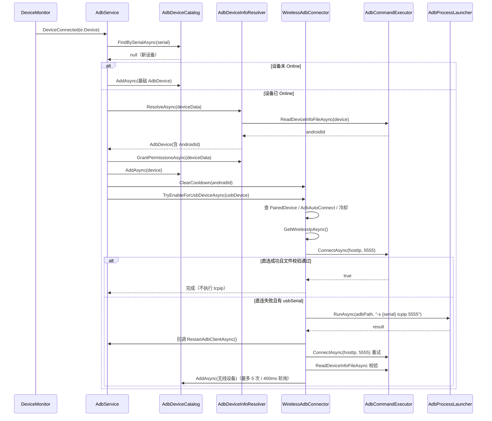
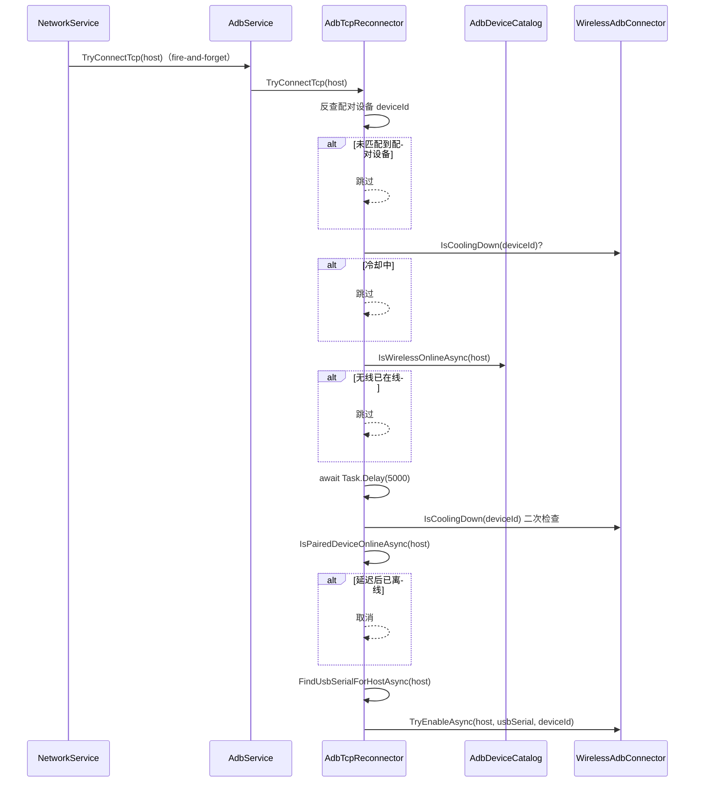
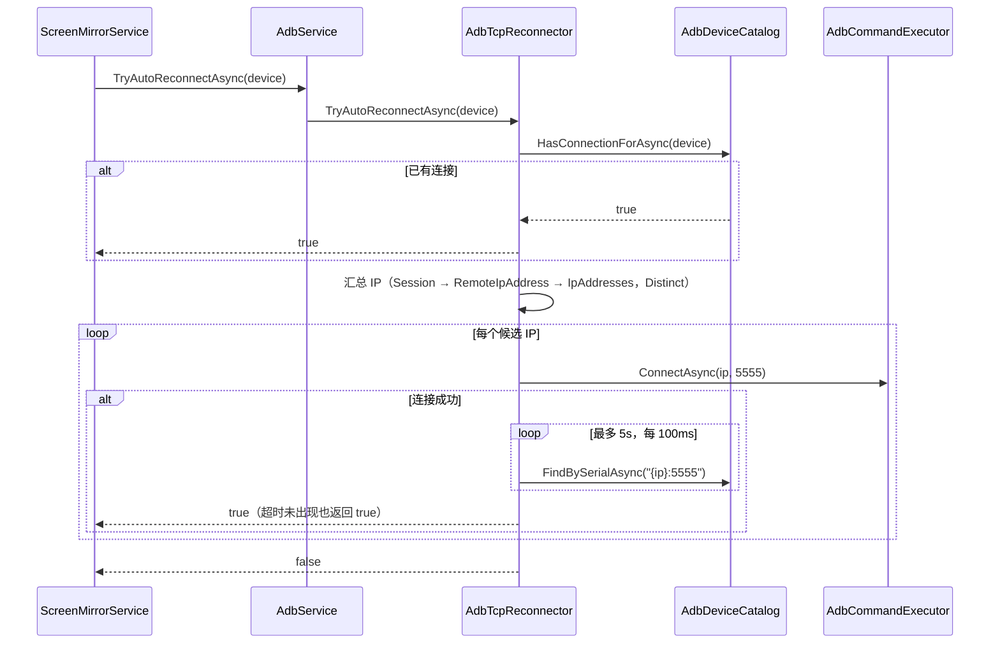

# AdbService.cs 拆分计划（详细）

> 制定日期：2026-09-15
> 目标文件：`Win/src/NotifyRelay/Services/AdbService.cs`
> 当前规模：**1198 物理行 / 1067 非空行 / 969 代码行**，24 个方法，1 个类
> 目标规模：主类瘦身后 ≤ 250 非空行，共 8 个文件
> 上游文档：[`GodClassAnalysis.md`](./GodClassAnalysis.md)（AdbService 相关章节已移至本文档）

---

## 一、拆分必要性（已校验）

### 1.1 规模事实

| 指标 | 实测值 |
|------|--------|
| 物理行数 | 1198 |
| 空行 | 131 |
| 注释行 | 98 |
| **非空行** | **1067** |
| 方法数 | 24 |
| 类数 | 1 |

### 1.2 职责识别（6 个不相关领域）

| # | 职责领域 | 方法 | 非空行数 |
|---|----------|------|----------|
| A | ADB 服务启停 / 设备监控生命周期 | `StartAsync` `StopAsync` `CleanupAsync` `RestartAdbClient` | ~90 |
| B | 设备连接/断开/变更事件处理 | `DeviceConnected` `DeviceDisconnected` `DeviceChanged` `RefreshDevicesAsync` | ~190 |
| C | 设备信息获取与权限授予 | `GetFullDeviceInfoAsync` `CheckAndGrantLogPermissionAsync` | ~150 |
| D | 无线 ADB 建立（tcpip + 连接 + 文件校验） | `EnableTcpipMode` `TryEnableWirelessAdbAsync` `VerifyWirelessFileAsync` `AddWirelessDeviceToListIfMissingAsync` `RecordWirelessFailure` `TryEnableWirelessForUsbDeviceAsync` `FindPairedDeviceAsync` `GetWirelessIpAsync` | ~330 |
| E | TCP 自动重连 / 握手触发 | `TryConnectTcp` `FindUsbSerialForHostAsync` `IsPairedDeviceOnlineAsync` `TryAutoReconnectAsync` `ConnectWireless` | ~220 |
| F | 设备操作（解锁/锁屏判定/卸载/日志权限） | `UnlockDevice` `IsLocked` `UninstallApp` | ~40 |
| G | Scrcpy 偏好选项集合 | `DisplayOrientationOptions` `VideoCodecOptions` `AudioCodecOptions` | ~30 |

### 1.3 判定结论

- 非空行 1067 > 800（🔴 严重阈值）
- 职责领域 6 个 ≥ 4 个（🔴 严重阈值）
- **判定成立**：属于必须拆分的严重级上帝类，且是全项目最大源文件（第 2 名 `NotificationService.cs` 为 991 非空行）

### 1.4 拆分阻力（已核实，均不构成阻塞）

| 阻力点 | 实测结论 |
|--------|----------|
| `IAdbService` 接口契约 | 26 行，13 个成员；拆分时**保持接口完全不变**，仅内部实现下沉 |
| DI 注册 | 仅 `AppLifecycleHelper.cs:496` 一处 `.AddSingleton<IAdbService, AdbService>()`。采用**收口注册**：子服务由 `AdbService` 内部组合，**不进容器**，主注册程序保持一行不变（见 §2.2） |
| 外部引用 | `ScreenMirrorService`(6 处) `NetworkService`(1) `AppsViewModel`(1) `DeviceSettingsViewModel`(3) `PairedDevice`(3)；全部走 `IAdbService` 接口或属性转发，**不触碰私有成员** |
| UI 线程耦合 | `App.MainWindow.DispatcherQueue` 出现 21 次，是拆分时必须保留的核心时序约束 |
| 单元测试 | 当前解决方案**无测试项目**（仅 NotifyRelay / NativeCore / Overlay / Worker 四个 csproj），拆分无测试回归风险，但也无测试保护 → 必须依赖编译 + 冒烟 |
| 循环依赖 | `AdbService → IDeviceManager` 单向；`EnableTcpipMode` 需要回调 `RestartAdbClient`（即 A ↔ D 双向），需用**委托/接口回调**解耦 |

---

## 二、目标结构

```
Services/
├── AdbService.cs                    ← 瘦身后 ~230 非空行（外观 / 协调 / 组合根）
└── Adb/                             ← 新建子目录（与 Services/Settings 惯例一致）
    ├── IAdbCommandExecutor.cs       ← 新增 ~40（接口，4 处消费者）
    ├── AdbCommandExecutor.cs        ← 新增 ~200
    ├── IAdbDeviceCatalog.cs         ← 新增 ~45（接口，3 处消费者）
    ├── AdbDeviceCatalog.cs          ← 新增 ~290
    ├── IAdbDeviceInfoResolver.cs    ← 新增 ~25（接口，2 处消费者）
    ├── AdbDeviceInfoResolver.cs     ← 新增 ~200
    ├── IWirelessAdbConnector.cs     ← 新增 ~40（接口，2 处消费者）
    ├── WirelessAdbConnector.cs      ← 新增 ~300
    ├── AdbProcessLauncher.cs        ← 新增 ~130（无接口，单一消费者）
    ├── AdbTcpReconnector.cs         ← 新增 ~230（无接口，单一消费者）
    ├── AdbDeviceOperator.cs         ← 新增 ~90 （无接口，单一消费者）
    └── ScrcpyPreferences.cs         ← 新增 ~60 （静态类）
```

### 2.0 各文件职责

| 文件 | 职责 | 不负责 |
|------|------|--------|
| **`AdbService.cs`** | ADB Server 启动与停止；`DeviceMonitor` 生命周期与三事件订阅分发；7 个子服务的**组合根**；作为 `IAdbService` 的外观，把公开方法一行转发到对应子服务 | 不含任何具体 ADB 业务逻辑；不直接操作 `AdbDevices` 集合；不直接调 `adbClient` |
| **`Adb/IAdbCommandExecutor.cs`** | 声明 ADB 命令执行契约：设备枚举、shell 命令执行、无线连接、卸载包、读取设备信息文件 | 无实现 |
| **`Adb/AdbCommandExecutor.cs`** | 持有唯一的 `AdbClient` 实例，封装全部 17 处 `adbClient` 调用；定义 `DeviceInfoPath` / `PackageName` 常量，消除重复字符串 | 不解析返回结果；不做业务判定；不碰 UI 线程 |
| **`Adb/IAdbDeviceCatalog.cs`** | 声明设备集合读写契约：按序列号查找、存在性、无线在线判定、增删改、快照、连接匹配、通用 UI 线程读取 | 无实现 |
| **`Adb/AdbDeviceCatalog.cs`** | 持有 `AdbDevices` ObservableCollection **唯一实例**；把 21 处散落的 `DispatcherQueue.EnqueueAsync` 收敛为统一的 UI 线程封送入口 | 不发起任何 ADB 调用；不做设备信息解析；不订阅 DeviceMonitor 事件 |
| **`Adb/IAdbDeviceInfoResolver.cs`** | 声明设备信息解析契约：由 `DeviceData` 解析完整 `AdbDevice`、授予设备权限 | 无实现 |
| **`Adb/AdbDeviceInfoResolver.cs`** | 由 `DeviceData` 解析出完整 `AdbDevice`（读 `device_info.txt` 取 AndroidId，为空时按 Model 模糊匹配已配对设备回退）；授予 `READ_LOGS` 与 `READ_CLIPBOARD` 权限 | 不写入设备集合（只返回对象）；不判断 USB/WIFI 之外的业务规则 |
| **`Adb/IWirelessAdbConnector.cs`** | 声明无线 ADB 建立契约：按 host/usbSerial/deviceId 幂等建立、为 USB 设备自动建立、清除与查询失败冷却 | 无实现 |
| **`Adb/WirelessAdbConnector.cs`** | 无线 ADB 全流程编排：幂等短路 → 直连 → 文件校验 → 必要时 `adb tcpip` → 重连 → 同步设备进列表；持有失败冷却与防重入两个并发字典 | 不持有 `AdbDevices` 集合（经 `IAdbDeviceCatalog` 操作）；不自行重启 ADB 客户端（走回调） |
| **`Adb/AdbProcessLauncher.cs`** | 启动外部 `adb.exe` 进程并完整回收 stdout/stderr，返回退出码 | 不解析 adb 输出语义；不读配置（`adbPath` 由调用方传入） |
| **`Adb/AdbTcpReconnector.cs`** | 握手触发的延迟重连（`TryConnectTcp`，含 5 秒观察窗）与配对设备掉线后自动重连（`TryAutoReconnectAsync`，多 IP 逐个尝试） | 不执行 `adb tcpip`（委托给 `IWirelessAdbConnector`）；不直接读写设备集合 |
| **`Adb/AdbDeviceOperator.cs`** | 单设备原子操作：按命令序列解锁、锁屏状态判定、按 AndroidId 卸载应用 | 不做批量/编排；不参与连接建立 |
| **`Adb/ScrcpyPreferences.cs`** | 静态提供 Scrcpy 三组偏好选项集合（显示方向 / 视频编码 / 音频编码），索引与命令字符串固定 | 无状态、无依赖、不读写设置 |

**职责边界总原则**：

1. **只有 `AdbDeviceCatalog` 能碰 `AdbDevices` 集合实例**——其余类一律通过 `IAdbDeviceCatalog` 间接访问
2. **只有 `AdbCommandExecutor` 持有 `AdbClient`**——其余类一律通过 `IAdbCommandExecutor` 发起 ADB 调用
3. **只有 `AdbService` 能订阅 `DeviceMonitor` 事件**——它是唯一的事件入口与编排者
4. **只有 `AdbProcessLauncher` 启动外部进程**——其余类不得出现 `Process.Start`
5. **子服务之间只通过接口依赖，不互相 `new`**——组合动作集中发生在 `AdbService` 构造函数

### 2.1 接口取舍原则

**只有被多个类引用的协作类才定义接口**；单一消费者或纯内部实现细节不定义接口，直接用具体类。

| 类 | 消费者 | 是否定义接口 |
|---|---|---|
| `AdbCommandExecutor` | `AdbDeviceInfoResolver` / `WirelessAdbConnector` / `AdbTcpReconnector` / `AdbDeviceOperator` | ✅ 是（4 处） |
| `AdbDeviceCatalog` | `WirelessAdbConnector` / `AdbTcpReconnector` / `AdbDeviceOperator` | ✅ 是（3 处） |
| `AdbDeviceInfoResolver` | `AdbService` / `WirelessAdbConnector` | ✅ 是（2 处） |
| `WirelessAdbConnector` | `AdbService` / `AdbTcpReconnector` | ✅ 是（2 处） |
| `AdbProcessLauncher` | 仅 `WirelessAdbConnector` | ❌ 否 |
| `AdbTcpReconnector` | 仅 `AdbService` | ❌ 否 |
| `AdbDeviceOperator` | 仅 `AdbService` | ❌ 否 |
| `ScrcpyPreferences` | 静态类 | ❌ 否 |

### 2.2 收口注册策略（本次确立的新惯例）

**问题**：常规拆分每提取一个类就往 `AppLifecycleHelper.ConfigureServices()` 加一行注册，主注册程序会随拆分持续膨胀，且 7 个纯实现细节类会污染全局容器。

**本次确立的原则**：

> **主注册程序只注册主体；子服务由主体内部组合，不进容器。**
> 只有当某个子服务确实需要被容器外的第三方使用时，才单独提升为容器注册项。

**落地方式**：

- `AppLifecycleHelper.cs:496` 的 `.AddSingleton<IAdbService, AdbService>()` **保持原样一行不变**
- 7 个子服务由 `AdbService` 在自己的构造函数中直接 `new` 组合
- `AdbService` 所需的外部依赖（`ILogger` / `IUserSettingsService` / `IDeviceManager`）**仍由容器注入**——它们是跨模块共享的基础设施，不属于 Adb 子系统的实现细节
- 各子服务的 `ILogger<T>` 由注入的 `ILoggerFactory` 现场创建

**容器注册项变化**：**0 个新增**（`+0`），主注册程序行数变化 **0 行**。

**后续推广**：本次是首个采用该惯例的模块。后续 `NotificationService` / `WindowsPlaybackService` 等拆分沿用同一原则——`ConfigureServices()` 只登记主体，实现细节下沉到主体内部组合。

> 说明：原先考虑过提供 `.AddAdbServices()` 扩展方法收口（复用 `Platforms/Windows/ServiceCollectionExtensions.cs` 的 `AddWindowsServices()` 惯例）。在"子服务不进容器"方案下，没有新的容器注册代码需要收口，因此该扩展方法**不再需要**。此惯例留待未来真正出现需要进容器的子服务时再引入。

---

## 三、分项目标结构与职责映射

### 3.1 `Adb/AdbProcessLauncher.cs`（新建，~130 非空行）

**唯一职责**：启动外部 `adb.exe` 进程并回收 stdout/stderr。

**来源**：`EnableTcpipMode`（569-656）中的 `Process.Start` 部分。

**公开 API**：

```csharp
namespace NotifyRelay.Services.Adb;

public interface IAdbProcessLauncher
{
    Task<AdbProcessResult> RunAsync(string adbPath, string arguments, CancellationToken ct = default);
}

public sealed record AdbProcessResult(int ExitCode, string StandardOutput, string StandardError);
```

**实现要点**：
- `ProcessStartInfo` 固定 `RedirectStandardOutput/Error = true`、`UseShellExecute = false`、`CreateNoWindow = true`
- **先 `WaitForExitAsync()` 再 `ReadToEndAsync()`**（与原代码顺序一致，避免死锁）
- 不引用 `userSettingsService`，adbPath 由调用方传入

**校验点**：`adb tcpip 5555` 的输出/错误文本须完整透传（原代码依赖 `error.Contains("more than one device")` 做诊断）。

---

### 3.2 `Adb/AdbCommandExecutor.cs`（新建，~200 非空行）

**唯一职责**：封装 `AdbClient` 的所有调用，提供设备枚举与 shell 命令执行。

**来源**：17 处 `adbClient.` 调用，散落在 `GetFullDeviceInfoAsync` / `CheckAndGrantLogPermissionAsync` / `ConnectWireless` / `IsLocked` / `UninstallApp` / `VerifyWirelessFileAsync` / `TryAutoReconnectAsync`。

**公开 API**：

```csharp
public interface IAdbCommandExecutor
{
    AdbClient AdbClient { get; }
    Task<IReadOnlyList<DeviceData>> GetDevicesAsync(CancellationToken ct = default);
    Task<string> ExecuteShellCommandAsync(DeviceData device, string command, CancellationToken ct = default);
    Task<bool> ConnectAsync(string host, int port = 5555, CancellationToken ct = default);
    Task UninstallPackageAsync(DeviceData device, string packageName, CancellationToken ct = default);
    Task<string> ReadDeviceInfoFileAsync(DeviceData device, CancellationToken ct = default);
}
```

**关键常量（提取为 `internal const string`）**：
```csharp
internal const string DeviceInfoPath =
    "cat /storage/emulated/0/Android/data/com.xzyht.notifyrelay/files/device_info.txt";
internal const string PackageName = "com.xzyht.notifyrelay";
```
> ⚠️ 该路径字符串目前在 `GetFullDeviceInfoAsync:369` 与 `VerifyWirelessFileAsync:814` 各出现一次（一处带 `cat` 前缀，一处不带），提取后**两处语义必须完全一致**。

**注意**：`AdbClient` 实例由本类持有（`new AdbClient()`），`AdbService.AdbClient` 属性改为转发到本类，保证 `IAdbService.AdbClient` 契约不变。

---

### 3.3 `Adb/AdbDeviceInfoResolver.cs`（新建，~200 非空行）

**唯一职责**：由 `DeviceData` 解析出完整 `AdbDevice`（含 AndroidId 回退匹配），以及授予 READ_LOGS / READ_CLIPBOARD 权限。

**来源**：`GetFullDeviceInfoAsync`(343-458，117 行) + `CheckAndGrantLogPermissionAsync`(460-503，45 行)。

**公开 API**：

```csharp
public interface IAdbDeviceInfoResolver
{
    Task<AdbDevice> ResolveAsync(DeviceData deviceData, CancellationToken ct = default);
    Task GrantPermissionsAsync(DeviceData deviceData, CancellationToken ct = default);
}
```

**依赖**：`IAdbCommandExecutor`、`IDeviceManager`（6 处 `deviceManager.PairedDevices` 中有 2 处在此）、`ILogger`

**保留逻辑（不得变更）**：
1. 先 `GetDevicesAsync()` 取 full data；取不到则返回基础 `AdbDevice`
2. AndroidId 优先读 `device_info.txt`
3. 为空时用 `PairedDevices` 按 Model 模糊匹配（OrdinalIgnoreCase，双向 Contains）
4. `Type` 判定：`Serial.Contains(':') || Serial.Contains("tcp")` → WIFI，否则 USB
5. 权限：`pm grant ... READ_LOGS` 幂等执行 + `cmd appops set ... READ_CLIPBOARD allow`

---

### 3.4 `Adb/AdbDeviceCatalog.cs`（新建，~290 非空行）

**唯一职责**：持有 `AdbDevices`  ObservableCollection，统一封装所有集合读写的 **UI 线程封送**，对外提供幂等的增删改查。

**来源**：`DeviceConnected`(139-199) / `DeviceDisconnected`(200-221) / `DeviceChanged`(222-289) / `RefreshDevicesAsync`(290-341) 中的全部集合操作 + 21 处 `DispatcherQueue.EnqueueAsync`。

**公开 API**：

```csharp
public interface IAdbDeviceCatalog
{
    ObservableCollection<AdbDevice> Devices { get; }           // 即 IAdbService.AdbDevices 的底层集合
    Task<AdbDevice?> FindBySerialAsync(string serial);
    Task<bool> ExistsAsync(string serial);
    Task<bool> IsWirelessOnlineAsync(string hostIp);
    Task AddAsync(AdbDevice device);
    Task ReplaceAsync(AdbDevice existing, AdbDevice updated);  // Remove+Insert 触发 CollectionChanged
    Task RemoveAsync(AdbDevice device);
    Task ClearAsync();
    Task<IReadOnlyList<AdbDevice>> SnapshotAsync();
    Task<bool> HasConnectionForAsync(PairedDevice device);      // TryAutoReconnectAsync 的匹配判定
    Task<T?> ReadAsync<T>(Func<IEnumerable<AdbDevice>, T?> selector); // 通用 UI 线程读取逃生口
}
```

**这是本次拆分的核心收敛点**：把 21 处散落的 `App.MainWindow.DispatcherQueue.EnqueueAsync` 收敛到单一文件，消除"在 UI 线程外读写 ObservableCollection"的隐患。

**关键约束**：

- `ReplaceAsync` 必须保留 **RemoveAt + Insert** 语义（原代码注释明确指出此写法是为了触发 `CollectionChanged`）
- `PairedDevice.cs:230` 订阅了 `adbService.AdbDevices.CollectionChanged`，拆分后集合实例**必须是同一个**（`AdbService.AdbDevices` 直接返回 `Catalog.Devices`，不得包装/拷贝）
- `ScreenMirrorService.cs:19` 持有 `adbService.AdbDevices` 引用，同理

---

### 3.5 `Adb/WirelessAdbConnector.cs`（新建，~300 非空行）

**唯一职责**：无线 ADB 的建立流程（幂等判定 → 直连 → 文件校验 → 必要时 tcpip 重启 → 重连 → 同步列表），以及失败冷却与防重入状态。

**来源**：`TryEnableWirelessAdbAsync`(684-784，101 行) + `EnableTcpipMode`(569-656，88 行) + `VerifyWirelessFileAsync`(796-830) + `AddWirelessDeviceToListIfMissingAsync`(832-877) + `RecordWirelessFailure`(785-794) + `TryEnableWirelessForUsbDeviceAsync`(879-920) + `FindPairedDeviceAsync`(922-934) + `GetWirelessIpAsync`(936-967)。

**公开 API**：

```csharp
public interface IWirelessAdbConnector
{
    Task<bool> TryEnableAsync(string hostIp, string? usbSerial = null, string? deviceId = null);
    Task TryEnableForUsbDeviceAsync(AdbDevice usbDevice);
    void ClearCooldown(string deviceId);          // USB 重连时清除
    bool IsCoolingDown(string deviceId);
}
```

**依赖**：`IAdbCommandExecutor`、`IAdbDeviceCatalog`、`IAdbDeviceInfoResolver`、`IAdbProcessLauncher`、`IDeviceManager`、`IUserSettingsService`（仅取 `AdbPath`）、`ILogger`

**必须保留的时序与状态机**：

1. **失败冷却** `_wirelessFailCooldown`（key = 配对设备 ID，非 IP）：失败后本次有线连接期间不再重试；仅 USB 重新连接时由 `AdbService` 调 `ClearCooldown` 清除
2. **防重入** `_pendingWireless`（key = hostIp）：`TryAdd` 失败即跳过，在 `finally` 中移除
3. **幂等短路**：`{hostIp}:5555` 已在线 → 直接 `return true`，**不执行 tcpip**（避免重启 adbd 打断 AS 安装）
4. **成功判据**：`adb connect` 返回成功 + `device_info.txt` 文本非空，二者缺一视为失败
5. **tcpip 仅在直连失败且提供 usbSerial 时执行**
6. `EnableTcpipMode` 前后的 `adb devices -l` 诊断输出、`more than one device` 检测须保留
7. `AddWirelessDeviceToListIfMissingAsync` 的 **5 次 / 400ms 轮询**须保留（覆盖 adb connect 后设备列表时序竞态）

**A ↔ D 双向依赖的解法**：
原 `EnableTcpipMode` 末尾调用 `RestartAdbClient()`（职责 A）。改为注入回调：

```csharp
public delegate Task RestartAdbClientDelegate();
// 构造注入：Func<Task> restartAdbClient
```
由 `AdbService` 在内部组合时以 `Func<Task>` 回调传入（不经过容器），避免 `WirelessAdbConnector` 反向依赖 `AdbService`。

---

### 3.6 `Adb/AdbTcpReconnector.cs`（新建，~230 非空行）

**唯一职责**：握手触发的延迟重连（`TryConnectTcp`）与配对设备断线后自动重连（`TryAutoReconnectAsync`）。

**来源**：`TryConnectTcp`(1004-1068，66 行) + `FindUsbSerialForHostAsync`(969-1002) + `IsPairedDeviceOnlineAsync`(1070-1084) + `TryAutoReconnectAsync`(1086-1197，113 行) + `ConnectWireless`(505-523) 的重连使用场景。

**公开 API**：

```csharp
public interface IAdbTcpReconnector
{
    void TryConnectTcp(string host);               // 保持 async void 语义（触发即忘，由 NetworkService 调用）
    Task<bool> TryAutoReconnectAsync(PairedDevice device);
}
```

**依赖**：`IAdbCommandExecutor`、`IAdbDeviceCatalog`、`IWirelessAdbConnector`、`IDeviceManager`、`ILogger`

**必须保留的时序**：

- `TryConnectTcp` 的 **5 秒延迟观察窗**：延迟前查冷却/查无线在线 → `Task.Delay(5000)` → 延迟后**二次查冷却** → `IsPairedDeviceOnlineAsync` 复核 → 才建立无线 ADB
- `TryConnectTcp` 保持 `async void`（`NetworkService.cs:147` 以 fire-and-forget 方式调用）；拆分后内部改为 `async Task` + 外层 `async void` 包装，**异常必须在内部全捕获**，否则会导致进程崩溃
- `TryAutoReconnectAsync` 的 IP 来源优先级：`Session.Socket.RemoteEndPoint` → `RemoteIpAddress` → `IpAddresses`，之后 `Distinct()`
- `TryAutoReconnectAsync` 的"已连接"判定：AndroidId 精确匹配，或 AndroidId 为空时按 Model 模糊匹配（三重 OrdinalIgnoreCase 比较）——这段判定建议收敛进 `IAdbDeviceCatalog.HasConnectionForAsync`
- 连接成功后**最多等 5 秒 / 每 100ms 轮询**设备出现在列表；超时仍返回 `true`（原逻辑如此，不得改为 false）

---

### 3.7 `Adb/AdbDeviceOperator.cs`（新建，~90 非空行）

**唯一职责**：单设备的原子操作（解锁、锁屏判定、卸载）。

**来源**：`UnlockDevice`(525-544) + `IsLocked`(546-551) + `UninstallApp`(553-567)。

**公开 API**：

```csharp
public interface IAdbDeviceOperator
{
    void UnlockDevice(DeviceData deviceData, List<string> commands);   // 保持 async void
    Task<bool> IsLocked(DeviceData deviceData);
    Task UninstallApp(string deviceId, string appPackage);
}
```

**依赖**：`IAdbCommandExecutor`、`IAdbDeviceCatalog`、`ILogger`

**必须保留**：
- `UnlockDevice` 保持 `async void`（`ScreenMirrorService.cs:203` fire-and-forget）
- 命令间 `Task.Delay(250)` 间隔
- `IsLocked` 的 shell：`dumpsys window policy | grep 'showing=' | cut -d '=' -f2`
- `UninstallApp` 按 **AndroidId**（不是 Serial）在 UI 线程查设备，取不到则直接 return

---

### 3.8 `Adb/ScrcpyPreferences.cs`（新建，~60 非空行）

**唯一职责**：提供 Scrcpy 的三组静态偏好选项集合。

**来源**：`DisplayOrientationOptions`(37-49) / `VideoCodecOptions`(51-59) / `AudioCodecOptions`(61-68)。

**公开 API**：

```csharp
public static class ScrcpyPreferences
{
    public static ObservableCollection<ScrcpyPreferenceItem> DisplayOrientation { get; }
    public static ObservableCollection<ScrcpyPreferenceItem> VideoCodec { get; }
    public static ObservableCollection<ScrcpyPreferenceItem> AudioCodec { get; }
}
```

**约束**：
- 三个集合的**索引顺序与 Command 字符串必须逐字节一致**（`ScreenMirrorService.cs:604/634/675` 用 `settings.VideoCodec` 等索引值直接下标访问，索引错位会直接改变用户配置语义）
- 集合为只读语义（无 setter），静态单例即可

---

### 3.9 `AdbService.cs`（瘦身后，~230 非空行）

**保留职责**：ADB Server 启动、`DeviceMonitor` 生命周期、事件订阅与分发、**子系统组合根**、作为 `IAdbService` 的外观（Facade）。

**瘦身后结构**：

```csharp
public class AdbService(
    ILoggerFactory loggerFactory,          // ← 变：原为 ILogger<AdbService>
    IUserSettingsService userSettingsService,
    IDeviceManager deviceManager
) : IAdbService
{
    // ── 子系统组合（全部在主体内部 new，不进容器） ──
    private readonly AdbProcessLauncher processLauncher = new(loggerFactory.CreateLogger<AdbProcessLauncher>());
    private readonly IAdbCommandExecutor commandExecutor = new AdbCommandExecutor(loggerFactory.CreateLogger<AdbCommandExecutor>());
    private readonly IAdbDeviceCatalog catalog = new AdbDeviceCatalog(loggerFactory.CreateLogger<AdbDeviceCatalog>());
    private readonly IAdbDeviceInfoResolver infoResolver;
    private readonly IWirelessAdbConnector wirelessConnector;
    private readonly AdbTcpReconnector tcpReconnector;
    private readonly AdbDeviceOperator deviceOperator;
    private readonly ILogger<AdbService> logger;

    public AdbService(...)
    {
        logger = loggerFactory.CreateLogger<AdbService>();
        infoResolver = new AdbDeviceInfoResolver(commandExecutor, deviceManager, loggerFactory.CreateLogger<AdbDeviceInfoResolver>());
        deviceOperator = new AdbDeviceOperator(commandExecutor, catalog, loggerFactory.CreateLogger<AdbDeviceOperator>());
        wirelessConnector = new WirelessAdbConnector(
            commandExecutor, catalog, infoResolver, processLauncher, deviceManager, userSettingsService,
            RestartAdbClientAsync,                    // ← 回调注入，解开 A↔D 循环依赖
            loggerFactory.CreateLogger<WirelessAdbConnector>());
        tcpReconnector = new AdbTcpReconnector(commandExecutor, catalog, wirelessConnector, deviceManager,
            loggerFactory.CreateLogger<AdbTcpReconnector>());
    }

    private CancellationTokenSource? cts;
    private DeviceMonitor? deviceMonitor;

    public ObservableCollection<AdbDevice> AdbDevices => catalog.Devices;
    public bool IsMonitoring => deviceMonitor != null && !(cts?.IsCancellationRequested ?? true);
    public AdbClient AdbClient => commandExecutor.AdbClient;

    public ObservableCollection<ScrcpyPreferenceItem> DisplayOrientationOptions => ScrcpyPreferences.DisplayOrientation;
    public ObservableCollection<ScrcpyPreferenceItem> VideoCodecOptions => ScrcpyPreferences.VideoCodec;
    public ObservableCollection<ScrcpyPreferenceItem> AudioCodecOptions => ScrcpyPreferences.AudioCodec;

    public Task StartAsync();            // ~30 行：启 server、建 monitor、订阅三事件、RefreshDevices
    public Task StopAsync();             // ~8 行
    private async Task CleanupAsync();   // ~20 行：退订 + Dispose monitor + Cancel/Dispose cts
    internal async Task RestartAdbClientAsync();  // ~15 行：供无线连接器的回调

    private async void DeviceConnected(...);    // ~25 行：仅编排，细节委托
    private async void DeviceDisconnected(...); // ~10 行
    private async void DeviceChanged(...);      // ~20 行

    // 以下全部一行转发
    public Task<bool> ConnectWireless(string? host, int port = 5555) => commandExecutor.ConnectAsync(host, port);
    public Task<bool> IsLocked(DeviceData d) => deviceOperator.IsLocked(d);
    public void UnlockDevice(DeviceData d, List<string> c) => deviceOperator.UnlockDevice(d, c);
    public Task UninstallApp(string id, string pkg) => deviceOperator.UninstallApp(id, pkg);
    public void TryConnectTcp(string host) => tcpReconnector.TryConnectTcp(host);
    public Task<bool> TryEnableWirelessAdbAsync(string h, string? s = null, string? d = null) => wirelessConnector.TryEnableAsync(h, s, d);
    public Task<bool> TryAutoReconnectAsync(PairedDevice d) => tcpReconnector.TryAutoReconnectAsync(d);
}
```

**构造顺序约束**（依赖 DAG，必须按此顺序）：

```
ILoggerFactory（容器注入）
  → AdbProcessLauncher（无依赖）
  → AdbCommandExecutor（无依赖，持有 AdbClient 实例）
  → AdbDeviceCatalog（无依赖，持有 AdbDevices 集合实例）
  → AdbDeviceInfoResolver（← commandExecutor, deviceManager）
  → AdbDeviceOperator（← commandExecutor, catalog）
  → WirelessAdbConnector（← commandExecutor, catalog, infoResolver, processLauncher, deviceManager, userSettingsService, restart 回调）
  → AdbTcpReconnector（← commandExecutor, catalog, wirelessConnector, deviceManager）
  → AdbService 自身字段初始化完成
```

无循环依赖；`WirelessAdbConnector` 对 `RestartAdbClient` 的反向需求由 `Func<Task>` 回调注入解决。

**`IAdbService` 接口 26 行 / 13 个成员保持不变**，`AppLifecycleHelper.cs:496` 的 `AddSingleton<IAdbService, AdbService>()` **一行不变**。

> ⚠️ **唯一需要改动的注入点**：构造参数 `ILogger<AdbService>` → `ILoggerFactory`。
> 原因：主体需要为 7 个不进容器的子服务现场创建各自的 `ILogger<T>`。
> `ILoggerFactory` 由 Generic Host + Serilog 自动提供，**无需新增注册**（已确认：全项目无 `AddLogging()` 调用，`ILogger<App>` 在 `AppLifecycleHelper.cs:474` 由工厂解析得到，证明工厂可用）。
> `ILogger<AdbService>` 现场 `loggerFactory.CreateLogger<AdbService>()` 获得，日志类别名不变，Serilog 输出与现有过滤规则保持一致。

---

## 四、拆分步骤（按依赖顺序，每步独立提交）

> 每一步执行前后都必须 `msbuild -p:Platform=x64` 确认无新增错误/警告。
> **全程原则：容器零改动。** 每个 Step 只新建 `Services/Adb/` 下的文件并让 `AdbService` 内部组合，
> 不触碰 `AppLifecycleHelper.cs`，不新增任何 `AddSingleton`。

### Step 0 — 基线构建

```
msbuild -p:Platform=x64
```
记录当前 error / warning 数量、以及 `AppLifecycleHelper.cs` 行数作为基线。

---

### Step 1 — 提取 `ScrcpyPreferences`（最安全，~30 行）

1. 新建 `Services/Adb/ScrcpyPreferences.cs`，搬移三个集合（保持索引与字符串逐字一致）
2. `AdbService` 三个属性改为 `=> ScrcpyPreferences.X`
3. 构建验证 → 提交

**容器改动**：无。**回归点**：设置页 Scrcpy 下拉框三项（显示方向/视频编码/音频编码）显示与选中不变。

---

### Step 2 — 提取 `AdbProcessLauncher`（~60 行）

1. 新建 `Services/Adb/AdbProcessLauncher.cs` + `AdbProcessResult` 记录
2. `EnableTcpipMode` 内部两处 `Process.Start`（`devices -l` 诊断 + `tcpip 5555`）改为调用
3. 在 `AdbService` 内部 `new AdbProcessLauncher(logger)` 持有
4. 构建验证 → 提交

**容器改动**：无。**回归点**：`adb tcpip 5555` 仍能正常执行，`more than one device` 日志仍出现。

---

### Step 3 — 提取 `AdbCommandExecutor`（17 处调用收敛）

1. 新建 `Services/Adb/AdbCommandExecutor.cs` + `IAdbCommandExecutor`（持有 `AdbClient` 实例 + `DeviceInfoPath` 常量）
2. 逐处替换 `adbClient.X(...)` → `executor.X(...)`；先全量替换再构建
3. `AdbService.AdbClient` 改为 `=> commandExecutor.AdbClient`
4. 在 `AdbService` 内部 `new AdbCommandExecutor(logger)` 持有
5. 构建验证 → 提交

**容器改动**：无。**回归点**：设备 AndroidId 获取、权限授予、无线连接、卸载均正常。

---

### Step 3.5 — 改注入点 `ILogger<AdbService>` → `ILoggerFactory`

（放在此处的理由：Step 4 起每个新子服务都需要独立 `ILogger<T>`，提前切换可避免后续反复改构造签名）

1. `AdbService` 构造参数改为 `ILoggerFactory loggerFactory`
2. `logger` 改为 `loggerFactory.CreateLogger<AdbService>()`
3. 构建验证 → 提交

**容器改动**：无（`ILoggerFactory` 由 Generic Host 自动提供，无需注册）。
**校验点**：Serilog 中 `NotifyRelay.Services.AdbService` 日志类别名不变，级别过滤不受影响。

---

### Step 4 — 提取 `AdbDeviceCatalog`（核心，21 处 Dispatcher 收敛）

1. 新建 `Services/Adb/AdbDeviceCatalog.cs`，把 `AdbDevices` 字段搬入（`Devices` 属性暴露**同一实例**）
2. `AdbService.AdbDevices` 改为 `=> catalog.Devices`
3. 逐处把 `await App.MainWindow.DispatcherQueue.EnqueueAsync(...)` 替换为 `catalog.XxxAsync(...)`，共 21 处
4. `TryAutoReconnectAsync` 的"已连接"判定收敛为 `catalog.HasConnectionForAsync(device)`
5. 在 `AdbService` 内部 `new AdbDeviceCatalog(logger)` 持有
6. 构建验证 → 提交

**容器改动**：无。

**⚠️ 高风险点**：
- `PairedDevice.cs:230` 订阅的是 `AdbDevices.CollectionChanged`，**集合实例绝不能被替换成新对象**
- `ReplaceAsync` 必须是 RemoveAt+Insert，不能改为属性赋值

**回归点**：主页面设备列表实时增删、已配对设备的"已连接 ADB 设备"列表同步。

---

### Step 5 — 提取 `AdbDeviceInfoResolver`（~150 行）

1. 新建 `Services/Adb/AdbDeviceInfoResolver.cs` + `IAdbDeviceInfoResolver`，搬入 `GetFullDeviceInfoAsync` + `CheckAndGrantLogPermissionAsync`
2. `AdbService` 调用改为 `infoResolver.ResolveAsync(...)` / `infoResolver.GrantPermissionsAsync(...)`
3. 在 `AdbService` 内部组合：`new AdbDeviceInfoResolver(commandExecutor, deviceManager, logger)`
4. 构建验证 → 提交

**容器改动**：无。**回归点**：设备型号/AndroidId 正确显示；无 AndroidId 时按型号匹配仍能命中。

---

### Step 6 — 提取 `WirelessAdbConnector`（最大块，~330 行）

1. 新建 `Services/Adb/WirelessAdbConnector.cs` + `IWirelessAdbConnector`，搬入 D 组 8 个方法 + 两个字典状态
2. `RestartAdbClient` 通过 `Func<Task>` 回调注入（由 `AdbService` 在内部组合时传入 `RestartAdbClientAsync`）
3. `DeviceConnected` / `DeviceChanged` 中的"USB 重连清冷却"改为 `wirelessConnector.ClearCooldown(androidId)`
4. `AdbService.TryEnableWirelessAdbAsync` 改为一行转发
5. 在 `AdbService` 内部组合（依赖 `commandExecutor` / `catalog` / `infoResolver` / `processLauncher` / `deviceManager` / `userSettingsService` / restart 回调）
6. 构建验证 → 提交

**容器改动**：无。

**回归点（重点）**：
- USB 插入 → 自动开启无线 ADB（AdbAutoConnect 开启时）
- 无线 ADB 已在线时**不再重复执行 adb tcpip**（不打断 AS 安装）
- 失败后本次有线连接期间不重试；拔插 USB 后可重试

---

### Step 7 — 提取 `AdbTcpReconnector`（~220 行）

1. 新建 `Services/Adb/AdbTcpReconnector.cs`，搬入 `TryConnectTcp` + `IsPairedDeviceOnlineAsync` + `FindUsbSerialForHostAsync` + `TryAutoReconnectAsync`
2. `AdbService` 两处改为一行转发
3. 在 `AdbService` 内部组合（依赖 `commandExecutor` / `catalog` / `wirelessConnector` / `deviceManager`）
4. 构建验证 → 提交

**容器改动**：无。

**回归点（重点）**：
- 握手触发的 5 秒延迟重连仍生效
- 配对设备掉线后自动重连（多 IP 逐个尝试）
- `async void` 内部异常不再冒泡（不得引发崩溃）

---

### Step 8 — 提取 `AdbDeviceOperator`（~40 行）

1. 新建 `Services/Adb/AdbDeviceOperator.cs`，搬入 `UnlockDevice` / `IsLocked` / `UninstallApp`
2. `AdbService` 三处改为一行转发
3. 构建验证 → 提交

**容器改动**：无。**回归点**：投屏前解锁、应用卸载。

---

### Step 9 — 组合根收尾（无容器改动）

在 `AdbService` 构造函数中完成 7 个子服务的组合（详见 §3.9 的构造顺序约束）。

**本步对 `AppLifecycleHelper.cs` 的改动：无**。

最终状态：

```
AppLifecycleHelper.cs:496
    .AddSingleton<IAdbService, AdbService>()     ← 原样保留，一行未变
```

`Services/Adb/` 使用新命名空间 `NotifyRelay.Services.Adb`，仅 `AdbService.cs` 需要 `using NotifyRelay.Services.Adb;`，**`AppLifecycleHelper.cs` 无需新增 using**（它只引用 `IAdbService` / `AdbService`）。

**收口效果验收**：
- [ ] `AppLifecycleHelper.ConfigureServices()` 行数与 Step 0 基线**完全一致**
- [ ] 容器注册项数量与基线**完全一致**（新增 0 个）
- [ ] `git diff AppLifecycleHelper.cs` 为空

**最终校验**：
```
msbuild -p:Platform=x64
```
与 Step 0 基线对比，**不得有新增 error / warning**；`AdbService.cs` 非空行 ≤ 250。

---

## 五、时序约束（拆分后必须保持）

### 5.1 USB 插入 → 自动建立无线 ADB



### 5.2 握手触发的重连（5 秒观察窗）



### 5.3 配对设备自动重连



---

## 六、验收清单

编译期：

- [ ] `msbuild -p:Platform=x64` 无新增 error / warning（与 Step 0 基线对比）
- [ ] `IAdbService` 接口 26 行未改动
- [ ] `AdbService.cs` 非空行 ≤ 250

**收口注册验收**（本次新惯例）：

- [ ] `git diff Win/src/NotifyRelay/Helpers/AppLifecycleHelper.cs` **为空**
- [ ] `AppLifecycleHelper.ConfigureServices()` 行数与基线完全一致
- [ ] 容器注册项数量与基线一致，**新增 0 个**
- [ ] 7 个子服务均未在 `ConfigureServices()` 中出现
- [ ] Serilog 中 `NotifyRelay.Services.AdbService` 类别名不变（`ILoggerFactory` 切换后）

运行期冒烟：

- [ ] 应用启动 → ADB 设备监控启动成功，设备列表正确显示
- [ ] USB 插入 → 设备出现、型号与 AndroidId 正确
- [ ] USB 拔出 → 设备移除
- [ ] 开启 AdbAutoConnect → USB 插入后自动建立无线 ADB
- [ ] 无线 ADB 已在线时，不再重复执行 `adb tcpip`（日志中不应出现第二次 tcpip）
- [ ] 无线 ADB 失败后本次有线连接期间不重试；拔插 USB 后可重试
- [ ] 握手触发的无线 ADB 仍有 5 秒延迟（日志可验证）
- [ ] 投屏前解锁命令按 250ms 间隔逐条执行
- [ ] 应用卸载功能正常
- [ ] Scrcpy 设置页三组下拉框（显示方向 / 视频编码 / 音频编码）选项与选中值不变
- [ ] 投屏时 `--video-codec` / `--orientation` / `--audio-codec` 参数值与拆分前一致

---

## 七、不做的事

- 不修改任何业务逻辑/时序/日志文本（纯搬移，对齐"先提取后修改"原则）
- 不改动 `IAdbService` 接口签名
- 不改动 `AdbDevices` 集合实例（保持 `PairedDevice` 的 `CollectionChanged` 订阅有效）
- **不新增任何容器注册项**（子服务由主体内部组合，收口注册）
- 不顺手重构其它类（避免本次变更面扩散）
- 不新增单元测试（当前解决方案无测试项目；如需，应作为独立议题评估）
