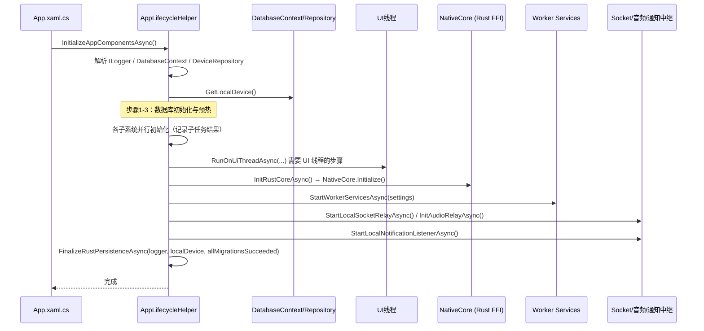

# AppLifecycleHelper.cs 拆分计划

> 制定日期：2026-09-17
> 目标文件：`Win/src/NotifyRelay/Helpers/AppLifecycleHelper.cs`
> 基线提交：`31ce450`（分支 `整理项目`）
> 当前规模：**616 物理行**，15 个方法，1 个 `static class`
> 目标规模：主文件瘦身后 ≤ 300 行，共 3 个文件

---

## 一、拆分必要性（实测）

| 指标 | 实测值 |
|------|--------|
| 物理行数 | 616 |
| 类 | `public static class AppLifecycleHelper`（静态类） |
| 方法数 | 15 |
| 外部引用 | 8 处（`App.xaml.cs` 等调用 `InitializeAppComponentsAsync` / `BuildHost` / `HandleAppUnhandledException` / `HandleStartupTaskAsync` / `AppVersion`） |

### 1.1 方法分组（实测行号）

| # | 分组 | 方法 | 行号区间 | 行数 |
|---|------|------|----------|------|
| A | DI 容器配置 | `ConfigureServices` | 488~589 | **~102** |
| B | Host 构建 | `BuildHost` | 449~486 | ~38 |
| C | 初始化编排 | `InitializeAppComponentsAsync` | 37~220 | **~184** |
| D | 初始化子任务 | `FinalizeRustPersistenceAsync`、`LogSubtaskDone`、`RegisterWindowsNotificationAsync`、`InitRustCoreAsync`、`StartLocalSocketRelayAsync`、`InitWorkerConfigAsync`、`StartWorkerServicesAsync`、`RunOnUiThreadAsync`、`InitAudioRelayAsync`、`StartLocalNotificationListenerAsync` | 221~448 | **~228** |
| E | 异常/启动任务 | `HandleAppUnhandledException`、`HandleStartupTaskAsync` | 594~616 | ~23 |
| F | 版本属性 | `AppVersion` | 34~35 | ~2 |

**判定**：🟡 警告级。混合了 DI 注册、启动编排、子任务实现、异常处理 4 类职责。

### 1.2 初始化时序（**必须保持**，来自 `InitializeAppComponentsAsync`）



**关键约束**：
- `FinalizeRustPersistenceAsync` 依赖 `allMigrationsSucceeded` 这一**跨步骤累积状态**，必须在所有迁移步骤之后调用。
- `LogSubtaskDone` 是各子任务的统一日志收口，**依赖任务列表顺序**。
- `RunOnUiThreadAsync` 涉及 `DispatcherQueue`，**调用时机与线程归属不能变**。

---

## 二、采用策略：抽取静态协作者（**必须遵守**）

`AppLifecycleHelper` 是 `public static class`，被 8 处调用。

**采用「按职责抽出独立静态类 + 保留原公开方法为转发」**，而不是 partial 分文件，理由：
- 本文件有 15 个**真方法**（含 102 行的 DI 配置与 184 行的编排），partial 分文件只能改善可读性，无法让「DI 注册」与「启动编排」各自独立、便于单独审阅。
- 三个职责（DI 配置 / 初始化编排 / 异常处理）之间**没有共享可变状态**（全部是静态方法 + 局部变量），可安全抽出为独立静态类。
- 公开面（8 处调用）通过**保留同名转发方法**做到零改动。

> **与 `NativeCore` 计划的差异说明**：`NativeCore` 因 FFI 回调与静态字段强耦合而用 partial；本文件无此约束，故用抽取。

---

## 三、目标结构

```
Helpers/
├── AppLifecycleHelper.cs        ← 瘦身至 ~280 行（生命周期编排 + 公开面转发）
│      AppVersion、InitializeAppComponentsAsync（保留编排主体）、
│      BuildHost（保留，因它调用 ConfigureServices）、
│      HandleAppUnhandledException / HandleStartupTaskAsync（保留为转发）
├── ServiceCollectionConfigurator.cs  ← 新增 ~110 行（A：DI 注册）
└── AppInitializer.cs                 ← 新增 ~240 行（D：初始化子任务）
```

### 3.1 各文件职责

| 文件 | 负责 | 不负责 |
|------|------|--------|
| **`AppLifecycleHelper`** | `AppVersion`；`InitializeAppComponentsAsync` 的**编排骨架**（调用顺序、子任务登记、失败累积）；`BuildHost`；两个公开入口保持可调用 | 不含具体 DI 注册清单；不含子系统初始化细节 |
| **`ServiceCollectionConfigurator`** | `internal static class`；`ConfigureServices(IServiceCollection services)` —— 原方法**整段搬移** | 不解析服务实例；不参与启动顺序 |
| **`AppInitializer`** | `internal static class`；分组 D 的 10 个子任务方法（`InitRustCoreAsync`、`StartWorkerServicesAsync`、`InitAudioRelayAsync` 等） | 不决定调用顺序（顺序仍由 `AppLifecycleHelper` 编排） |

### 3.2 可见性

- `ConfigureServices` 从 `private static` → `internal static`（**必要的可见性提升**，需在提交信息中说明）。
- 分组 D 的 10 个方法从 `private static` → `internal static`（同上）。
- 这是本计划**唯一允许的签名变更**；公开面（`public`）不变。

---

## 四、执行步骤

**每步完成后立即构建**（见 §6.1）。

### 步骤 1：抽出 `ServiceCollectionConfigurator`（最先，最独立）
1. 新建 `Helpers/ServiceCollectionConfigurator.cs`：
```csharp
namespace NotifyRelay.Helpers;

internal static class ServiceCollectionConfigurator
{
    internal static void ConfigureServices(IServiceCollection services)
    {
        // 从 AppLifecycleHelper.cs:488-589 整段搬入
    }
}
```
2. **必须补齐原 `using`**：`ConfigureServices` 引用了大量类型（`IUserSettingsService`、`DatabaseContext`、`DeviceRepository`、`NotificationRepository`、`FilterConfigRepository`、`AdbService`、`ScreenMirrorService`、`FileTransferService`、`ProtocolSender`、`ClipboardService`、`RemoteAppService`、`ProtocolRouter`、`HeartbeatProcessor`、`DeviceSnapshotStore`、`DeviceDirectory`、`NetworkService`、`SessionManager`、`LocalNotificationListenerService`、`DiscoveryService`、`WorkerConfiguration`、各 Worker 服务、`AudioRelayService`、`OverlayRenderService`、各 `IOverlayFeature`、`HeartRateBleService`、各 ViewModel 等）。
   > 最稳妥做法：**把主文件 `using` 区块整体复制到新文件**，构建后再删除编译器提示未使用的（本任务不要求清理，保留亦可）。
3. `AppLifecycleHelper.BuildHost` 内 `ConfigureServices(services);` 改为 `ServiceCollectionConfigurator.ConfigureServices(services);`。

### 步骤 2：抽出 `AppInitializer`
1. 新建 `Helpers/AppInitializer.cs`，`internal static class AppInitializer`。
2. 搬入分组 D 的 10 个方法（221~448）。
3. 这些方法内部若引用 `AppLifecycleHelper` 的其他成员（如 `RunOnUiThreadAsync` 被多个子任务调用），需明确归属：
   - `RunOnUiThreadAsync` **留在 `AppLifecycleHelper`** 并提升为 `internal static`，由 `AppInitializer` 调用（它是编排级工具）。
   - `LogSubtaskDone` **留在 `AppLifecycleHelper`** 并提升为 `internal static`（它服务于编排的任务登记）。
4. `InitializeAppComponentsAsync` 内的调用点改为 `AppInitializer.XxxAsync(...)`。

### 步骤 3：主文件收尾
确认 `InitializeAppComponentsAsync` 的**步骤顺序与日志文本一字未改**。

---

## 五、严格禁止事项

1. **不得修改 4 个 public 成员的签名**：`AppVersion`、`InitializeAppComponentsAsync`、`BuildHost`、`HandleAppUnhandledException`、`HandleStartupTaskAsync`。
2. **不得修改 `InitializeAppComponentsAsync` 的调用顺序、并行结构、日志文本**（步骤编号文本「步骤1-3」等是排查依据）。
3. **不得修改 `BuildHost` 的 `HostBuilder` 配置链**（`UseContentRoot`、`ConfigureHostConfiguration`、`ConfigureAppConfiguration`、`UseSerilog` 的参数）。
4. **不得改动 Serilog 配置**（`WriteTo.Debug` / `WriteTo.File` 的路径、`rollingInterval`、`retainedFileCountLimit`、`outputTemplate`）。
5. **不得改动 DI 注册的生存期**（`AddSingleton` / `AddSingleton<TI, TImpl>(sp => ...)` 的委托形式与顺序）。
6. **不得新增/删除/重排任何 DI 注册项**。
7. **不得修改 `FinalizeRustPersistenceAsync` 中 `allMigrationsSucceeded` 的判定逻辑**。
8. **不得改动 `RunOnUiThreadAsync` 的线程调度实现**。
9. 不得改动命名空间 `NotifyRelay.Helpers`。
10. 不得改动 `App.xaml.cs`。

---

## 六、验收标准

### 6.1 构建
```powershell
& 'C:\Program Files\Microsoft Visual Studio\18\Community\MSBuild\Current\Bin\MSBuild.exe' `
  'E:\GitHubCode\01Main\NotifyRelay\worktree\app-lifecycle\src\NotifyRelay.sln' `
  -p:Platform=x64 -p:Configuration=Debug -v:m -nologo -nodeReuse:false -restore
```
**必须 `EXIT=0`。**

### 6.2 警告基线（由主代理在 `31ce450` 实测，**禁止自行重做基线**）
基线 `EXIT=0`，41s，存量警告**恰好 8 条**：

| # | 警告 | 位置 |
|---|------|------|
| 1 | `CS8604` | `Platforms/Windows/Services/KeyboardHookService.cs(85,13)` |
| 2~8 | `WMC1506` ×7 | `Views/Settings/OverlayLogiBatteryPage.xaml` 行 58,59,63,72,78,82,83 |

Rust 子模块另有 2 条 `dead_code` + 1 条汇总（存量）。
> 增量构建时 `CS8604` 可能被打印两次，比对时按**警告代码 + 文件 + 行号去重**。

### 6.3 结构验收
- 主文件 ≤ 300 行。
- `git status` 只涉及 `Helpers/` 下文件。
- DI 注册项数量与顺序不变：可对比 `ConfigureServices` 搬移前后的 `.Add` 计数。
- **`git diff` 中 `InitializeAppComponentsAsync` 的方法体应无逻辑改动**（仅调用点加 `AppInitializer.` 前缀）。

### 6.4 提交
```powershell
cd E:\GitHubCode\01Main\NotifyRelay\worktree\app-lifecycle
git add -A
git commit -m "refactor(lifecycle): 抽出 ServiceCollectionConfigurator/AppInitializer"
```

---

## 七、风险清单

| 风险 | 说明 | 缓解 |
|------|------|------|
| DI 注册漏项 | ~100 行注册易漏，且**编译期无法发现**（运行时才失败） | 搬移前后对比 `.Add` 行数与内容清单 |
| `using` 大量缺失 | 新文件需数十个命名空间 | 整体复制 using 区块 |
| 启动顺序被改 | 影响应用可用性 | 保持「剪切」语义，diff 复核方法体 |
| 并行初始化语义 | 子任务可能被并行等待 | 不改变 `Task.WhenAll`/分步 await 结构 |
| 日志文本改动 | 影响问题排查 | 日志字符串一字不改 |
