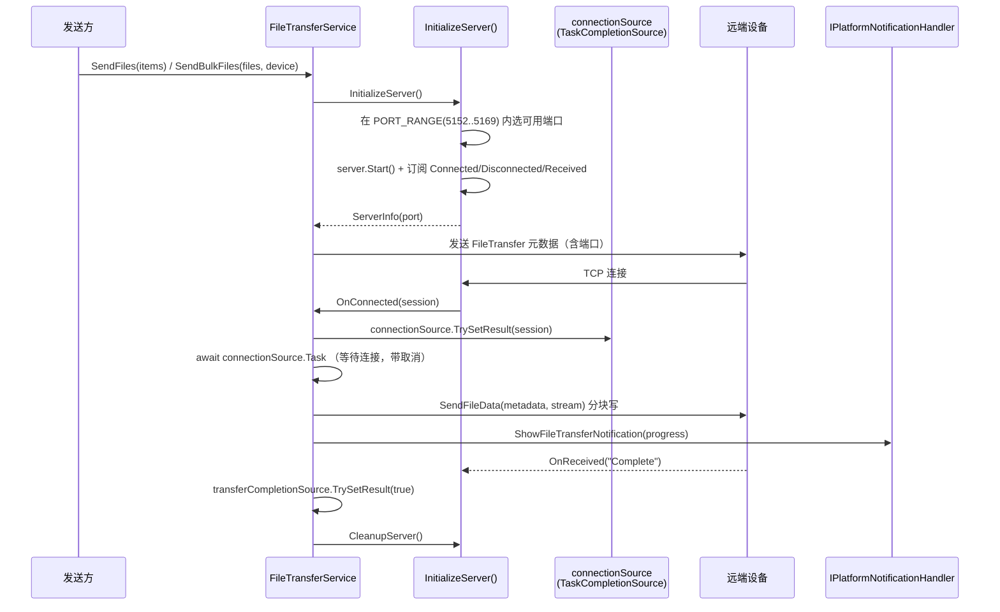

# FileTransferService.cs 拆分计划

> 制定日期：2026-09-17
> 目标文件：`Win/src/NotifyRelay/Services/Media/FileTransferService.cs`
> 基线提交：`31ce450`（分支 `整理项目`）
> 当前规模：**660 物理行**，19 个方法，1 个类
> 目标规模：主类瘦身后 ≤ 280 行，共 3 个文件

---

## 一、拆分必要性（实测）

| 指标 | 实测值 |
|------|--------|
| 物理行数 | 660 |
| 方法数 | 19 |
| 类 | `public class FileTransferService(...) : IFileTransferService, ITcpClientProvider, ITcpServerProvider`（主构造函数） |
| 接口 | `IFileTransferService`（29 行，7 个成员） |
| 外部引用 | 7 处：DI 注册 1（`AppLifecycleHelper.cs:514`）、`ClipboardService`（字段 + 构造参数）、`WindowsNotificationHandler.cs:502`、`App.xaml.cs:218`、`MainPageViewModel.cs:23` |
| 额外接口 | `ITcpClientProvider`、`ITcpServerProvider`（**由本类实现，被网络层用**） |

### 1.1 方法分组（实测行号）

| # | 分组 | 方法 | 行号区间 | 行数 |
|---|------|------|----------|------|
| A | 发送 | `SendFiles`、`SendFile`、`SendBulkFiles`、`SendFileData` | 320~579 | **~260** |
| B | 接收 | `ReceiveBulkFiles`、`CleanupFileStream`、`ReceiveFile` | 47~225 | **~179** |
| C | 服务端生命周期 | `InitializeServer`、`CleanupServer` | 580~626 | ~47 |
| D | 客户端事件回调 | `OnConnected`、`OnDisconnected`、`OnError`、`OnReceived`、`CleanupClient` | 226~319 | ~94 |
| E | 服务端事件回调 | `OnConnected(session)`、`OnDisconnected(session)`、`OnReceived(session,...)` | 627~660 | ~34 |
| F | 取消 | `CancelTransfer` | 42~46 | ~5 |

### 1.2 关键时序（**必须保持**）



**关键约束**：
- `connectionSource` / `transferCompletionSource` 两个 `TaskCompletionSource` 是**连接与传输完成的核心同步原语**，`TrySetResult` 的调用点（事件回调）与 `await` 点（发送/接收方法）分处不同方法。拆分后**必须仍在同一实例内共享**，不能让发送器与服务端各持一份。
- `PORT_RANGE = Enumerable.Range(5152, 18)` 与 `notificationSequence`（自增）为实例状态。

---

## 二、采用策略：抽取协作者 + 主类保留共享状态（**必须遵守**）

对齐 `AdbService` 先例（子服务不进 DI，由主类 `new`）。但本文件有**特殊约束**：

### 2.1 关键决策：`TaskCompletionSource` 与 `Server/Client` 必须留在主类

`connectionSource`、`transferCompletionSource`、`client`、`server`、`serverInfo`、`session` 这 6 个字段被**发送路径与服务端事件回调同时访问**。若把它们搬进 `FileTransferSender` 或 `FileTransferServer`，就会出现「事件回调在 A 类、await 在 B 类」的跨类同步，必须额外引入回调或共享状态对象——**徒增风险**。

**因此本计划采用「按方法组搬移 + 状态留主类」的务实方案**：

- 主类**保留全部可变状态字段**（§1.2 所列 6 个 + `storageLocation`、`currentFileStream`、`currentFileMetadata`、`bytesTransferred`、`currentTransfer`、`cancellationTokenSource`、`notificationSequence`）。
- 抽出的协作者通过**构造参数接收主类实例**或**回调委托**访问这些状态。

> 若你判断「子类持主类引用」比「维持现状」更难维护，**允许只在 `FileTransferServer` 上做拆分**（见步骤 3 的可选性），并在提交信息中说明。**不得**为了追求彻底拆分而改动 §1.2 的同步语义。

### 2.2 为什么不用 partial 分文件
本类有 19 个**真方法**（非属性转发），且外部还依赖 `ITcpClientProvider`/`ITcpServerProvider` 两个接口实现。partial 分文件虽然零风险，但无法解决「19 个方法混在一处」的可读性问题。故采用**抽取 + 主类编排**。

---

## 三、目标结构

```
Services/Media/
├── FileTransferService.cs        ← 瘦身至 ~260 行（协调者 + 全部可变状态）
│      类声明、全部字段、构造函数、
│      CancelTransfer、SendFiles、ReceiveFile/ReceiveBulkFiles 入口转发
└── FileTransfer/
    ├── FileTransferSender.cs     ← 新增 ~250 行（SendFile/SendBulkFiles/SendFileData 分块发送）
    └── FileTransferServer.cs     ← 新增 ~120 行（InitializeServer/CleanupServer + 服务端事件）
```

> 新建子目录 `Services/Media/FileTransfer/`，与 `Services/Adb/`、`Services/Settings/` 的既有惯例一致。

### 3.1 各文件职责

| 文件 | 负责 | 不负责 |
|------|------|--------|
| **`FileTransferService`** | 实现 `IFileTransferService` + `ITcpClientProvider` + `ITcpServerProvider`；持有全部可变状态与两个 `TaskCompletionSource`；公开方法签名不变；接收路径 `ReceiveFile`/`ReceiveBulkFiles`/`CleanupFileStream` 及客户端事件回调（分组 D）**可留在主类** | 不含 `SendFileData` 的分块循环细节 |
| **`FileTransferSender`** | `SendFile`、`SendBulkFiles`、`SendFileData` 的文件流读取与分块写；进度通知节流 | 不创建/持有 `Server`；不解析端口范围；不碰接收状态 |
| **`FileTransferServer`** | `InitializeServer`（端口探测 + 启动 + 订阅）、`CleanupServer`、服务端三个事件回调 | 不读文件内容；不发送业务数据 |

### 3.2 依赖方向（避免循环）

```
FileTransferService ──> FileTransferServer ──> (回调) FileTransferService.OnServerConnected
        │
        └──> FileTransferSender ──> (回调) FileTransferService 暴露的进度/完成通知
```

- `FileTransferServer` 在 `OnConnected(ServerSession)` 里需 `connectionSource.TrySetResult(session)` → 通过**注入 `Action<ServerSession>` 回调**实现（参考 `AdbService` 中 `RestartAdbClientAsync` 回调注入先例）。
- `FileTransferSender` 需 `connectionSource.Task` 才能拿到 session → 通过注入 `Func<Task<ServerSession>>` 获取，**不要**直接把 `TaskCompletionSource` 交给它（避免它误 `TrySetResult`）。

---

## 四、执行步骤

**每步完成后立即构建**（见 §6.1）。

### 步骤 1：新建子目录与骨架
```
Services/Media/FileTransfer/FileTransferServer.cs
Services/Media/FileTransfer/FileTransferSender.cs
```

### 步骤 2：抽出 `FileTransferServer`
1. 搬入 `InitializeServer`（580~613）、`CleanupServer`（614~626）、服务端事件 `OnConnected(ServerSession)`(628)、`OnDisconnected(ServerSession)`(633)、`OnReceived(ServerSession,...)`(643)。
2. 构造参数：主类需传入 `(server 字段的访问方式, Action<ServerSession> onConnected, Action onDisconnected, Action<byte[],long,long> onReceived)`。
   > 但 `server` 字段归主类所有 → 建议把 `server`/`serverInfo` 的**所有权也一并交给 `FileTransferServer`**，而 `connectionSource`/`transferCompletionSource` 留主类，通过回调连接。这样更干净。
3. `PORT_RANGE` 随 `InitializeServer` 一并搬入。

### 步骤 3：抽出 `FileTransferSender`（可选，若步骤 2 后主类已 ≤ 300 行可跳过）
1. 搬入 `SendFile`（367~435）、`SendBulkFiles`（436~513）、`SendFileData`（514~579）。
2. 构造参数：`Func<Task<ServerSession>> getSession`、进度回调、`ILogger`、`IPlatformNotificationHandler`。
3. 主类 `IFileTransferService` 的 `SendFile`/`SendBulkFiles` 改为一行转发。

### 步骤 4：主类收尾
确认 `ReceiveFile`/`ReceiveBulkFiles`/客户端事件回调仍在主类且**未被改动**。

---

## 五、严格禁止事项

1. **不得修改 `IFileTransferService.cs`**（7 个成员签名不变）。
2. **不得修改 `ITcpClientProvider` / `ITcpServerProvider` 的实现契约**（本类仍须实现它们；这两个接口被网络层按具体类型解析）。
3. **不得修改 `AppLifecycleHelper.cs:514` 的 DI 注册**；不得把新类注册进 DI 容器。
4. **不得修改 4 处外部消费者**（`ClipboardService`、`WindowsNotificationHandler.cs:502`、`App.xaml.cs:218`、`MainPageViewModel.cs:23`）。
5. **不得改变 §1.2 的连接/完成同步语义**：`connectionSource` 与 `transferCompletionSource` 的 `TrySetResult` 调用点与 `await` 点必须仍指向**同一实例**。
6. **不得把 `PORT_RANGE` 从 `Enumerable.Range(5152, 18)` 改掉**（端口区间是协议约定）。
7. **不得修改 `COMPLETE_MESSAGE = "Complete"` 常量值**。
8. **不得改动 `notificationSequence` 的自增语义**（通知去重依赖它）。
9. 不得改动 `OnReceived` 中按 `COMPLETE_MESSAGE` / 偏移量判断的逻辑。
10. 不得引入新的第三方库或异步原语（保持 `TaskCompletionSource`）。

---

## 六、验收标准

### 6.1 构建
```powershell
& 'C:\Program Files\Microsoft Visual Studio\18\Community\MSBuild\Current\Bin\MSBuild.exe' `
  'E:\GitHubCode\01Main\NotifyRelay\worktree\file-transfer\src\NotifyRelay.sln' `
  -p:Platform=x64 -p:Configuration=Debug -v:m -nologo -nodeReuse:false -restore
```
**必须 `EXIT=0`。**

### 6.2 警告基线（由主代理在 `31ce450` 实测，**禁止自行重做基线**）
基线 `EXIT=0`，41s，存量警告**恰好 8 条**：

| # | 警告 | 位置 |
|---|------|------|
| 1 | `CS8604` | `Platforms/Windows/Services/KeyboardHookService.cs(85,13)` |
| 2~8 | `WMC1506` ×7 | `Views/Settings/OverlayLogiBatteryPage.xaml` 行 58,59,63,72,78,82,83 |

Rust 子模块另有 2 条 `dead_code` + 1 条汇总（存量）。
> 增量构建时 `CS8604` 可能被打印两次，比对时按**警告代码 + 文件 + 行号去重**。

### 6.3 结构验收
- 主文件 ≤ 300 行（若跳过步骤 3 则可放宽至 400 行，但需在提交信息中说明原因）。
- 公开方法签名零变化；`IFileTransferService`/`ITcpClientProvider`/`ITcpServerProvider` 三接口仍由主类实现。
- `git status` 只涉及 `Services/Media/` 下文件。

### 6.4 提交
```powershell
cd E:\GitHubCode\01Main\NotifyRelay\worktree\file-transfer
git add -A
git commit -m "refactor(file-transfer): 抽取 FileTransferServer/FileTransferSender 协作者"
```

---

## 七、风险清单

| 风险 | 说明 | 缓解 |
|------|------|------|
| 同步原语割裂 | 两个 TCS 被跨类访问导致死锁/永久等待 | TCS 一律留主类，用回调解耦；对照 §1.2 复核 |
| 端口选择回归 | `InitializeServer` 的端口探测顺序敏感 | 整段搬移，保持 `PORT_RANGE` 遍历顺序 |
| 事件订阅泄漏 | `CleanupServer` 必须反订阅全部事件 | 成对搬移订阅/反订阅代码 |
| 双接口实现分散 | `ITcpClientProvider`/`ITcpServerProvider` 若被误移出主类会破坏网络层解析 | 接口实现声明留在主类 |
| `async void` | 本类存在 `async void SendFiles` | 保持原样，不改为 `async Task`（属行为变更） |
