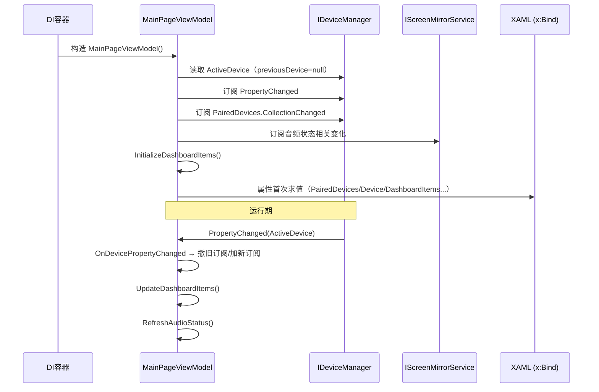

# MainPageViewModel.cs 拆分计划

> 制定日期：2026-09-17
> 目标文件：`Win/src/NotifyRelay/ViewModels/MainPageViewModel.cs`
> 基线提交：`31ce450`（分支 `整理项目`）
> 当前规模：**603 物理行**，19 个方法，1 个 ViewModel
> 目标规模：主文件瘦身后 ≤ 190 行，共 4 个文件

---

## 一、拆分必要性（实测）

| 指标 | 实测值 |
|------|--------|
| 物理行数 | 603 |
| 类声明 | `public sealed partial class MainPageViewModel : BaseViewModel`（**已是 partial**） |
| 方法数 | 19（含 11 个 `[RelayCommand]`） |
| 外部引用 | **仅 5 处**：DI 注册（`AppLifecycleHelper.cs:585`）、`MainPage.xaml.cs:16`、`NotificationsListControl.xaml.cs:8` |
| XAML 绑定 | `Views/MainPage.xaml` 大量 `x:Bind ViewModel.Xxx`（`Device`、`LoadingScrcpy`、`AudioStatusIcon`、`AudioStatusText`、各 `XxxCommand` 等） |

### 1.1 职责域划分（实测行号）

| # | 域 | 成员 | 行号区间 | 行数 |
|---|-----|------|----------|------|
| A | 服务依赖 | 9 个服务属性（`DeviceManager`、`ScreenMirrorService`、`NotificationService`、`RemoteAppsRepository`、`SessionManager`、`UpdateService`、`FileTransferService`、`NetworkDriveMapper`、`PlaybackService`） | 16~28 | ~13 |
| B | 设备/通知投影属性 | `PairedDevices`、`Notifications`、`GroupedNotifications`、`Device`、`CurrentMusicMediaBlocks`、`LoadingScrcpy`、`IsUpdateAvailable` | 30~33, 70~81 | ~20 |
| C | 仪表盘/混合集合 | `DashboardItems`、`MixedNotifications`、`InitializeDashboardItems`、`UpdateDashboardItems` | 36~69, 284~367 | **~118** |
| D | 音频状态域 | `IsAudioOnlyRunning`、`AudioStatusIcon`、`AudioStatusText`、`RefreshAudioStatus` | 82~115, 368~377 | ~44 |
| E | ADB 信息域 | `AdbConnectionTypes`、`AdbDeviceInfo`、`AdbStatusIcons`、`OnAdbDevicesCollectionChanged` | 117~219, 394~403 | **~113** |
| F | 构造函数 + 设备变更订阅 | 构造函数、`OnDevicePropertyChanged` | 222~283, 378~393 | ~78 |
| G | Commands | 11 个 `[RelayCommand]` 方法 | 410~543 | **~134** |
| H | 其余方法 | `GetDeviceName`、`OpenApp`、`ToggleNotificationPin`、`SendFiles` | 404~408, 545~603 | ~64 |

**判定**：接近阈值（603 行 > 500），职责 ≥ 3 个。属「VM 膨胀型」。

### 1.2 构造订阅时序（**必须保持**）



**关键约束**：构造函数中 `previousDevice = null` 起始、`DeviceManager.PropertyChanged` 回调内「先撤旧订阅、再挂新订阅」的顺序，是**避免事件泄漏**的核心。搬移 `OnDevicePropertyChanged` 时不得改变该顺序。

---

## 二、采用策略：`partial` 分文件（**必须遵守**）

本类**已是 `partial`**，且是 XAML `x:Bind` 绑定的 ViewModel。

**必须用 partial，不得改用组合子对象**，理由：

1. `MainPage.xaml` 中 `x:Bind ViewModel.Device`、`ViewModel.LoadingScrcpy`、`ViewModel.AudioStatusIcon`、`ViewModel.SetRingerModeCommand` 等是**编译期绑定**。若改为嵌套子对象（如 `ViewModel.Audio.StatusIcon`），**所有 XAML 绑定路径都要改**，且 `x:Bind` 会编译失败——这是破坏性改动。
2. `DashboardItems`、`MixedNotifications` 是 `ObservableCollection<object>`，被 XAML 直接迭代绑定；包一层子对象会改变绑定语义。
3. 11 个 `[RelayCommand]` 由 CommunityToolkit MVVM **源生成器**产出 `XxxCommand` 属性。源生成器对 partial 类的**跨文件方法**完全支持——方法搬到任一 partial 分文件，`XxxCommand` 仍生成在同一类上，XAML 绑定路径不变。
4. `[ObservableProperty] public partial bool LoadingScrcpy { get; set; }`（C# 13 partial 属性 + 源生成器）：**只要保持整个类是 partial，属性留在哪个分文件都可以**。
5. partial 各分文件共享类作用域，可直接访问 9 个 `private ... { get; }` 服务属性，**无需提升可见性**。

---

## 三、目标结构

```
ViewModels/
├── MainPageViewModel.cs                    ← 主文件（瘦身至 ~180 行）
│      类声明、A 服务依赖、B 设备/通知投影属性、
│      F 构造函数 + OnDevicePropertyChanged、
│      GetDeviceName
├── MainPageViewModel.Dashboard.cs          ← ~120 行（C：仪表盘/混合集合）
│      DashboardItems、MixedNotifications、
│      InitializeDashboardItems、UpdateDashboardItems
├── MainPageViewModel.AdbStatus.cs          ← ~115 行（E + D）
│      AdbConnectionTypes、AdbDeviceInfo、AdbStatusIcons、
│      OnAdbDevicesCollectionChanged、
│      IsAudioOnlyRunning、AudioStatusIcon、AudioStatusText、RefreshAudioStatus
└── MainPageViewModel.Commands.cs           ← ~200 行（G + H）
│      11 个 [RelayCommand] 方法、OpenApp、ToggleNotificationPin、SendFiles
```

> **D（音频状态）与 E（ADB 信息）合并**到 `AdbStatus.cs`：两者都是「设备连接态 → UI 展示」的投影，内聚度高，合并可避免文件过碎。

---

## 四、执行步骤

### 步骤 1：分文件骨架
每个新文件模板：
```csharp
using NotifyRelay.Data.Contracts;   // 按需
using NotifyRelay.Data.Models;      // 按需

namespace NotifyRelay.ViewModels;

public sealed partial class MainPageViewModel
{
    // 从主文件整段剪切搬入
}
```
> **注意**：分文件**不带** `: BaseViewModel` 基类列表（基类列表只允许出现在一处）。

### 步骤 2：逐域搬移（一次一个域，每域构建一次）

| 顺序 | 域 | 行号 | 目标文件 |
|------|-----|------|----------|
| 1 | H 其余方法 | 545~603 | `Commands.cs` |
| 2 | G Commands | 410~543（含 `#region Commands` / `#endregion` 成对搬走） | `Commands.cs` |
| 3 | E ADB 信息 | 117~219 + 394~403 | `AdbStatus.cs` |
| 4 | D 音频状态 | 82~115 + 368~377 | `AdbStatus.cs` |
| 5 | C 仪表盘 | 36~69 + 284~367 | `Dashboard.cs` |
| 6 | 主文件收尾 | — | — |

> **域 E 与域 D 在原文件中交错**（82~115 是音频，117~219 是 ADB，368~377 是 `RefreshAudioStatus`，394~403 是 `OnAdbDevicesCollectionChanged`）。按行号逐段剪切，不要整块搬。

### 步骤 3：主文件收尾
主文件应保留：类声明 + 9 个服务属性 + 6 个投影属性（`PairedDevices`/`Notifications`/`GroupedNotifications`/`Device`/`CurrentMusicMediaBlocks`/`LoadingScrcpy`/`IsUpdateAvailable`）+ 构造函数 + `OnDevicePropertyChanged` + `GetDeviceName`。

---

## 五、严格禁止事项

1. **必须保持 `partial` 关键字**（`line 14`）——删除它会直接导致源生成器与 XAML 绑定全部失败。
2. **不得修改任何属性名、方法名**（XAML `x:Bind` 与源生成器命名都依赖它们）。
3. **不得删除或改动 `[RelayCommand]` / `[ObservableProperty]` 特性**；不得把 `[RelayCommand]` 方法改为非 partial 形式。
4. **不得修改 `MainPage.xaml`、`MainPage.xaml.cs`、`NotificationsListControl.xaml.cs`**。
5. **不得修改构造函数（222~283）的订阅顺序与事件注销逻辑**。
6. **不得把服务依赖属性（16~28）改成构造注入**（本 VM 用 `Ioc.Default.GetRequiredService` 字段初始化 + DI 无参构造，改动会影响 DI 注册）。
7. **不得改动 `DashboardItems`/`MixedNotifications` 的 `ObservableCollection<object>` 类型**。
8. **不得修改 `#region` 文本**（整体搬移，`#region Commands`/`#endregion` 成对）。
9. 不得改动 `#if WINDOWS` 条件编译块（`NetworkDriveMapper` 与 `StartftpConnection` 内）。
10. 不得改动 `BaseViewModel`。

---

## 六、验收标准

### 6.1 构建
```powershell
& 'C:\Program Files\Microsoft Visual Studio\18\Community\MSBuild\Current\Bin\MSBuild.exe' `
  'E:\GitHubCode\01Main\NotifyRelay\worktree\main-page-vm\src\NotifyRelay.sln' `
  -p:Platform=x64 -p:Configuration=Debug -v:m -nologo -nodeReuse:false -restore
```
**必须 `EXIT=0`。**

> 本类被 XAML `x:Bind` + MVVM 源生成器双重绑定，**构建通过即证明绑定与命令生成均正确**：属性改名、漏搬 `[RelayCommand]` 都会导致编译错误。

### 6.2 警告基线（由主代理在 `31ce450` 实测，**禁止自行重做基线**）
基线 `EXIT=0`，41s，存量警告**恰好 8 条**：

| # | 警告 | 位置 |
|---|------|------|
| 1 | `CS8604` | `Platforms/Windows/Services/KeyboardHookService.cs(85,13)` |
| 2~8 | `WMC1506` ×7 | `Views/Settings/OverlayLogiBatteryPage.xaml` 行 58,59,63,72,78,82,83 |

> `WMC1506` 与本次拆分无关，**不得试图修复**。
> 增量构建时 `CS8604` 可能被打印两次，比对时按**警告代码 + 文件 + 行号去重**。

### 6.3 结构验收
- 主文件 ≤ 190 行；`Commands.cs` 允许 ~200 行。
- 全部 4 个文件均含 `partial class MainPageViewModel`，且**只有一个**文件带 `: BaseViewModel`。
- **`git status` 只涉及 `ViewModels/MainPageViewModel*.cs`**——XAML 与 `MainPage.xaml.cs` 必须零改动。
- 搬移前后 `[RelayCommand]` 计数应为 11，`[ObservableProperty]` 计数不变。

### 6.4 提交
```powershell
cd E:\GitHubCode\01Main\NotifyRelay\worktree\main-page-vm
git add -A
git commit -m "refactor(main-vm): 按展示域将 MainPageViewModel 拆为 partial 分文件"
```

---

## 七、风险清单

| 风险 | 说明 | 缓解 |
|------|------|------|
| 丢失 `partial` | 源生成器与 XAML 绑定全面失败 | 不触碰类声明行 |
| 命令生成位置 | `[RelayCommand]` 需在同一 partial 类内 | 仅移动文件位置，不移动类 |
| 事件订阅顺序 | 构造函数内订阅顺序影响泄漏 | 构造函数整段不动 |
| `#region` 悬空 | `#region Commands` 未成对搬移 | 每域搬完立即构建 |
| `#if WINDOWS` 跨文件 | 条件编译块被切断 | `StartftpConnection` 整体搬入 `Commands.cs`，条件编译块一并保留 |
