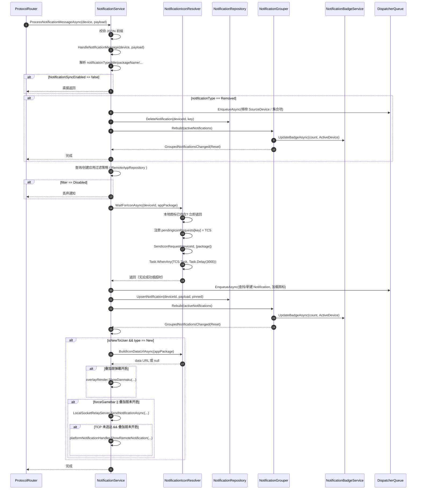
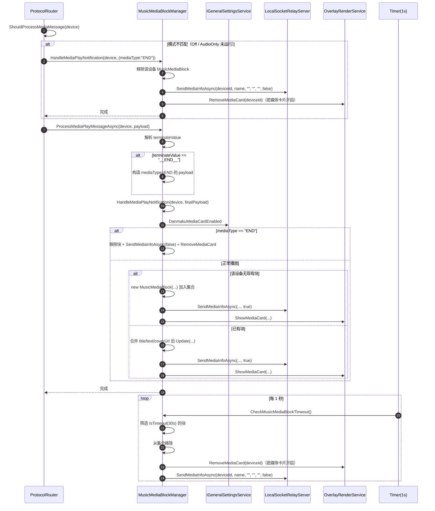
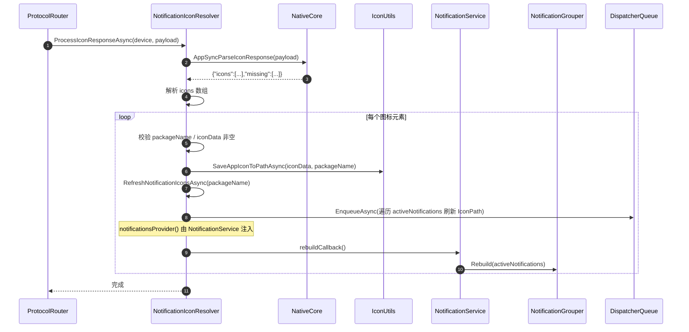
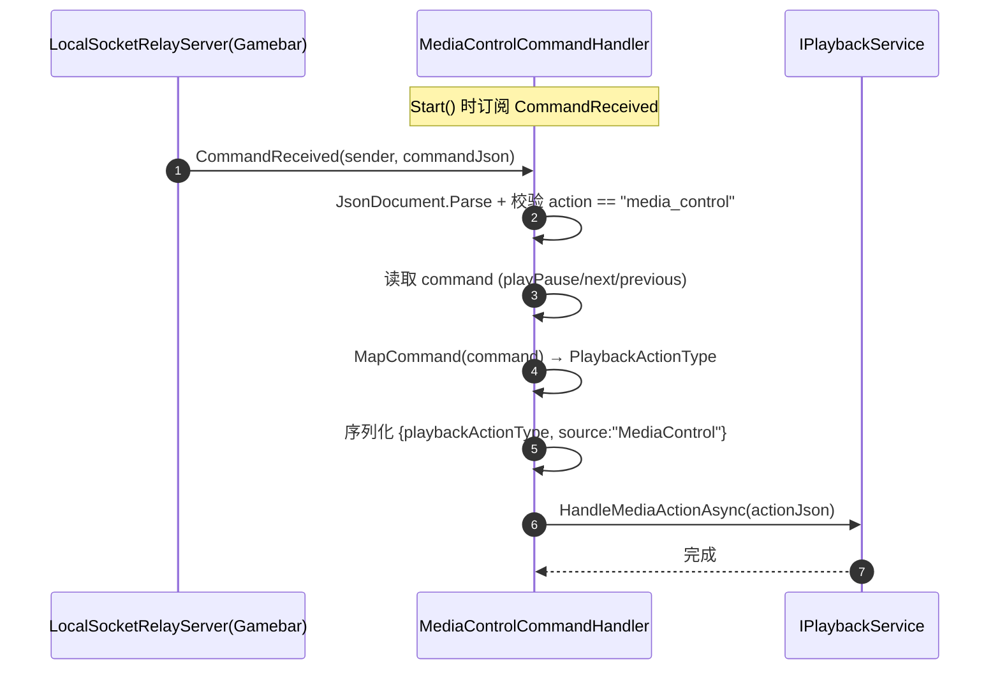
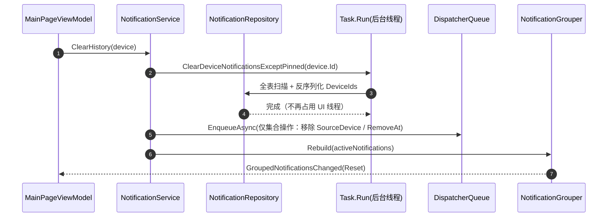

# `Services/NotificationService.cs` 拆分计划

> 目标文件：`Win/src/NotifyRelay/Services/NotificationService.cs`（当前 **991 行 / 22 方法**）
> 关联分析：[`GodClassAnalysis.md`](./GodClassAnalysis.md)（本节已移出该文档）
> 构建验证：`msbuild -p:Platform=x64`（`Win` 目录）
> 拆分原则：先提取后修改、每阶段独立提交、每阶段构建对比无新增错误/警告

---

## 一、现状：成员清单与归属判定

### 1.1 全部成员（按当前行号）

| 行号 | 成员 | 类型 | 目标归属 |
|------|------|------|----------|
| 29 | `dispatcher` | 字段 | **保留**（核心，UI 线程切换） |
| 31 | `activeNotifications` | 字段 | **保留**（核心集合） |
| 32 | `groupedNotifications` | 字段 | → `NotificationGrouper` |
| 35–36 | `_currentMusicMediaBlocks` / `...ReadOnly` | 字段 | → `MusicMediaBlockManager` |
| 37–38 | `_musicMediaBlockTimer` / `MUSIC_MEDIA_BLOCK_TIMEOUT` | 字段/常量 | → `MusicMediaBlockManager` |
| 41–42 | `pendingIconRequests` / `ICON_REQUEST_TIMEOUT` | 字段/常量 | → `NotificationIconResolver` |
| 47–50 | `PropertyChanged` / `OnPropertyChanged` | 事件 | **保留**（`CurrentMusicMediaBlocks` 转发需要） |
| 55–63 | `GroupedNotificationsChanged` / `OnGroupedNotificationsChanged` | 事件 | → `NotificationGrouper` |
| 68 | `NotificationHistory` | 属性 | **保留** |
| 73 | `GroupedNotificationHistory` | 属性 | **保留**（转发到 Grouper） |
| 78 | `CurrentMusicMediaBlocks` | 属性 | **保留**（转发到 Manager） |
| 81–97 | `Initialize` | 方法 | **保留**（改为编排新组件的启动） |
| 99–130 | `OnSocketCommandReceived` | 方法 | → `MediaControlCommandHandler`（阶段5 L1） |
| 136–353 | `HandleNotificationMessage` | 方法 | **保留**（核心，但内部 3 段被抽走） |
| 355–393 | `RemoveNotification` | 方法 | **保留** |
| 395–409 | `TogglePinNotification` | 方法 | **保留** |
| 411–421 | `ClearAllNotification(device)` | 方法 | **保留** |
| 426–454 | `ClearAllNotificationall()` | 方法 | **保留** |
| 459–483 | `ClearAllNotifications(appPackage)` | 方法 | **保留** |
| 485–518 | `ClearHistory(device)` | 方法 | **保留** |
| 522–648 | `UpdateActiveNotifications` | 方法 | → `NotificationGrouper`（含 badge 段，阶段4再剥离） |
| 650–657 | `ParseNotificationTime` | 方法 | → `NotificationGrouper`（私有静态） |
| 659–754 | `LoadAllNotificationsAsync` | 方法 | **保留**（→ 阶段5 L2 再抽 `NotificationHistoryLoader`） |
| 759–773 | `ClearBadge` | 方法 | → `NotificationBadgeService` |
| 776–791 | `IsAppActiveAsync` | 方法 | **保留**（`#if WINDOWS` 过滤判定） |
| 799–919 | `HandleMediaPlayNotification` | 方法 | → `MusicMediaBlockManager` |
| 924–936 | `ConvertCoverUrlToBytes` | 方法 | → `MusicMediaBlockManager`（私有静态） |
| 941–966 | `CheckMusicMediaBlockTimeout` | 方法 | → `MusicMediaBlockManager` |
| 973–1004 | `HandleIconResponse` | 方法 | → `NotificationIconResolver`（拆为刷新子方法） |
| 1006–1036 | `ProcessMediaPlayMessageAsync` | 方法 | → `MusicMediaBlockManager` |
| 1038–1104 | `ProcessIconResponseAsync` | 方法 | → `NotificationIconResolver` |
| 1106–1127 | `ProcessNotificationMessageAsync` | 方法 | **保留** |

### 1.2 `HandleNotificationMessage` 内部被抽走的 3 段

| 行号 | 片段 | 抽往 |
|------|------|------|
| 214–231 | 图标缺失判定 → `SendIconRequest` → `pendingIconRequests` 注册 → `Task.WhenAny` 超时等待 | `NotificationIconResolver.WaitForIconAsync` |
| 294–322 | 图标文件读取 → 扩展名→MIME 映射 → base64 → `data:` URL | `NotificationIconResolver.BuildIconDataUrlAsync` |
| 540–550（在 `UpdateActiveNotifications` 内） | 角标 XML 构造与 `BadgeUpdater.Update` | `NotificationBadgeService.UpdateBadgeAsync` |

### 1.3 拆分后行数预估

| 文件 | 预估行数 | 说明 |
|------|----------|------|
| `NotificationService.cs`（阶段1–4 后） | **~520** | 核心 CRUD + 历史加载 + Socket 命令 + 转发 |
| `MusicMediaBlockManager.cs` | ~200 | 音乐块生命周期 + 超时 + 封面转换 |
| `NotificationIconResolver.cs` | ~150 | 请求等待 + 响应解析 + 刷新 + dataURL |
| `NotificationGrouper.cs` | ~145 | 排序 + 分组 + 事件 |
| `NotificationBadgeService.cs` | ~55 | 角标设置/清除 |
| `MediaControlCommandHandler.cs`（阶段5 L1） | ~50 | `media_control` 指令处理 |
| `NotificationHistoryLoader.cs`（阶段5 L2） | ~110 | 历史通知加载与聚合 |
| `NotificationService.cs`（阶段5–6 后） | **~330** | 仅核心 CRUD + 转发 |

> 注：与 `GodClassAnalysis.md` 原估计的"瘦身后 ~350 行"不同——该文件未计入 `LoadAllNotificationsAsync`（96 行）与 `HandleNotificationMessage`（218 行）保留在核心内。以本计划实测预估为准。

---

## 二、目标结构

```
Services/Notification/                      （新目录）
├── NotificationGrouper.cs                  — 排序/分组/集合变化事件
├── MusicMediaBlockManager.cs               — 音乐媒体块生命周期 + 超时定时器
├── NotificationIconResolver.cs             — 图标请求/响应/缓存刷新/dataURL
└── NotificationBadgeService.cs             — 角标设置与清除

Data/Contracts/
├── INotificationService.cs                 （缩减：移除 5 个入口方法）
├── INotificationGrouper.cs                 （新）
├── IMusicMediaBlockManager.cs              （新）
├── INotificationIconResolver.cs            （新）
└── INotificationBadgeService.cs            （新）

Services/NotificationService.cs             （瘦身后 ~520 行，作为聚合门面）
```

---

## 三、契约定义

### 3.1 `INotificationGrouper`

```csharp
public interface INotificationGrouper
{
    ReadOnlyObservableCollection<GroupedNotification> GroupedNotificationHistory { get; }
    event System.Collections.Specialized.NotifyCollectionChangedEventHandler? GroupedNotificationsChanged;

    /// <summary>按时间重排 activeNotifications 并重建分组集合</summary>
    void Rebuild(ObservableCollection<Notification> activeNotifications, PairedDevice? activeDevice = null);
}
```

### 3.2 `IMusicMediaBlockManager`

```csharp
public interface IMusicMediaBlockManager
{
    ReadOnlyObservableCollection<MusicMediaBlock> Blocks { get; }

    /// <summary>启动 1s 周期的超时检查定时器（由 NotificationService.Initialize 调用）</summary>
    void StartTimeoutChecker();

    Task HandleMediaPlayNotification(PairedDevice device, string payload);
    Task ProcessMediaPlayMessageAsync(PairedDevice device, string payload);
    void CheckMusicMediaBlockTimeout();
}
```

### 3.3 `INotificationIconResolver`

```csharp
public interface INotificationIconResolver
{
    /// <summary>本地无图标时发送请求并等待响应，最长 ICON_REQUEST_TIMEOUT 毫秒</summary>
    Task WaitForIconAsync(string deviceId, string appPackage);

    /// <summary>读取本地图标文件并编码为 data URL，失败返回 null</summary>
    Task<string?> BuildIconDataUrlAsync(string appPackage);

    /// <summary>解析 DATA_ICON_RESPONSE，落盘图标并刷新相关通知</summary>
    Task ProcessIconResponseAsync(PairedDevice device, string payload);

    /// <summary>刷新指定包名下所有通知的图标并请求重建分组</summary>
    Task RefreshNotificationIconsAsync(string packageName);
}
```

### 3.4 `INotificationBadgeService`

```csharp
public interface INotificationBadgeService
{
    Task UpdateBadgeAsync(int count, PairedDevice? activeDevice);
    Task ClearBadgeAsync();
}
```

### 3.5 `INotificationService`（缩减后）

**移除**以下 5 个成员（调用方改为直接依赖新接口）：

- `Task HandleMediaPlayNotification(...)` → `IMusicMediaBlockManager`
- `void CheckMusicMediaBlockTimeout()` → `IMusicMediaBlockManager`
- `Task ProcessMediaPlayMessageAsync(...)` → `IMusicMediaBlockManager`
- `Task ProcessIconResponseAsync(...)` → `INotificationIconResolver`
- `void HandleIconResponse(string, string)` → `INotificationIconResolver`（改为 `RefreshNotificationIconsAsync`）

**保留**（作为聚合门面，避免 UI 层多处改动）：

- `NotificationHistory` / `GroupedNotificationHistory`（转发）/ `CurrentMusicMediaBlocks`（转发）
- `Initialize` / `RemoveNotification` / `TogglePinNotification`
- `ClearAllNotification` / `ClearAllNotificationall` / `ClearAllNotifications(string)` / `ClearHistory`
- `HandleNotificationMessage` / `ProcessNotificationMessageAsync`
- `GroupedNotificationsChanged` 事件（转发 Grouper 事件，供 `NotificationsListControl` 订阅）

---

## 四、依赖与 DI 注册

### 4.1 依赖矩阵

| 新类 | 依赖 |
|------|------|
| `NotificationBadgeService` | `ILogger`, `DispatcherQueue` |
| `NotificationGrouper` | `ILogger`, `DispatcherQueue`, `INotificationBadgeService` |
| `MusicMediaBlockManager` | `ILogger`, `DispatcherQueue`, `IGeneralSettingsService`, `OverlayRenderService` |
| `NotificationIconResolver` | `ILogger`, `DispatcherQueue`, `Func<IRemoteAppService>`, 通知集合访问器, 重建回调 |
| `NotificationService` | 原有依赖 + 上述 4 个接口 |

### 4.2 `NotificationIconResolver` 的反向依赖处理

`ProcessIconResponseAsync` 保存图标后需要刷新 `activeNotifications` 里的通知图标并触发重建。为避免 Resolver 反向依赖 `NotificationService`，由 `NotificationService` 在**构造后**注入两个委托（在 `NotificationService` 构造函数体内或 `Initialize` 中）：

```csharp
// NotificationService 内
iconResolver.Configure(
    notificationsProvider: () => activeNotifications,
    rebuildCallback: () => grouper.Rebuild(activeNotifications, deviceManager.ActiveDevice));
```

`Resolver` 内部字段：

```csharp
private Func<IEnumerable<Notification>> notificationsProvider = () => [];
private Action? rebuildCallback;
public void Configure(Func<IEnumerable<Notification>> notificationsProvider, Action rebuildCallback) { ... }
```

### 4.3 `AppLifecycleHelper.ConfigureServices` 变更（第 518–520 行附近）

```csharp
// 6. 注册通知相关服务
.AddSingleton(sp => App.MainWindow.DispatcherQueue)          // 新增：Microsoft.UI.Dispatching.DispatcherQueue
.AddSingleton<INotificationBadgeService, NotificationBadgeService>()
.AddSingleton<INotificationGrouper, NotificationGrouper>()
.AddSingleton<IMusicMediaBlockManager, MusicMediaBlockManager>()
.AddSingleton<INotificationIconResolver, NotificationIconResolver>()
.AddSingleton<INotificationService, NotificationService>()
.AddSingleton<Func<INotificationService>>(sp => () => sp.GetRequiredService<INotificationService>())
```

> `App.MainWindow.DispatcherQueue` 写在注册 lambda 内，仅在首次解析时求值，与当前 `NotificationService` 字段初始化时机等价，不引入新的构造期时序风险。

### 4.4 `ProtocolRouter` 变更（构造函数 + 2 处调用）

```csharp
// 构造函数新增两个参数（替换 notificationServiceFactory 的部分用途）
Func<IMusicMediaBlockManager> musicMediaBlockManagerFactory,
Func<INotificationIconResolver> iconResolverFactory,

// 第 80 行
await musicMediaBlockManager.Value.HandleMediaPlayNotification(device, json);

// 第 84 行
await musicMediaBlockManager.Value.ProcessMediaPlayMessageAsync(device, plaintext);

// 第 91 行
=> iconResolver.Value.ProcessIconResponseAsync(device, plaintext);
```

`Lazy<INotificationService> notificationService` 保留（第 68 行 `OnDataNotificationAsync` 仍走通知通道）。

### 4.5 `MainPageViewModel`

**无需改动** —— `CurrentMusicMediaBlocks`（第 75 行）与 `GroupedNotifications`（第 33 行）仍通过 `INotificationService` 转发获取；第 271 行的 `PropertyChanged` 监听仍由 `NotificationService` 转发 `MusicMediaBlockManager` 的集合实例变化事件。

---

## 五、分阶段实施

### 阶段 1：`NotificationGrouper`（分组/排序）

| 步骤 | 内容 |
|------|------|
| 1.1 | 新建 `Data/Contracts/INotificationGrouper.cs`（§3.1） |
| 1.2 | 新建 `Services/Notification/NotificationGrouper.cs`：搬入 32（`groupedNotifications`）、55–63（事件）、73（属性）、**522–657**（`UpdateActiveNotifications` + `ParseNotificationTime`） |
| 1.3 | `UpdateActiveNotifications` 重命名为 `Rebuild(ObservableCollection<Notification> activeNotifications, PairedDevice? activeDevice = null)`；内部 `OnGroupedNotificationsChanged` 保持不变 |
| 1.4 | `NotificationService`：删除搬走的代码；`GroupedNotificationHistory` 改为 `=> grouper.GroupedNotificationHistory`；`GroupedNotificationsChanged` 改为转发事件（`add`/`remove` 转发到 `grouper`）；**全部 7 处 `UpdateActiveNotifications()` 调用**改为 `grouper.Rebuild(activeNotifications)` |
| 1.5 | DI 注册 `INotificationGrouper` + `DispatcherQueue` |
| 1.6 | 构建验证 + 提交 |

**⚠️ 本阶段为纯搬移**：`Rebuild` 内的 badge 段（原 540–550 行）原样搬入 Grouper，阶段 4 再剥离。

### 阶段 2：`MusicMediaBlockManager`（音乐媒体块）

| 步骤 | 内容 |
|------|------|
| 2.1 | 新建 `Data/Contracts/IMusicMediaBlockManager.cs`（§3.2） |
| 2.2 | 新建 `Services/Notification/MusicMediaBlockManager.cs`：搬入 35–38（字段/常量）、**799–936**（`HandleMediaPlayNotification` + `ConvertCoverUrlToBytes`）、**941–966**（`CheckMusicMediaBlockTimeout`）、**1006–1036**（`ProcessMediaPlayMessageAsync`） |
| 2.3 | 新增 `Blocks` 属性（原 `CurrentMusicMediaBlocks` 实现）与 `StartTimeoutChecker()`（原 `Initialize` 88–93 行的定时器创建） |
| 2.4 | `NotificationService`：`CurrentMusicMediaBlocks` 改为 `=> manager.Blocks`；`Initialize` 内定时器创建改为 `manager.StartTimeoutChecker()`；移除 4 个已搬走方法 |
| 2.5 | `INotificationService` 移除 `HandleMediaPlayNotification` / `CheckMusicMediaBlockTimeout` / `ProcessMediaPlayMessageAsync` |
| 2.6 | `ProtocolRouter`：改注入 `Func<IMusicMediaBlockManager>`，更新第 80、84 行 |
| 2.7 | DI 注册 + 构建验证 + 提交 |

> `MusicMediaBlockManager` 不实现 `INotifyPropertyChanged`：其 `Blocks` 返回**稳定实例**（`??=` 缓存），与现状一致；`MainPageViewModel` 第 271 行的监听由 `NotificationService` 转发满足。

### 阶段 3：`NotificationIconResolver`（图标）

| 步骤 | 内容 |
|------|------|
| 3.1 | 新建 `Data/Contracts/INotificationIconResolver.cs`（§3.3） |
| 3.2 | 新建 `Services/Notification/NotificationIconResolver.cs`：搬入 41–42（字段/常量）；`WaitForIconAsync` ← 原 214–231；`BuildIconDataUrlAsync` ← 原 294–322；`RefreshNotificationIconsAsync` ← 原 973–1004（去掉其中的 `pendingIconRequests` 完成逻辑，仅保留刷新段 986–998）；`ProcessIconResponseAsync` ← 原 1038–1104（第 1091 行改为调用自身 `RefreshNotificationIconsAsync`） |
| 3.3 | `NotificationService`：`HandleNotificationMessage` 内 214–231 → `await iconResolver.WaitForIconAsync(device.Id, appPackage)`；294–322 → `var iconUrlForTcp = await iconResolver.BuildIconDataUrlAsync(appPackage)` |
| 3.4 | `NotificationService` 构造函数内调用 `iconResolver.Configure(...)`（§4.2） |
| 3.5 | `INotificationService` 移除 `ProcessIconResponseAsync` / `HandleIconResponse` |
| 3.6 | `ProtocolRouter`：改注入 `Func<INotificationIconResolver>`，更新第 91 行 |
| 3.7 | DI 注册 + 构建验证 + 提交 |

**原 `HandleIconResponse` 拆分说明**：原方法混合了"完成 pending TCS"（仅被 `ProcessIconResponseAsync` 内部调用）与"刷新通知图标"两个动作。拆分后 TCS 完成逻辑内联进 `ProcessIconResponseAsync`，刷新逻辑独立为 `RefreshNotificationIconsAsync`。

### 阶段 4：`NotificationBadgeService`（徽章）+ 收尾修复

| 步骤 | 内容 |
|------|------|
| 4.1 | 新建 `Data/Contracts/INotificationBadgeService.cs`（§3.4） |
| 4.2 | 新建 `Services/Notification/NotificationBadgeService.cs`：`UpdateBadgeAsync` ← 原 540–550（从 Grouper 中剥出）；`ClearBadgeAsync` ← 原 759–773 |
| 4.3 | `NotificationGrouper` 注入 `INotificationBadgeService`，badge 段改为 `await badgeService.UpdateBadgeAsync(totalNotifications, activeDevice)` |
| 4.4 | `NotificationService` 三处 `ClearBadge()` 调用（86、445、508 行）改为 `badgeService.ClearBadgeAsync()` |
| 4.5 | **修复 F1**（角标恒不设置）：见 §5.4.1 |
| 4.6 | **修复 F2**（异常被吞）：见 §5.4.2 |
| 4.7 | 清理 `NotificationService` 冗余 `using`、补齐 XML 注释；构建验证 + 提交 |

#### 5.4.1 修复 F1 — `activeDevice` 恒为 `null` 导致角标从不设置

**现状**：`UpdateActiveNotifications(PairedDevice? activeDevice = null)` 的 7 处调用**全部无参**，因此 `if (activeDevice?.DeviceSettings.ShowBadge == true)`（原 542 行）恒为 `false`，角标从未被设置过。

**修复**：`NotificationGrouper` 注入 `IDeviceManager`，`Rebuild` 去掉 `activeDevice` 参数，改为内部取 `deviceManager.ActiveDevice`：

```csharp
var activeDevice = deviceManager.ActiveDevice;
if (activeDevice?.DeviceSettings.ShowBadge == true) { /* 设置角标 */ }
```

**⚠️ 行为变化（已确认）**：修复后角标会真正生效，语义为"当前活动设备的未读通知总数"。其中：

- `Initialize` 路径：`ClearBadgeAsync()` → `LoadAllNotificationsAsync()` → `Rebuild` → 角标 = 加载的历史条数（启动时角标可能非 0）。
- 若该表现不符合预期，可选方案：在 `LoadAllNotificationsAsync` 的 `dispatcher.EnqueueAsync` 末尾追加一次 `badgeService.ClearBadgeAsync()`。该分支留待实测后决定，**不在本阶段默认启用**。

#### 5.4.2 修复 F2 — `ClearBadge` 的 try/catch 无法捕获异常

**现状**（原 759–773 行）：

```csharp
try { _ = dispatcher.EnqueueAsync(() => { ...Clear(); }); }   // lambda 在 dispatcher 上异步执行
catch (Exception ex) { logger.LogError(...); }                 // 抓不到 lambda 内异常
```

`EnqueueAsync` 的 `Task` 被 `_ =` 丢弃 → lambda 内异常成为 **未观察任务异常**，日志中丢失。

**修复**：改为在 `BadgeService` 内 `await`：

```csharp
public async Task ClearBadgeAsync()
{
    try
    {
        await dispatcher.EnqueueAsync(() =>
        {
            BadgeUpdateManager.CreateBadgeUpdaterForApplication().Clear();
        });
    }
    catch (Exception ex)
    {
        logger.LogError(ex, "清除角标失败");
    }
}
```

调用点（均在同步上下文）保持显式 fire-and-forget 并注释：`_ = badgeService.ClearBadgeAsync(); // 显式丢弃：异常已在 BadgeService 内记录`

---

## 六、时序图

### 6.1 `DATA_NOTIFICATION` 主流程（拆分后）



### 6.2 `DATA_MEDIAPLAY` 与超时清理（拆分后）



### 6.3 `DATA_ICON_RESPONSE` 处理（拆分后）



---

## 七、验证清单

每阶段执行前后各一次：

```powershell
cd E:\GitHubCode\01Main\NotifyRelay\Win
msbuild -p:Platform=x64
```

| 检查项 | 标准 |
|--------|------|
| 编译错误 | 0 |
| 编译警告 | 与阶段前**完全一致**，无新增 |
| `INotificationService` 接口成员 | 与 §3.5 一致 |
| `NotificationsListControl` 分组事件 | 仍能收到 `Reset` 通知 |
| `MainPageViewModel.DashboardItems` | 媒体块 + 分组仍正常合成 |
| 运行时冒烟 | 接收一条通知 → 列表出现 / 媒体播放 → 卡片出现 → 30s 后消失 / 图标缺失 → 请求后自动补全 |

---

## 八、提交策略

`Win` 为独立 git 仓库，每阶段一次提交：

```
refactor(notification): 提取 NotificationGrouper
refactor(notification): 提取 MusicMediaBlockManager
refactor(notification): 提取 NotificationIconResolver
refactor(notification): 提取 NotificationBadgeService 并修复角标逻辑
refactor(notification): 提取 MediaControlCommandHandler
refactor(notification): 提取 NotificationHistoryLoader
refactor(notification): 统一通知聚合键
fix(notification): UI 线程 lambda 异常不再被吞
perf(notification): 通知 DB 操作移出 UI 线程
```

> 阶段 5/6 内部建议再拆细提交（见 §9.3、§9.5），避免单次改动过大。

文档改动单独提交：`docs(win): NotificationService 拆分计划独立成文`

---

## 九、补充阶段：遗留项 L1–L5 的处理

> 本节由原"遗留项（本轮不处理）"转为**正式实施阶段**，在阶段 1–4 完成后执行。
> 目标：让 `NotificationService` 不再承担媒体控制、历史加载、DB 同步 I/O 等无关职责，并消除 fire-and-forget 造成的异常黑洞。

### 9.1 阶段 5 — L1：提取 `MediaControlCommandHandler`（新建类）

**现状**：`OnSocketCommandReceived`（99–130 行）订阅 `LocalSocketRelayServer.CommandReceived`，把 `media_control` 指令的 `playPause/next/previous` 映射为字符串 `"Play"/"Next"/"Previous"`，再序列化 JSON 交给 `IPlaybackService`。该映射与 `ProtocolRouter.OnDataMediaControlAsync`（121–133 行）**完全重复**，只差一处用 `PlaybackActionType` 枚举、一处用裸字符串。

**变更**：

| 步骤 | 内容 |
|------|------|
| 5.1 | 新建 `Services/Media/MediaControlCommandHandler.cs`：搬入 99–130 行；依赖 `ILogger` + `Func<IPlaybackService>` |
| 5.2 | 映射统一为 `PlaybackActionType` 枚举，序列化用 `actionType.ToString()`，与 `ProtocolRouter` 一致 |
| 5.3 | 新增 `IMediaControlCommandHandler` 契约，仅暴露 `void Start()`（内部订阅 `LocalSocketRelayServer.CommandReceived`）与 `void Stop()` |
| 5.4 | `NotificationService`：删除 `OnSocketCommandReceived`、删除 `IPlaybackService playbackService` 构造参数、删除 `Initialize` 中第 96 行的事件订阅 |
| 5.5 | `AppLifecycleHelper`：注册 `IMediaControlCommandHandler`；在 `NotificationService.Initialize()` 附近调用 `Start()` |
| 5.6 | `ProtocolRouter.OnDataMediaControlAsync` 的 121–133 行改为调用同一映射方法（可选，见下） |

**去重方案**：把映射抽为 `MediaControlCommandHandler` 的静态内部方法或 `PlaybackActionType` 扩展：

```csharp
internal static PlaybackActionType MapCommand(string? command) => command switch
{
    "next" => PlaybackActionType.Next,
    "previous" => PlaybackActionType.Previous,
    _ => PlaybackActionType.Play,
};
```

`ProtocolRouter` 通过注入 `IMediaControlCommandHandler` 复用。**若希望阶段 5 保持最小改动，可先只搬移不去重**，把去重留作独立提交。

**⚠️ 依赖方向**：`NotificationService` 移除 `IPlaybackService` 后，其构造参数减一。需确认 DI 无循环依赖：`MediaControlCommandHandler` → `Func<IPlaybackService>`（与 `ProtocolRouter` 现有用法一致，无环）。

### 9.2 阶段 5 — L2：提取 `NotificationHistoryLoader`

**现状**：`LoadAllNotificationsAsync`（659–754 行，96 行）负责从 DB 读取各设备通知、解析 `DeviceIds`/`DeviceNames`、按聚合键合并、加载图标、回填 `activeNotifications`。

**变更**：

| 步骤 | 内容 |
|------|------|
| 5.7 | 新建 `Services/Notification/NotificationHistoryLoader.cs` + `INotificationHistoryLoader` |
| 5.8 | 契约：`Task<List<Notification>> LoadAsync(IEnumerable<PairedDevice> devices)` —— 只返回聚合后的列表，**不碰 `activeNotifications` 集合** |
| 5.9 | `NotificationService.LoadAllNotificationsAsync` 保留，改为：调用 loader → `dispatcher.EnqueueAsync` 回填 → `grouper.Rebuild` |
| 5.10 | 依赖：`ILogger`、`IDeviceManager`、`NotificationRepository` |

**边界判定**：集合回填仍留在 `NotificationService`（它持有 `activeNotifications`），loader 纯函数化、可单测。

### 9.3 阶段 5 — L3：统一聚合去重键

**现状**：聚合键 `$"{AppPackage}|{Title}|{Text}|{Type}"` 出现在两处：

- `NotificationService.LoadAllNotificationsAsync`（原 718 行）
- `NotificationRepository.UpsertNotification`（70 行，`$"{appPackage}|{title}|{text}|{notificationType}"`）
- 另外 `LocalNotificationListenerService`（283 行）有第三份：`$"{androidPackage ?? appPackage}|{title}|{text}|New"`

三处**必须严格一致**，否则 DB 主键与内存聚合对不上，会导致通知重复或去重失效。

**变更**：

| 步骤 | 内容 |
|------|------|
| 5.11 | 在 `Notification` 模型新增静态工厂：`public static string BuildAggregationKey(string? appPackage, string? title, string? text, NotificationType type)` |
| 5.12 | `NotificationRepository.UpsertNotification` 第 70 行改为调用它（注意：此处 `notificationType` 是**字符串**，需先转 `NotificationType` 或提供字符串重载） |
| 5.13 | `LoadAllNotificationsAsync`（搬入 loader 后）第 718 行改为调用它 |
| 5.14 | `LocalNotificationListenerService` 第 283 行改为调用它（跨文件，建议独立提交） |

**⚠️ 风险**：`LocalNotificationListenerService` 的第三份键把 `type` 硬编码为 `New` 字符串，与 `NotificationType.New` 的 `ToString()` 是否一致需实测确认。若存在大小写/枚举名差异，统一后**会改变去重行为**（可能多推或少推通知）。建议先加日志打印三处键值比对，确认一致后再统一。

### 9.4 阶段 6 — L4：消除 fire-and-forget 异常黑洞

**现状**：`dispatcher.EnqueueAsync` 共 14 处，其中 **7 处**用 `_ =` 丢弃（361、397、428、461、487、524、763、986 行），lambda 内异常成为未观察任务异常，日志完全丢失。

**变更原则**（按 §七 `AGENTS.md` 的"不抑制警告"要求）：

| 位置 | 处理 |
|------|------|
| 763（`ClearBadge`） | 已在阶段 4 的 F2 修复 |
| 361 `RemoveNotification` | 改为 `async void` 包装器 + 内部 `await` + `try/catch` |
| 397 `TogglePinNotification` | 同上 |
| 428 `ClearAllNotificationall` | 同上 |
| 461 `ClearAllNotifications(pkg)` | 同上 |
| 487 `ClearHistory` | 同上 |
| 524 `UpdateActiveNotifications`（已搬入 Grouper） | 同上 |
| 986 `HandleIconResponse`（已搬入 Resolver） | 同上 |

**统一模式**（各新类内）：

```csharp
private async void RunOnUiThread(Func<Task> action)
{
    try { await dispatcher.EnqueueAsync(action); }
    catch (Exception ex) { logger.LogError(ex, "UI 线程操作失败"); }
}
// 调用点：RunOnUiThread(() => { ...; return Task.CompletedTask; });
```

> `async void` 仅用于事件处理器/显式 fire-and-forget 入口，且内部必须 try/catch —— 这是 WinUI 中的既定惯例，不算抑制警告。

### 9.5 阶段 6 — L5：`NotificationRepository` 同步调用移出 UI 线程

**现状**：以下同步 DB 调用发生在 `dispatcher.EnqueueAsync` 的 lambda 内（即 UI 线程上）：

| 调用点 | 方法 | 所在 lambda |
|--------|------|-------------|
| 200 | `DeleteNotification` | `HandleNotificationMessage`（179 行） |
| 278 | `UpsertNotification` | `HandleNotificationMessage`（233 行） |
| 377、381 | `DeleteNotification` | `RemoveNotification`（361 行） |
| 404 | `UpdatePinned` | `TogglePinNotification`（397 行） |
| 442 | `ClearDeviceNotificationsExceptPinned` | `ClearAllNotificationall`（428 行，且**在 foreach 内**） |
| 472 | `DeleteNotification` | `ClearAllNotifications`（461 行，且**在嵌套 foreach 内**） |
| 509 | `ClearDeviceNotificationsExceptPinned` | `ClearHistory`（487 行） |

其中 `DeleteNotification` / `ClearDeviceNotificationsExceptPinned` 内部还会 `Table<>().ToList()` **全表扫描**并逐条 JSON 反序列化（见 `NotificationRepository` 133、184、236、288、340 行），在 UI 线程上是明显卡顿源。

**变更**（分两步，先易后难）：

**步骤 5.15（低风险，先做）**：把"DB 操作"从 UI lambda 中**前置/后置**到 `await Task.Run(...)`：

```csharp
// 以 ClearHistory 为例
await Task.Run(() => notificationRepository.ClearDeviceNotificationsExceptPinned(device.Id)); // 在 UI 操作前
await dispatcher.EnqueueAsync(() => { /* 仅集合操作 */ });
```

适用于 442、472、509 这类"DB 操作与集合操作无顺序耦合"的场景。

**步骤 5.16（较高风险，需实测）**：200、278、404 三处的 DB 写依赖 UI lambda 内的判定结果（如 `notification.Pinned`），不能简单前置。方案：在 lambda 内**先取出需要的快照值**，再 `Task.Run` 写库：

```csharp
var pinned = notification.Pinned;   // UI 线程取值
await Task.Run(() => notificationRepository.UpsertNotification(device.Id, payload, pinned));
```

**⚠️ 约束**：`Task.Run` 内的 SQLite 调用需注意 `DatabaseContext` 是 Singleton 且 `SQLiteConnection` 非线程安全。当前代码已在 `LoadAllNotificationsAsync`（668 行）与 `LocalNotificationHistoryViewModel`（40、56、73 行）使用 `Task.Run` 包 DB 调用，说明**现有用法已接受该风险**；本阶段沿用同一模式，不引入新的一致性模型。若实测出现 `SQLiteException: database is locked`，则应改为串行化队列，属独立议题。

### 9.6 补充阶段的时序图

#### L1：`media_control` 指令（拆分后）



**拆分前对比**：原链路为 `LocalSocketRelayServer → NotificationService.OnSocketCommandReceived → IPlaybackService`，通知服务被迫持有 `IPlaybackService`。

#### L5：`ClearHistory` 的 DB 调用移出 UI 线程（步骤 5.15 后）



### 9.7 更新后的阶段总览

```
阶段1: NotificationGrouper            （§五 阶段1）
阶段2: MusicMediaBlockManager          （§五 阶段2）
阶段3: NotificationIconResolver        （§五 阶段3）
阶段4: NotificationBadgeService + F1/F2（§五 阶段4）
阶段5: L1 MediaControlCommandHandler
       L2 NotificationHistoryLoader
       L3 聚合键统一（建议拆为 3 次提交）
阶段6: L4 fire-and-forget 异常捕获
       L5 DB 调用移出 UI 线程（建议拆为 5.15 / 5.16 两次提交）
```

### 9.8 补充阶段的验证要点

| 编号 | 验证点 |
|------|--------|
| L1 | Gamebar 发送 `media_control` → 本地媒体响应；`NotificationService` 构造参数不再含 `IPlaybackService` |
| L2 | 冷启动后历史通知条数、顺序、图标与改动前一致 |
| L3 | 打印三处聚合键比对；重复通知不再重复入库 |
| L4 | 人为在 lambda 内抛异常 → 日志可见（改动前不可见） |
| L5 | 大量通知（>200 条）下点击"清除全部"不卡顿；DB 无 `database is locked` |

### 9.9 补充提交

```
refactor(notification): 提取 MediaControlCommandHandler
refactor(notification): 提取 NotificationHistoryLoader
refactor(notification): 统一通知聚合键
fix(notification): UI 线程 lambda 异常不再被吞
perf(notification): 通知 DB 操作移出 UI 线程
```
