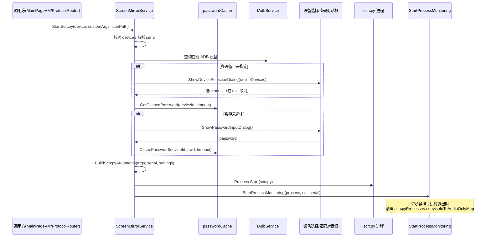

# ScreenMirrorService.cs 拆分计划

> 制定日期：2026-09-17
> 目标文件：`Win/src/NotifyRelay/Services/Media/ScreenMirrorService.cs`
> 基线提交：`31ce450`（分支 `整理项目`）
> 当前规模：**867 物理行**，14 个方法，1 个类
> 目标规模：主类瘦身后 ≤ 300 行，共 4 个文件

---

## 一、拆分必要性（实测）

| 指标 | 实测值 |
|------|--------|
| 物理行数 | 867 |
| 方法数 | 14 |
| 主类 | `public class ScreenMirrorService(...) : IScreenMirrorService, IDisposable`（主构造函数，无字段声明区） |
| 接口 | `IScreenMirrorService`（16 行，5 个成员） |
| 外部引用 | 仅 4 处走接口：`ProtocolRouter`（2）、`TrayIconControl.xaml.cs`、`AppsViewModel`、`MainPageViewModel`；DI 注册 1 处 `AppLifecycleHelper.cs:513` |

### 1.1 方法规模分布（实测行号）

| 方法 | 行号 | 行数 | 职责 |
|------|------|------|------|
| `StartScrcpy` | 30~361 | **~332** | 巨型方法：进程启动 + 密码缓存 + 参数构建 + 设备选择对话框 |
| `StartProcessMonitoring` | 362~481 | ~120 | 进程生命周期监控 |
| `ShowDeviceSelectionDialog` | 482~541 | ~60 | 对话框交互 |
| `BuildScrcpyArguments` | 542~712 | **~171** | scrcpy 命令行参数构建 |
| `SelectScrcpyLocationClick` | 713~725 | ~13 | 文件选择 |
| `ShowPasswordInputDialog` | 726~746 | ~21 | 对话框交互 |
| `GetCachedPassword` / `CachePassword` | 747~767 | ~21 | 密码缓存 |
| `StopScrcpy` / `StopScrcpyByDeviceId` | 768~794 | ~27 | 进程停止 |
| `IsAudioOnlyRunning` | 795~804 | ~10 | 状态查询 |
| `ProcessAudioRequestAsync` | 805~846 | ~42 | 音频请求 |
| `Dispose` | 847~867 | ~21 | 资源释放 |

**判定**：单方法 `StartScrcpy` 占全文件 38%，混入 4 类职责。属 🟡 警告级巨石类。

### 1.2 核心时序约束（`StartScrcpy` 内部，必须保持不变）



**关键**：`passwordCache` 是 `readonly Dictionary`（非线程安全），`GetCachedPassword`/`CachePassword` 必须与调用点同线程语义；搬到新类时**不得改成并发集合**。

---

## 二、采用策略：抽取内部协作者 + 主类保留编排

对齐 `AdbService` 拆分先例（外观/协调者 + 子服务，子服务不进 DI 容器，由主类 `new` 出来）。

- **本类必须继续实现 `IScreenMirrorService`**，4 个外部消费者与 DI 注册**一行不改**。
- 新协作者作为 `private readonly` 字段由主构造函数体 `new` 出来，**不注册到 DI**。
- 主类的公开方法保持签名不变，公开方法体可改为「一行转发」。

---

## 三、目标结构

```
Services/Media/
├── ScreenMirrorService.cs            ← 瘦身至 ~250 行（编排者/外观）
├── ScrcpyProcessManager.cs           ← 新增 ~180 行（进程启动/监控/停止）
├── ScrcpyConfigBuilder.cs            ← 新增 ~180 行（命令行参数构建）
└── ScrcpyPasswordCache.cs            ← 新增 ~70 行（密码缓存 + 密码对话框）
```

### 3.1 各文件职责

| 文件 | 负责 | 不负责 |
|------|------|--------|
| **`ScreenMirrorService`** | 实现 `IScreenMirrorService`；持有 `devices`/`dispatcher`/`cts`；编排 `StartScrcpy` 主流程；`ProcessAudioRequestAsync`、`Dispose`、`IsAudioOnlyRunning`；`deviceIdToAudioOnlyMap`/`deviceIdToSerialMap` 的所有权 | 不直接 `Process.Start`；不构建命令行字符串；不管理密码缓存内容 |
| **`ScrcpyProcessManager`** | `scrcpyProcesses` 字典所有权；启动进程（含 scrcpy 路径解析）；`StartProcessMonitoring`；`StopScrcpy(serial)`；`StopScrcpyByDeviceId`；进程退出回调（通知主类更新 audioOnly 标记） | 不构建参数；不弹对话框；不知道密码 |
| **`ScrcpyConfigBuilder`** | 由 `BuildScrcpyArguments` 整体搬入（~171 行）；纯函数式：输入 `(args, serial, settings)` → 输出 `(exe, args)` | 不持有任何可变状态；不启动进程 |
| **`ScrcpyPasswordCache`** | `passwordCache` 字典所有权；`GetCachedPassword`/`CachePassword`；`ShowPasswordInputDialog` | 不启动进程；不知道 scrcpy 参数 |

### 3.2 类间依赖方向（避免循环）

```
ScreenMirrorService ──> ScrcpyProcessManager ──> (回调) ScreenMirrorService
        │                       ↑
        ├──> ScrcpyConfigBuilder │（无状态，单向）
        └──> ScrcpyPasswordCache
```

- `ScrcpyProcessManager` 需要通知主类「进程已退出 / audioOnly 变化」→ 用 **`Action<string, ...>` 回调注入**（参考 `AdbService` 中 `RestartAdbClientAsync` 以回调形式注入解开 A↔D 双向依赖的既有做法）。
- **不要**让 `ScrcpyProcessManager` 反过来持有 `ScreenMirrorService` 引用。

---

## 四、执行步骤

**每步完成后立即构建**（见 §6.1），分 3 次提交或 1 次总提交均可。

### 步骤 1：抽出 `ScrcpyConfigBuilder`
1. 新建 `Services/Media/ScrcpyConfigBuilder.cs`，`internal sealed class`。
2. 将 `BuildScrcpyArguments`（542~712）的**方法体逐字搬入**为 `public (string exe, string args) Build(...)` 或保持 `private static`→`internal static`。
3. 主类原地改为委托调用。
4. 该方法内若引用了主类字段（如 `logger`），改为方法参数传入。

> 先做这个，因为它**最独立**（~171 行、无状态），可最先验证搬移手法。

### 步骤 2：抽出 `ScrcpyPasswordCache`
1. 新建 `ScrcpyPasswordCache.cs`，`internal sealed class`。
2. 搬入 `passwordCache` 字段声明（主类可从字段列表删除）与 `GetCachedPassword`/`CachePassword`/`ShowPasswordInputDialog`。
3. 主类持有 `private readonly ScrcpyPasswordCache passwordCache = new();`（注意：原字段名 `passwordCache` 若与新类字段同名会冲突，**类字段建议命名 `passwordCacheStore`**，并把原 `passwordCache` 字段删除）。
4. `ShowPasswordInputDialog` 若用到 `dispatcher`，由构造参数注入。

### 步骤 3：抽出 `ScrcpyProcessManager`
1. 新建 `ScrcpyProcessManager.cs`。
2. 搬入 `scrcpyProcesses`、`deviceIdToSerialMap` 所有权、`StartProcessMonitoring`、`StopScrcpy`、`StopScrcpyByDeviceId`，以及 `StartScrcpy` 内**实际启动进程的那一段**（`Process.Start` 及路径解析）。
3. 构造时注入退出回调 `Action<...>`，用于主类更新 `deviceIdToAudioOnlyMap`。
4. 主类 `StopScrcpy`/`StopScrcpyByDeviceId` 改为一行转发。

### 步骤 4：确认 `StartScrcpy` 仍 ≤ ~120 行
拆分后 `StartScrcpy` 应只剩：校验 → 选设备 → 查密码 → 建参数 → 起进程 → 起监控。若仍偏长，说明有段逻辑没抽干净。

---

## 五、严格禁止事项

1. **不得修改 `IScreenMirrorService.cs`**（5 个成员签名不变）。
2. **不得修改 `AppLifecycleHelper.cs:513` 的 DI 注册**；不得把新类注册进 DI 容器。
3. **不得修改 4 处外部消费者**（`ProtocolRouter`、`TrayIconControl.xaml.cs`、`AppsViewModel`、`MainPageViewModel`）。
4. **不得改变 §1.2 的时序**：设备选择 → 密码 → 构建参数 → 启动 → 监控 的顺序与失败短路行为必须一致。
5. **不得把 `passwordCache` 改为线程安全集合**（保持 `Dictionary` 与原有并发假设）。
6. **不得把 `StartProcessMonitoring` 的 async/await 结构改成同步**，它依赖 `processCts` 与 `cts` 的联动取消。
7. 不得改动 `dispatcher`（`App.MainWindow?.DispatcherQueue`）的取值时机——它在字段初始化时求值，搬到新类后**必须仍在等价时机求值**（建议由主类构造时求值后作为参数注入）。
8. 不得改动 `PROCESS` 相关日志文本（便于排查回归）。

---

## 六、验收标准

### 6.1 构建
```powershell
& 'C:\Program Files\Microsoft Visual Studio\18\Community\MSBuild\Current\Bin\MSBuild.exe' `
  'E:\GitHubCode\01Main\NotifyRelay\worktree\screen-mirror\src\NotifyRelay.sln' `
  -p:Platform=x64 -p:Configuration=Debug -v:m -nologo -nodeReuse:false -restore
```
**必须 `EXIT=0`。**

### 6.2 警告基线（由主代理在 `31ce450` 实测，**禁止自行重做基线**）
基线 `EXIT=0`，41s，存量警告**恰好 8 条**：

| # | 警告 | 位置 |
|---|------|------|
| 1 | `CS8604` | `Platforms/Windows/Services/KeyboardHookService.cs(85,13)` |
| 2~8 | `WMC1506` ×7 | `Views/Settings/OverlayLogiBatteryPage.xaml` 行 58,59,63,72,78,82,83 |

Rust 子模块另有 2 条 `dead_code` + 1 条汇总（存量）。
> 增量构建时 `CS8604` 可能被打印两次，比对时按**警告代码 + 文件 + 行号去重**。

### 6.3 结构验收
- 主文件 ≤ 300 行。
- `StartScrcpy` 单方法 ≤ 120 行。
- `git diff` 中主类**公开方法签名零变化**。
- 新类均不进 DI 容器。

### 6.4 提交
```powershell
cd E:\GitHubCode\01Main\NotifyRelay\worktree\screen-mirror
git add -A
git commit -m "refactor(screen-mirror): 抽取 ScrcpyProcessManager/ScrcpyConfigBuilder/ScrcpyPasswordCache"
```

---

## 七、风险清单

| 风险 | 说明 | 缓解 |
|------|------|------|
| 时序改动 | `StartScrcpy` 的失败短路位置极多 | 搬移时保持「剪切」不重写；对照 §1.2 时序图复核 |
| `dispatcher` 时机 | 原为字段初始化时求值 | 主类求值后注入，不在新类里重复求值 |
| 回调循环引用 | 进程管理器需反向通知主类 | 用 `Action` 回调注入，勿持有主类引用 |
| 密码缓存共享 | 多个设备共用同一缓存实例 | 只保留一份 `ScrcpyPasswordCache` 实例，由主类持有 |
