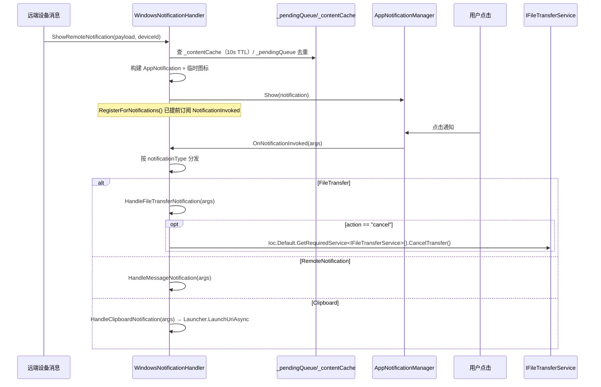

# WindowsNotificationHandler.cs 拆分计划

> 制定日期：2026-09-17
> 目标文件：`Win/src/NotifyRelay/Platforms/Windows/Services/WindowsNotificationHandler.cs`
> 基线提交：`31ce450`（分支 `整理项目`）
> 当前规模：**557 物理行**，~16 个方法，1 个类
> 目标规模：主类瘦身后 ≤ 300 行，共 3 个文件

---

## 一、拆分必要性（实测）

| 指标 | 实测值 |
|------|--------|
| 物理行数 | 557 |
| 类 | `public class WindowsNotificationHandler(ILogger logger, IDeviceManager deviceManager, ILocalNotificationListenerService localListener) : IPlatformNotificationHandler`（**主构造函数**） |
| 外部引用 | **仅 1 处**：DI 注册（`Platforms/Windows/` 下的 `AddWindowsServices()` 扩展，见 `AppLifecycleHelper.cs:507`） |
| 接口 | `IPlatformNotificationHandler` |

> **本文件是 9 个文件中外部耦合最低的一个**（仅 1 处 DI 注册）。

### 1.1 方法分组（实测行号）

| # | 分组 | 方法 | 行号区间 | 行数 |
|---|------|------|----------|------|
| A | 临时图标目录管理 | `TempIconMaxAge`/`TempIconsFolderName` 常量、`GetTempIconsDirectory` | 22~68 | ~47 |
| B | 远程通知展示 | `ShowRemoteNotification` | 71~257 | **~187** |
| C | 文件传输通知 | `ShowFileTransferNotification`、`ShowCompletedFileTransferNotification` | 258~360 | **~103** |
| D | 剪贴板通知 | `ShowClipboardNotification`、`ShowClipboardNotificationWithActions` | 361~417 | ~57 |
| E | 注册与分发 | `RegisterForNotifications`、`OnNotificationInvoked` | 418~464 | ~47 |
| F | 激活回调处理 | `HandleClipboardNotification`、`HandleFileTransferNotification`、`HandleMessageNotification` | 466~520 | ~55 |
| G | 移除/清理 | `RemoveNotificationByTag`、`RemoveNotificationsByGroup`、`RemoveNotificationsByTagAndGroup`、`ClearAllNotifications`、`CleanExpiredCacheEntries` | 523~557 | ~35 |

**判定**：接近阈值（557 > 500），职责 ≥ 3 个（通知构建 / 激活回调 / 图标与缓存管理）。

### 1.2 通知触发时序（**必须保持**）



**关键约束**：
- `RegisterForNotifications` 中 `NotificationInvoked -= OnNotificationInvoked; += OnNotificationInvoked;` 的**先减后加**是防重复订阅的关键，不得改动。
- `_pendingQueue` / `_contentCache` 是 `ConcurrentDictionary`，去重与 TTL（`ContentCacheTtl = 10s`）语义不得变。

---

## 二、采用策略：抽取内部协作者 + 主类保留接口实现（**必须遵守**）

对齐 `AdbService` 先例。本文件耦合极低（仅 1 处 DI 注册），是**风险最小**的一个。

- 主类**必须继续实现 `IPlatformNotificationHandler`**，DI 注册与 `AddWindowsServices()` **一行不改**。
- 新协作者由主构造函数体 `new` 出来，**不注册进 DI**。

### 2.1 关键决策：`OnNotificationInvoked` 必须留在主类

`RegisterForNotifications` 订阅的 `OnNotificationInvoked` 是**方法组引用**，且 `HandleXxxNotification` 是它的分发目标。若把 `OnNotificationInvoked` 搬到新类，则订阅点与处理方法分处两类，需额外转发。

**因此**：分组 E（注册与分发）与分组 F（激活回调处理）**一并留在主类**。

---

## 三、目标结构

```
Platforms/Windows/Services/
├── WindowsNotificationHandler.cs          ← 瘦身至 ~280 行
│      类声明、主构造函数、_pendingQueue/_contentCache、
│      RegisterForNotifications、OnNotificationInvoked、
│      HandleClipboardNotification、HandleFileTransferNotification、
│      HandleMessageNotification、
│      全部 Remove*/Clear* 转发方法
└── Notifications/
    ├── NotificationIconProvider.cs        ← 新增 ~70 行（A：临时图标目录 + 清理）
    ├── RemoteNotificationBuilder.cs       ← 新增 ~230 行（B：ShowRemoteNotification 主体）
    └── TransferNotificationBuilder.cs     ← 新增 ~180 行（C + D：文件传输/剪贴板通知构建）
```

> **注意**：分组 G 的 4 个 `Remove*`/`ClearAll` 是 `IPlatformNotificationHandler` 的接口成员，**必须留在主类**（保持接口实现完整）。

### 3.1 各文件职责

| 文件 | 负责 | 不负责 |
|------|------|--------|
| **`WindowsNotificationHandler`** | 实现 `IPlatformNotificationHandler`；注册与激活分发；去重缓存；`Remove*`/`ClearAll`；组合上述协作者 | 不拼接通知 XML/Builder 细节；不管理图标文件 |
| **`NotificationIconProvider`** | `GetTempIconsDirectory`（含 `TempIconMaxAge=1天` 清理）、远程图标下载/落盘、临时文件路径生成 | 不构建通知 |
| **`RemoteNotificationBuilder`** | `ShowRemoteNotification` 的 payload 解析、去重判定、通知构建与发送 | 不处理激活回调 |
| **`TransferNotificationBuilder`** | 文件传输两个通知 + 剪贴板两个通知的构建与发送 | 不处理 `"cancel"` 动作（回调留主类） |

---

## 四、执行步骤

**每步完成后立即构建**（见 §6.1）。

### 步骤 1：抽出 `NotificationIconProvider`（最独立）
1. 新建 `Platforms/Windows/Services/Notifications/NotificationIconProvider.cs`，`internal sealed class`。
2. 搬入 `TempIconMaxAge`、`TempIconsFolderName` 常量与 `GetTempIconsDirectory`（**整段**）。
3. `GetTempIconsDirectory` 原为 `private static` → 改为 `internal static`。
4. 若 `ShowRemoteNotification` 内还有图标下载/写盘逻辑，一并搬入并暴露 `async Task<string?> ResolveIconAsync(...)`。
5. 主类调用点改为 `NotificationIconProvider.GetTempIconsDirectory()`。

### 步骤 2：抽出 `TransferNotificationBuilder`（C + D）
1. 新建同目录 `TransferNotificationBuilder.cs`，`internal sealed class`。
2. 搬入 `ShowFileTransferNotification`(258)、`ShowCompletedFileTransferNotification`(317)、`ShowClipboardNotification`(361)、`ShowClipboardNotificationWithActions`(386)。
3. 这些是 `IPlatformNotificationHandler` 的接口方法 → 主类保留**同名转发方法**，方法体一行调用协作者。
4. 构造参数：`ILogger logger`、`uint notificationSequence` 的提供方式（若用实例字段则以 `Func<uint>` 或直接搬走该字段，需在提交信息说明）。

### 步骤 3：抽出 `RemoteNotificationBuilder`（B，最大块）
1. 新建同目录 `RemoteNotificationBuilder.cs`。
2. 搬入 `ShowRemoteNotification`(71~257) 的方法体；`_contentCache`/`_pendingQueue` 的**所有权保留在主类**，通过构造参数注入（`ConcurrentDictionary<...>` 引用传递即可，二者都是并发安全集合）。
3. 主类 `ShowRemoteNotification` 改为转发。

### 步骤 4：主类收尾
确认分组 E/F/G 仍在主类且未被改动，`RegisterForNotifications` 的先减后加订阅顺序未变。

---

## 五、严格禁止事项

1. **不得修改 `IPlatformNotificationHandler` 接口**；主类必须仍实现其**全部**成员。
2. **不得修改 `AddWindowsServices()` 中的 DI 注册**；不得把新类注册进 DI。
3. **不得修改 `RegisterForNotifications` 中 `-=` 后 `+=` 的订阅顺序**。
4. **不得修改 `ContentCacheTtl`（10 秒）与 `TempIconMaxAge`（1 天）的取值**。
5. **不得把 `_pendingQueue`/`_contentCache` 换成非并发集合**。
6. **不得改动 `OnNotificationInvoked` 的 `switch` 分支与 `ToastNotificationType` 常量匹配**。
7. **不得改动 `HandleFileTransferNotification` 中 `Ioc.Default.GetRequiredService<IFileTransferService>()` 的解析方式**（它是 `static` 方法，不能改为构造注入）。
8. **不得改动 `HandleClipboardNotification` 的 `ClipboardService.IsValidWebUrl` 校验与 `Launcher.LaunchUriAsync` 调用**。
9. **不得改动 `Process.Start` 的 `ProcessStartInfo`（`UseShellExecute = true`、`explorer.exe` 参数格式）**。
10. **不得改动 `HandleMessageNotification`**（注意：其方法体为空，**不要"顺手"补全逻辑**）。
11. 不得改动命名空间 `NotifyRelay.Platforms.Windows.Services`。

---

## 六、验收标准

### 6.1 构建
```powershell
& 'C:\Program Files\Microsoft Visual Studio\18\Community\MSBuild\Current\Bin\MSBuild.exe' `
  'E:\GitHubCode\01Main\NotifyRelay\worktree\win-notification\src\NotifyRelay.sln' `
  -p:Platform=x64 -p:Configuration=Debug -v:m -nologo -nodeReuse:false -restore
```
**必须 `EXIT=0`。**

### 6.2 警告基线（由主代理在 `31ce450` 实测，**禁止自行重做基线**）
基线 `EXIT=0`，41s，存量警告**恰好 8 条**：

| # | 警告 | 位置 |
|---|------|------|
| 1 | `CS8604` | `Platforms/Windows/Services/KeyboardHookService.cs(85,13)` |
| 2~8 | `WMC1506` ×7 | `Views/Settings/OverlayLogiBatteryPage.xaml` 行 58,59,63,72,78,82,83 |

> **注意**：本文件与 `KeyboardHookService.cs` 同属 `Platforms/Windows/`。搬移时若改动到该目录结构，注意 `CS8604` 那条警告位置**不得变化**。
> Rust 子模块另有 2 条 `dead_code` + 1 条汇总（存量）。
> 增量构建时 `CS8604` 可能被打印两次，比对时按**警告代码 + 文件 + 行号去重**。

### 6.3 结构验收
- 主文件 ≤ 300 行。
- 主类仍完整实现 `IPlatformNotificationHandler`（可核对接口成员数与主类成员数）。
- `git status` 只涉及 `Platforms/Windows/Services/` 下文件。
- 临时图标目录名 `"Sefirah-pc-icons"` 字符串未变。

### 6.4 提交
```powershell
cd E:\GitHubCode\01Main\NotifyRelay\worktree\win-notification
git add -A
git commit -m "refactor(notification): 抽出通知构建器与图标提供者"
```

---

## 七、风险清单

| 风险 | 说明 | 缓解 |
|------|------|------|
| 接口实现不完整 | 接口成员被误搬出主类 | 核对 `IPlatformNotificationHandler` 全部成员仍在主类 |
| 重复订阅 | `-=`/`+=` 顺序被改会导致通知重复触发 | 保持原顺序 |
| 去重语义变化 | 两个并发字典被换/被复制 | 引用传递同一实例，不复制 |
| `static` 方法改造 | `HandleFileTransferNotification` 为 `static` | 保持 `static`，不改构造注入 |
| 顺手补全空方法 | `HandleMessageNotification` 为空 | 明确禁止改动 |
