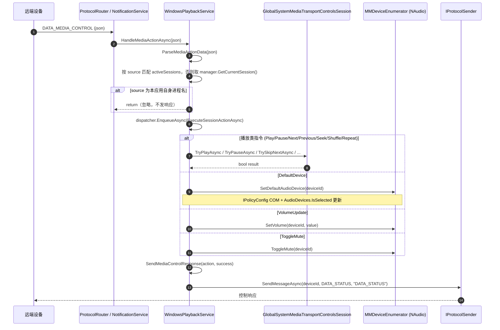
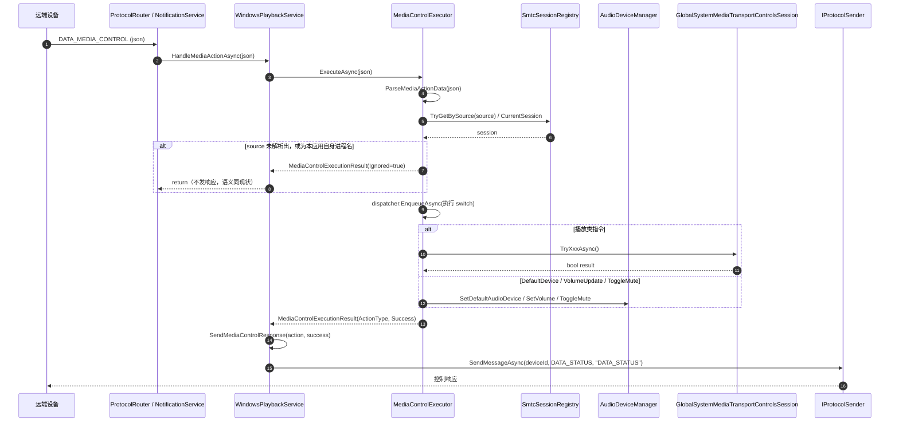
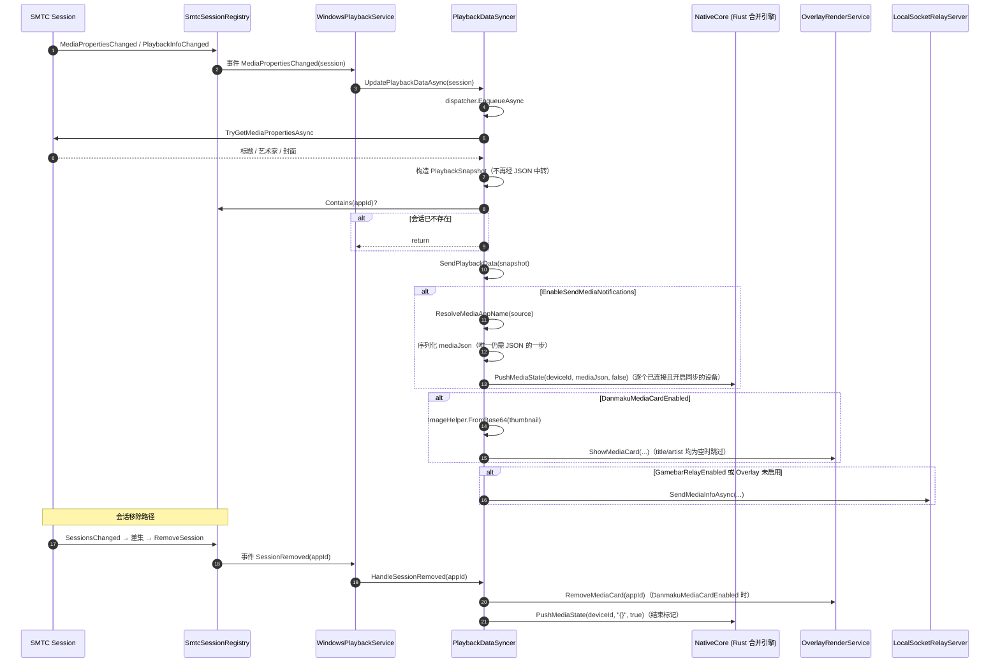
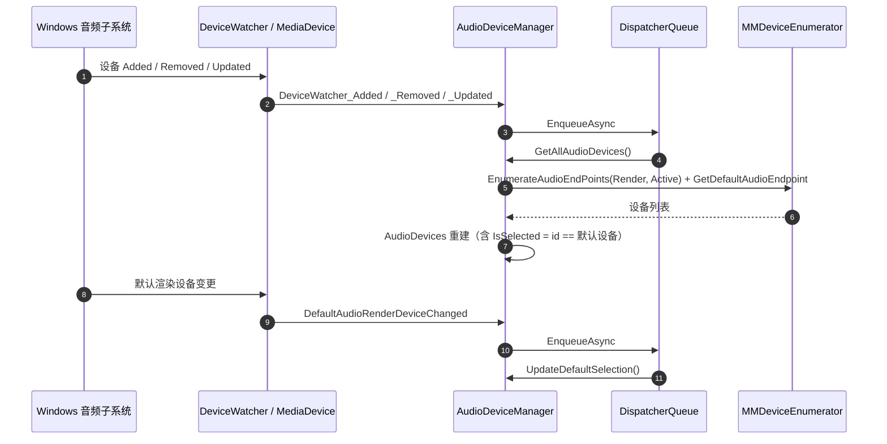

# `WindowsPlaybackService.cs` 拆分计划

> 状态：**已完成（已执行并提交，拆分生效）**
> 目标文件：`Win/src/NotifyRelay/Platforms/Windows/Services/WindowsPlaybackService.cs`（1005 → 155 行）
> 来源：`Win/Docs/GodClassAnalysis.md` 第 3.1 节（该节已整体迁移至本文档）
> 构建验证命令：`msbuild -p:Platform=x64`（根目录 `Win/`）
> 用户已确认：迁移时**顺带移除全部 7 项无谓中间层**（见第六节）
>
> **执行结果**（5 次提交，每步独立构建通过）：
>
> | 提交 | 内容 |
> |---|---|
> | `594f01f` | 抽出 `AudioDeviceManager` |
> | `94d8436` | 抽出 `SmtcSessionRegistry`（含 6.3 / 6.4 / 6.5） |
> | `f2d7a06` | 抽出 `PlaybackDataSyncer`（含 6.1 / 6.7 前半） |
> | `7a45583` | 抽出 `MediaControlExecutor` |
> | `8b24f1e` | 收尾清理（6.2 / 6.7 后半 / using / `ISessionManager` 依赖） |
>
> 最终规模：`WindowsPlaybackService` 155、`SmtcSessionRegistry` 177、
> `PlaybackDataSyncer` 305、`MediaControlExecutor` 200、`AudioDeviceManager` 263。
> 构建错误 0、警告数与基线完全一致（CS8604×2、WMC1506×7、Rust dead_code×3，均为存量）。
> `IPlaybackService` 接口与 4 处外部调用点零改动；`notify-relay-core` 子模块未改动。
>
> **执行时与原计划的差异**（均经用户确认）：
>
> 1. `SmtcSessionRegistry.InitializeAsync()` 返回 `Task<bool>` 而非 `Task`——否则会话管理器
>    获取失败时调用方无从得知，会继续执行本应中止的后续初始化（行为改变）。
> 2. `MediaControlExecutor.ExecuteAsync` 返回 `MediaControlExecutionResult`
>    （`Ignored`/`ActionType`/`Success`）而非 `Task<bool>`——`SendMediaControlResponse`
>    需要 `actionType` 且自应用会话需「不发响应」，单 bool 无法表达。
> 3. 依用户决定，`WindowsPlaybackService` 的 `IGeneralSettingsService` 与 `ISessionManager`
>    两个构造依赖一并移除（下沉后已无使用点；保留会产生新增警告 CS9113）。
> 4. 第 3.2 节称把 `EnableSendMediaNotifications` 判断上移到 `SendPlaybackData` 属「语义等价」，
>    该表述有误：原判断同时抑制了 Overlay/Gamebar 刷新。依用户决定按计划字面执行，
>    即开关关闭时 Overlay/Gamebar 仍会刷新（**行为变化，非等价**）。

---

## 一、现状

### 1.1 规模

| 项 | 值 |
|---|---|
| 行数 | 1005 |
| 方法数 | 30 |
| 类数 | 1（`WindowsPlaybackService`，实现 `IPlaybackService`） |
| 构造函数依赖 | `ILogger<WindowsPlaybackService>`、`ISessionManager`、`IDeviceManager`、`IProtocolSender`、`IGeneralSettingsService` |

### 1.2 对外契约

`IPlaybackService`（`Win/src/NotifyRelay/Data/Contracts/IPlaybackService.cs`）共 4 个成员：

| 成员 | 当前实现位置 |
|---|---|
| `InitializeAsync()` | 51–151 |
| `HandleMediaActionAsync(string)` | 153–188 |
| `HandleRemotePlaybackMessageAsync(string)` | 691–694（`throw new NotImplementedException()`） |
| `SendMediaControlRequest(string, string)` | 909–919 |

**额外 public 成员（不在接口内，且全仓无外部调用者）**：`AudioDevices`（39）、`GetAllAudioDevices()`（696）、`ToggleMute(string)`（727）、`SetVolume(string, float)`（749）、`SetDefaultAudioDevice(string)`（772）。
仅被本类内部调用（`ExecuteSessionActionAsync` 的 `DefaultDevice` / `VolumeUpdate` / `ToggleMute` 分支，294/300/305 行）。

> 结论：这 5 个成员可以自由下沉到新类，**无需改动 `IPlaybackService` 接口**。

### 1.3 外部调用方（拆分后必须保持不变）

| 调用方 | 调用 |
|---|---|
| `Helpers/AppLifecycleHelper.cs:182` | `playbackService.InitializeAsync()` |
| `Services/Protocol/ProtocolRouter.cs:139` | `playbackService.Value.HandleMediaActionAsync(actionJson)` |
| `Services/NotificationService.cs:111` | `playbackService.HandleMediaActionAsync(actionJson)` |
| `ViewModels/MainPageViewModel.cs:527` | `PlaybackService.SendMediaControlRequest(deviceId, action)` |
| `Native/NativeCore.cs` | 回调 `MediaSessionQueryHandler`（由本类在 87–93 行注册） |

### 1.4 职责分布（实测行号）

| 职责领域 | 方法 | 行号 | 行数 |
|---|---|---|---|
| 初始化与编排 | `InitializeAsync` | 51–151 | 101 |
| 周期同步循环 | 内联 `Task.Run` 9 秒循环 | 113–138 | 26 |
| 入站远程媒体控制 | `HandleMediaActionAsync`、`ParseMediaActionData`、`ExecuteSessionActionAsync` | 153–322 | 168 |
| SMTC 会话生命周期 | `SessionsChanged`、`UpdateActiveSessions`、`UpdateSessionsList`、`RemoveSession`、`AddSession`、`SubscribeToSessionEvents`、`Session_TimelinePropertiesChanged`、`UnsubscribeFromSessionEvents`、`Session_MediaPropertiesChanged`、`Session_PlaybackInfoChanged` | 324–492 | 160 |
| 播放数据构建与分发 | `UpdatePlaybackDataAsync`、`GetPlaybackSessionAsync`、`SendPlaybackData`、`ConvertBase64ToBytes`、`ResolveMediaAppName` | 494–689、961–1004 | 236 |
| 远程响应/请求 | `SendMediaControlRequest`、`SendMediaControlResponse` | 909–956 | 41 |
| 音频设备管理 | `GetAllAudioDevices`、`ToggleMute`、`SetVolume`、`SetDefaultAudioDevice`、`DeviceWatcher_×4`、`MediaDevice_DefaultAudioRenderDeviceChanged`、`UpdateDefaultSelection` | 696–906 | 200 |
| 占位实现 | `HandleRemotePlaybackMessageAsync` | 691–694 | 4 |

### 1.5 字段归属

| 字段 | 行 | 当前用途 | 拆分后归属 |
|---|---|---|---|
| `dispatcher` | 33 | 全类 UI 线程封送 | 各新类各自持有（构造时 `GetForCurrentThread()`，保持现有模式） |
| `activeSessions` | 34 | 会话表；被 87–93、122、159、398、502 使用 | `SmtcSessionRegistry` |
| `manager`（SMTC Manager） | 35 | 121、164、326、335、400 | `SmtcSessionRegistry` |
| `AudioDevices` | 39 | 设备列表 | `AudioDeviceManager` |
| `enumerator`（`MMDeviceEnumerator`） | 40 | 音频设备 | `AudioDeviceManager` |
| `_appNameCache` | 42 | 应用名缓存 | `PlaybackDataSyncer`（保持 `static`，语义不变） |
| ~~`lastTimelinePosition`~~ | 43 | 394–423 写入、521 写入 | **整删除**（见 6.5，只写不读） |
| `deviceWatcher` | 46 | 设备监听 | `AudioDeviceManager` |

---

## 二、目标结构

> 下列为计划时的估算行数；**实际落地行数**见文首「执行结果」表。

```
Platforms/Windows/Services/
├── WindowsPlaybackService.cs     瘦身后 ~195 行   编排 + IPlaybackService 实现 + 事件接线
├── SmtcSessionRegistry.cs        ~135 行          SMTC 会话集合与事件订阅
├── PlaybackDataSyncer.cs         ~240 行          播放数据构建与分发（Rust / Overlay / Gamebar）
├── MediaControlExecutor.cs       ~175 行          入站远程媒体指令解析与执行
└── AudioDeviceManager.cs         ~240 行          音频设备枚举 / 监听 / 音量 / 静音 / 默认设备
```

依赖方向（无环）：

```
WindowsPlaybackService ──> MediaControlExecutor ──> AudioDeviceManager
        │                          │
        ├──────────────────────────┴──> SmtcSessionRegistry
        │
        └─────────────────────────────> PlaybackDataSyncer ──> SmtcSessionRegistry
```

---

## 三、方法归属总表

### 3.1 `AudioDeviceManager`（新文件）

移动：**原样移动，不改逻辑**

| 方法 | 原行号 |
|---|---|
| `GetAllAudioDevices()` | 696–725 |
| `ToggleMute(string)` | 727–747 |
| `SetVolume(string, float)` | 749–769 |
| `SetDefaultAudioDevice(string)` | 772–815 |
| `DeviceWatcher_Added` | 818–831 |
| `DeviceWatcher_Removed` | 833–846 |
| `DeviceWatcher_Updated` | 848–861 |
| `DeviceWatcher_EnumerationCompleted` | 863–866 |
| `MediaDevice_DefaultAudioRenderDeviceChanged` | 868–881 |
| `UpdateDefaultSelection()` | 883–906 |

新增（薄封装，逻辑来自 `InitializeAsync` 的 67–81 行）：
- `StartWatcher()`：创建 `DeviceWatcher`、挂 4 个事件、`Start()`，并订阅 `MediaDevice.DefaultAudioRenderDeviceChanged`；异常时 `LogWarning("无法启动设备监视器…")` 后返回（保持现有"失败不阻断初始化"语义）。

公开成员：`IReadOnlyList<AudioDevice> AudioDevices { get; }`、上述 4 个 public 操作方法、`StartWatcher()`。
依赖：`ILogger<AudioDeviceManager>`、`DispatcherQueue`（构造时获取）。

### 3.2 `SmtcSessionRegistry`（新文件）

移动：

| 方法 | 原行号 | 说明 |
|---|---|---|
| `SessionsChanged` + `UpdateActiveSessions` | 324–342 | **合并为** `SyncSessions()`（见 6.4） |
| `UpdateSessionsList(...)` | 344–366 | 核心 diff 逻辑；移除恒真 `Where`（见 6.3） |
| `RemoveSession(string)` | 368–375 | 移除后触发 `SessionRemoved` 事件 |
| `AddSession(...)` | 377–385 | 新增后触发 `SessionAdded`；**删除** `lastTimelinePosition[...] = 0`（382，见 6.5） |
| `SubscribeToSessionEvents(...)` | 387–392 | 改为 2 个事件（去掉 `TimelinePropertiesChanged`，见 6.5） |
| `Session_MediaPropertiesChanged` | 459–475 | 改为触发 `MediaPropertiesChanged` 事件（**去掉** `if (!generalSettings.EnableSendMediaNotifications) return;` 判断，该判断上移到 `PlaybackDataSyncer.SendPlaybackData` 内部——该处已有 `shouldSendRemote` 判断，语义等价） |
| `Session_PlaybackInfoChanged` | 477–492 | 同上 |
| ~~`Session_TimelinePropertiesChanged`~~ | 394–423 | **整删除**（见 6.5） |
| `UnsubscribeFromSessionEvents(...)` | 425–457 | **拆分**：① 退订（`MediaPropertiesChanged` / `PlaybackInfoChanged`）+ `SessionRemoved` 事件触发留在本类（去掉 `TimelinePropertiesChanged` 退订与 `lastTimelinePosition.Remove`，见 6.5）；② 移除 Overlay 卡片（433–445）与推送结束标记（447–456）迁移到 `PlaybackDataSyncer.HandleSessionRemoved(...)` |

新增成员（供 `PlaybackDataSyncer` / `MediaControlExecutor` 使用）：
- `int Count { get; }`
- `bool Contains(string appUserModelId)`
- `GlobalSystemMediaTransportControlsSession? CurrentSession { get; }`（等价 `manager?.GetCurrentSession()`）
- `bool TryGetBySource(string source, out GlobalSystemMediaTransportControlsSession? session)`
- `Task InitializeAsync()`（`RequestAsync()` + 首次 `SyncSessions()` + 订阅 `SessionsChanged`）

事件：`SessionAdded`、`SessionRemoved`、`MediaPropertiesChanged`、`PlaybackInfoChanged`。
依赖：`ILogger<SmtcSessionRegistry>`。

### 3.3 `PlaybackDataSyncer`（新文件）

移动：

| 方法 | 原行号 | 说明 |
|---|---|---|
| `UpdatePlaybackDataAsync(session)` | 494–511 | 改为接收/传递 `PlaybackSnapshot`（见 6.1） |
| `GetPlaybackSessionAsync(session)` | 513–562 | **返回 `PlaybackSnapshot?` 而非 JSON 字符串**（见 6.1）；删除 521 行 `lastTimelinePosition` 写入（见 6.5） |
| `SendPlaybackData(string)` | 565–676 | **改为 `SendPlaybackData(PlaybackSnapshot)`**，删除 JSON 解析（见 6.1） |
| ~~`ConvertBase64ToBytes(string?)`~~ | 678–689 | **移除**，改用共享 `ImageHelper.FromBase64`（见 6.7） |
| `ResolveMediaAppName(string?)` | 961–1004 | 原样 |
| 9 秒周期循环 | 113–138 | 见下 |

新增：
- `StartPeriodicSyncLoop()`：内容即 113–138 行原逻辑，`manager.GetCurrentSession()` → `registry.CurrentSession`，`activeSessions.ContainsKey` → `registry.Contains`。
- `HandleSessionRemoved(string appUserModelId)`：承载从 `UnsubscribeFromSessionEvents` 迁出的 433–456 行（移除 Overlay 媒体卡片 + 对已连接且启用媒体同步的设备 `NativeCore.PushMediaState(id, "{}", true)`）。**注**：原计划名为 `HandleSessionRemovedAsync`，因方法体无 await 实际实现为同步 `HandleSessionRemoved`。
- `private sealed record PlaybackSnapshot(string? Source, string? TrackTitle, string? Artist, string? Thumbnail, bool IsPlaying);`（内部传递用，替代 JSON 字符串）

依赖：`ILogger<PlaybackDataSyncer>`、`IGeneralSettingsService`、`IDeviceManager`、`DispatcherQueue`、`SmtcSessionRegistry`。

> 注：629 与 437 行的 `Ioc.Default.GetRequiredService<OverlayRenderService>()` **保持服务定位器写法不变**，不改为构造注入（见「七、风险」）。

### 3.4 `MediaControlExecutor`（新文件）

移动：

| 方法 | 原行号 | 说明 |
|---|---|---|
| `ParseMediaActionData(string)` | 190–205 | 原样 |
| `ExecuteSessionActionAsync(...)` | 207–322 | 原样；294/300/305 改调 `AudioDeviceManager` |
| `HandleMediaActionAsync` 中「按 source 选会话 + 排除本应用自身会话」逻辑 | 158–181 | 原样 |

新增：
- `Task<bool> ExecuteAsync(string mediaActionJson)`：合并 158–181 + 184 行全部逻辑，返回 `success`。

依赖：`ILogger<MediaControlExecutor>`、`AudioDeviceManager`、`SmtcSessionRegistry`、`DispatcherQueue`。

### 3.5 `WindowsPlaybackService`（瘦身后 ~195 行）

保留：

| 方法 | 原行号 | 变化 |
|---|---|---|
| `InitializeAsync()` | 51–151 | 编排：① `registry.InitializeAsync()`；② `audioDeviceManager.StartWatcher()` + `GetAllAudioDevices()`；③ 订阅 registry 与 syncer 的事件；④ 注册 `NativeCore.MediaSessionQueryHandler = _ => registry.Count > 0`；⑤ `syncer.StartPeriodicSyncLoop()`；⑥ 保留 `sessionManager.ConnectionStatusChanged` 空处理器（95–110，内容为注释块）或按「七、风险」第 4 条决定 |
| `HandleMediaActionAsync(string)` | 153–188 | 委托 `MediaControlExecutor.ExecuteAsync`，再调用 `SendMediaControlResponse` |
| `HandleRemotePlaybackMessageAsync(string)` | 691–694 | 原样保留 `NotImplementedException`（见 6.6） |
| `SendMediaControlRequest(string, string)` | 909–919 | 删除死 null 判（见 6.2） |
| `SendMediaControlResponse(string, bool)` | 927–956 | 删除死 null 判（见 6.2） |

新增接线代码（约 30 行）：registry/syncer 事件的订阅与转发。

---

## 四、时序图

### 4.1 现状：入站远程媒体控制指令



### 4.2 拆分后：入站远程媒体控制指令



### 4.3 拆分后：播放数据同步（SMTC 事件 → Rust / Overlay / Gamebar）



> 注：原 `Session_TimelinePropertiesChanged` 路径已随 6.5 删除——其节流结果本就无下游消费者，全量推送由 Rust 合并引擎负责。

### 4.4 拆分后：音频设备变更



> 注：`SetDefaultAudioDevice` / `SetVolume` / `ToggleMute` 由 `MediaControlExecutor` 经 dispatcher 同步调用（现状即同步调用，无 UI 封送），拆分后保持不变。

---

## 五、执行步骤

> 原则：**移动代码不改逻辑**；顺带执行第六节的 7 项中间层移除；每步独立构建 + 独立提交。

### 步骤 0：基线

```bash
cd Win && msbuild -p:Platform=x64
```
记录基线错误数/警告数（用于后续对比）。

### 步骤 1：抽出 `AudioDeviceManager`

1. 新建 `Platforms/Windows/Services/AudioDeviceManager.cs`，移入 696–906 行全部方法 + 字段 `AudioDevices`(39)、`enumerator`(40)、`deviceWatcher`(46)。
2. 从 `InitializeAsync` 的 67–81 行抽 `StartWatcher()`。
3. `WindowsPlaybackService` 改为构造注入 `AudioDeviceManager`；`InitializeAsync` 调用 `audioDeviceManager.StartWatcher()` 与 `GetAllAudioDevices()`。
4. 294/300/305 三处改为 `audioDeviceManager.…`。
5. 在 `Platforms/Windows/ServiceCollectionExtensions.cs` 的 `AddWindowsServices()` 中注册 `services.AddSingleton<AudioDeviceManager>();`。
6. 构建验证 + 提交。

**验收**：`AudioDevices` / `GetAllAudioDevices` / `ToggleMute` / `SetVolume` / `SetDefaultAudioDevice` 无外部调用者，改后编译应零错误；运行时设备列表、静音、音量、默认设备切换行为不变。

### 步骤 2：抽出 `SmtcSessionRegistry`

1. 新建 `SmtcSessionRegistry.cs`，移入 324–492 行（**不含** 394–423，见 6.5）+ 字段 `activeSessions`(34)、`manager`(35)。
2. 执行 **6.5**：删除 `Session_TimelinePropertiesChanged`(394–423)、`lastTimelinePosition`(43)、382/430/521 三处写入、389/429 行的 `TimelinePropertiesChanged` 订阅与退订。
3. 执行 **6.4**：`SessionsChanged`(324–327) 与 `UpdateActiveSessions`(329–342) 合并为 `SyncSessions()`。
4. 执行 **6.3**：移除 `UpdateSessionsList` 358 行恒真的 `Where(s => s is not null)`。
5. `Session_MediaPropertiesChanged` / `Session_PlaybackInfoChanged` 改为触发事件（去掉开关判断，见 3.2 说明）。
6. `UnsubscribeFromSessionEvents` 拆为退订部分 + `SessionRemoved` 事件。
7. 注册为 singleton 并注入 `WindowsPlaybackService`；87–93 行改为 `_ => registry.Count > 0`；164 行 `manager?.GetCurrentSession()` → `registry.CurrentSession`；159 行 `activeSessions.Values.FirstOrDefault(...)` → `registry.TryGetBySource(...)`。
8. 构建验证 + 提交。

**验收**：SMTC 会话增减日志不变；`NativeCore.MediaSessionQueryHandler` 行为不变；**时间线相关日志消失属预期**（原逻辑无下游）。

### 步骤 3：抽出 `PlaybackDataSyncer`

1. 新建 `PlaybackDataSyncer.cs`，移入 494–689、961–1004 行 + 113–138 行周期循环 + 字段 `_appNameCache`(42)。
2. 执行 **6.1**：引入 `PlaybackSnapshot` record；`GetPlaybackSessionAsync` 返回 `PlaybackSnapshot?`（删除 540–549 的序列化与 542 行废弃 `type` 字段）；`SendPlaybackData` 接收 snapshot（删除 565–576 的 `JsonDocument.Parse` 与 668–671 的 `catch (JsonException)`）。仅 592–600 行构造 `mediaJson` 处保留序列化。
3. 执行 **6.7**：删除 `ConvertBase64ToBytes`(678–689)，627 行改调 `ImageHelper.FromBase64(thumbnail)`。
4. 122 行 `activeSessions.ContainsKey` → `registry.Contains`；502 行同理。
5. 新增 `HandleSessionRemovedAsync`（承载 433–456）。
6. `WindowsPlaybackService` 注入 syncer，订阅 registry 事件转发。
7. 注册为 singleton，构建验证 + 提交。

**验收**：媒体状态推送、Overlay 卡片显示/移除、Gamebar 转发行为不变；9 秒周期循环仍在跑；封面图正常显示（验证 base64 抽取未破坏 data URI 处理）。

### 步骤 4：抽出 `MediaControlExecutor`

1. 新建 `MediaControlExecutor.cs`，移入 190–322 行 + 158–181 行的会话选择逻辑，对外 `Task<bool> ExecuteAsync(string)`。
2. 注入 `AudioDeviceManager` 与 `SmtcSessionRegistry`。
3. `WindowsPlaybackService.HandleMediaActionAsync` 简化为：调用 executor → `SendMediaControlResponse`。
4. 注册为 singleton，构建验证 + 提交。

**验收**：远端播放/暂停/上下曲/音量/静音/默认设备指令响应不变。

### 步骤 5：收尾与死代码清理

1. 执行 **6.2**：删除 `SendMediaControlRequest`(916–917) 与 `SendMediaControlResponse`(939–940) 的死 null 判。
2. 执行 **6.7（后半）**：`Services/Notifications/MusicMediaBlockManager.cs` 删除 `ConvertCoverUrlToBytes`(173–185)，88/124/154 行改调 `ImageHelper.FromBase64`；该文件需新增 `using NotifyRelay.Helpers;`。
3. 在 `Helpers/ImageHelper.cs` 新增共享方法：
   ```csharp
   /// <summary>将封面 base64（Data URL 或纯 base64）转为字节数组，失败返回 null。</summary>
   public static byte[]? FromBase64(string? base64)
   {
       if (string.IsNullOrEmpty(base64)) return null;
       try
       {
           var payload = base64.Contains(',') ? base64.Split(',')[1] : base64;
           return Convert.FromBase64String(payload);
       }
       catch { return null; }
   }
   ```
4. 清理 `WindowsPlaybackService` 中已无用的 `using`（`NAudio.*`、`Windows.Devices.Enumeration`、`Windows.Media.Devices` 等——若已全部下沉）。
5. 全量构建，与步骤 0 基线对比：**错误数不增加、无新增警告**。
6. 提交。

---

## 六、迁移时移除的无谓中间层（7 项，已确认全部执行）

### 6.1 移除 `GetPlaybackSessionAsync` → `SendPlaybackData` 的 JSON 中转（513–689）

**问题**：`GetPlaybackSessionAsync` 把字段序列化成 JSON（540–549），`SendPlaybackData` 立刻 `JsonDocument.Parse` 解回同一批字段（565–576），中间无任何消费者。带来三处纯负担：
- 668–671 行 `catch (JsonException)` 成为死代码（自己刚序列化的串不可能解析失败）
- 542 行 `type = "DATA_MEDIAPLAY"` 写入后从未被读取，是废弃字段
- 578 行调试日志被迫依赖解析出的中间变量

**处理**：内部改用 `PlaybackSnapshot` record 直接传递；`SendPlaybackData` 不再解析 JSON。唯一保留序列化的位置是 592–600 行构造推送给 Rust 的 `mediaJson`。
⚠️ `type` 字段被移除——已确认全链路无读取方（`SendPlaybackData` 仅读 `source`/`trackTitle`/`artist`/`thumbnail`/`isPlaying`）。

### 6.2 移除两处恒假 null 判（916–917、939–940）

```csharp
string requestJson = rawJson;
if (requestJson == null) return;   // 死代码：JsonSerializer.Serialize 返回非可空 string
```
`SendMediaControlRequest` 与 `SendMediaControlResponse` 各一处，属复制粘贴残留。直接删除 `if` 与中间变量。

### 6.3 移除恒真过滤器（358）

`UpdateSessionsList` 中 `activeSessions.Where(s => s is not null)`：元素类型 `GlobalSystemMediaTransportControlsSession` 本身非可空，过滤器恒真。改为直接遍历。

### 6.4 合并 `SessionsChanged` / `UpdateActiveSessions`（324–342）

两者都是「取 `manager.GetSessions()` → 调 `UpdateSessionsList`」的一行壳，且 `UpdateSessionsList` 内部无抛出路径，`UpdateActiveSessions` 的 try/catch 无实际保护对象。合并为单一 `SyncSessions()`，`SessionsChanged` 处理器直接调用。

### 6.5 删除死逻辑 `Session_TimelinePropertiesChanged` 与 `lastTimelinePosition`（394–423、43、382、430、521）— 收益最大

**判定依据**：
- 该方法唯一实质动作是写入 `lastTimelinePosition[appId]`，而 410–411 行注释明确写着「时间线位置变化不再单独发送：全量媒体状态由 Rust 合并引擎统一推送」
- 其产出（节流后的位置值）再无下游消费者
- 另一处写入 521 行是**无条件写入**（无节流判断），会直接覆盖 394–423 的节流结果
- 结论：`lastTimelinePosition` 是**只写不读**的字典

**处理**：删除 `Session_TimelinePropertiesChanged`(394–423)、字典字段(43)、三处写入(382/430/521)，以及 389/429 行 `TimelinePropertiesChanged` 的订阅/退订。可省约 40 行。

⚠️ 与注释所述「Rust 合并引擎接管」方向一致；删除后若将来恢复基于时间线的推送需重写。已确认删除。

### 6.6 `HandleRemotePlaybackMessageAsync`（691–694）

保留现状 `throw new NotImplementedException()`。理由：改接口会波及 Android 侧契约，收益不抵风险。**不移除，仅登记说明。**

### 6.7 消除 `ConvertBase64ToBytes` 与 `MusicMediaBlockManager.ConvertCoverUrlToBytes` 的重复（678–689 / 173–185）

两处逻辑逐字相同（判空 → 按 `,` 分割取后半 → `Convert.FromBase64String` → catch 返 null）。

**处理**：在 `Helpers/ImageHelper.cs` 新增 `FromBase64(string?)`（该类已有对偶的 `ToBase64Async`，且两处调用点均为封面图解码），两处调用点改调它，`WindowsPlaybackService` 与 `MusicMediaBlockManager` 各自删除私有副本。
`MusicMediaBlockManager.cs` 需新增 `using NotifyRelay.Helpers;`（当前未引用该命名空间）。

> 注：此项是 7 项中唯一触及拆分范围外文件（`MusicMediaBlockManager.cs`）的改动，已确认纳入。

---

## 七、风险与待确认

| # | 项 | 说明 | 处理 |
|---|---|---|---|
| 1 | `DispatcherQueue` 获取时机 | 现状为字段初始化 `DispatcherQueue.GetForCurrentThread()`，依赖构造发生在 UI 线程 | 新类沿用同一模式，不改为 `MainWindow.Dispatcher` 等 |
| 2 | `Ioc.Default.GetRequiredService<OverlayRenderService>()`（437、629） | 服务定位器写法 | **保持原样**，不改为构造注入（避免改变解析时机） |
| 3 | 9 秒循环 `while(true)` 无取消令牌（113–138） | 现状即 fire-and-forget，无停止机制 | **默认原样移动**（本次只搬不改）；如需加 `CancellationToken` 请单独确认 |
| 4 | `sessionManager.ConnectionStatusChanged` 空处理器（95–110） | 方法体全为注释，无任何语句 | 默认随 `ILogger`/`ISessionManager` 依赖一起原样保留在 `WindowsPlaybackService`（保留构造依赖以免 DI 变更）；如需连同 `ISessionManager` 一并移除，请单独确认 |
| 5 | `SetDefaultAudioDevice` 799 行 `AudioDevices.First().IsSelected = false` | 疑似既有缺陷：只清首个元素而非所有已选项（`UpdateDefaultSelection` 894–897 的写法才是清全部） | **本次不修**（不在拆分/中间层范围）；已单独记录，待确认后再动 |
| 6 | `_appNameCache` 为 `static` | 跨实例共享 | 保持 `static` 原样迁移 |
| 7 | 事件订阅泄漏 | 拆分后 registry 生命周期为 singleton，与现状一致 | 无需额外退订；`UnsubscribeFromSessionEvents` 的退订逻辑原样保留 |
| 8 | COM 异常捕获 | `catch (COMException)` → `LogDebug` 的既有约定 | 原样迁移，不合并、不改日志级别 |
| 9 | 6.1 移除 `type` 字段 | 已核查全链路无读取方 | 若后续发现 Rust 侧依赖 `DATA_MEDIAPLAY` 标记需回退此改动；本次按无依赖处理 |
| 10 | 6.5 删除时间线逻辑 | 依赖注释「Rust 合并引擎接管」的准确性 | 若后续恢复时间线推送需重写；已确认删除 |

---

## 八、验收标准

> 各项前面标注**实际结果**（截至 `9cfcffc`）。

1. ✅ `msbuild -p:Platform=x64` 构建通过，错误数不增加、无新增警告（与步骤 0 基线对比）。
   实测：错误 0；警告 CS8604×2、WMC1506×7、Rust dead_code×3，与基线**逐项一致**。
2. ✅ `IPlaybackService` 接口 4 个成员签名不变，外部 4 处调用点无需修改（`git diff` 该文件与其调用点为 0 改动）。
3. ✅ `WindowsPlaybackService.cs` 行数降至约 195 行。实测 **155 行**。
4. ✅ 第七节 7 项中间层移除均已落地：
   - 6.1 代码中不再出现 `GetPlaybackSessionAsync` → `SendPlaybackData` 的 JSON 往返
   - 6.2 两处死 null 判消失
   - 6.3 恒真 `Where` 消失
   - 6.4 `SessionsChanged` / `UpdateActiveSessions` 已合并
   - 6.5 `lastTimelinePosition` 与 `TimelinePropertiesChanged` 全链路消失
   - 6.6 `HandleRemotePlaybackMessageAsync` 按计划**保留** `NotImplementedException`
   - 6.7 `ConvertBase64ToBytes` / `ConvertCoverUrlToBytes` 均改为 `ImageHelper.FromBase64`
5. ⏳ **手工冒烟未执行**（需真实设备与音频硬件，构建环境无法验证）：
   - 本地播放媒体 → 对端收到媒体状态；
   - 远端下发播放/暂停/下一首/音量/静音 → 本地生效且收到 `DATA_STATUS` 响应；
   - 插拔/切换音频输出设备 → 设备列表刷新；
   - 切换默认输出设备 → 列表选中项正确；
   - 关闭媒体应用 → Overlay 媒体卡片移除、对端收到结束标记；
   - 封面图正常显示（`ImageHelper.FromBase64` 的 data URI 分支未破坏）；
   - 媒体卡片 Overlay 与 Gamebar 转发均正常。
   - ⚠️ 额外需确认（因第 4 项行为变化）：`EnableSendMediaNotifications` **关闭**时，
     Overlay 媒体卡片与 Gamebar 转发**仍会刷新**（原实现会整体抑制）。
6. ✅ 每步骤一次 Git 提交（`Win` 仓库）。实际 5 个代码提交 + 1 个文档提交：
   `594f01f` / `94d8436` / `f2d7a06` / `7a45583` / `8b24f1e` + `9cfcffc`。

---

## 九、与 `GodClassAnalysis.md` 的关系

- 该文档第 3.1 节（`WindowsPlaybackService.cs`，原 46–68 行）已整体迁移至本文档，原处**已完全删除**（含优先级路线图中的阶段 4 条目，不留悬空引用，后续阶段已重新编号为 5 阶段）。
- `GodClassAnalysis.md` 第「二、文件行数排行」中 `WindowsPlaybackService.cs` 的统计行（排名 2）为实测数据，**予以保留**；如需一并移除请另行说明。
