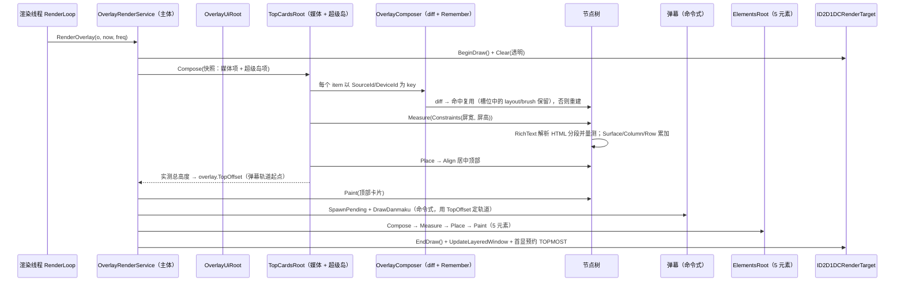
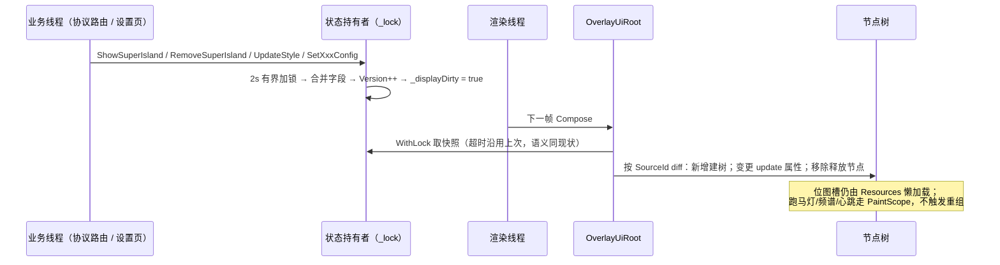

# PC 端覆盖层重构：声明式 UI（Compose 风格）+ 核心渲染收回主体

范围：`Win/src/NotifyRelay.Overlay/**` + 主项目设置页（`ViewModels/Settings`、`Views/Settings`）。

> 子组件不再是「各自调 D2D 画一遍」，而是像 Composable 一样**声明一棵 UI 节点树**，由核心统一 measure → layout → paint。涵盖：顶部卡片（媒体 + **超级岛**）、弹幕以外的全部叠加层元素。

## 一、目标与验收

**目标**

1. **核心收回主体**：渲染循环、活跃判定、目标屏判定、脏判定、重组（recompose）触发、资源生命周期，全部由 `OverlayRenderService` + 声明式运行时统一驱动。
2. **子组件声明化**：超级岛 12 个模板 + 媒体卡片 + 时钟 / 心率 / 罗技电池 / DeepSeek 余额 / 键盘五个元素，只写「UI 长什么样」，不再写锁模板、目标屏解析、画刷按 rt 失效、逐字段 try/catch 释放、8 方向描边、圆角卡片、垂直居中、cursorY 累加等样板。
3. **保留式运行时 + 状态记忆**：节点树跨帧保留，按 (类型, key) diff 复用；`Remember` 提供槽位状态；被移除的节点与清空的槽位在**渲染线程**统一释放。
4. **完整两遍布局**：子节点在 `Constraints` 下上报自身尺寸，父节点定位。**超级岛最大的收益**：现有 `MeasureExpandedTemplate`（823-843）与绘制分派（710-764）是两条并行 if 链、高度公式需手工同步，声明式化后合并为一次 measure。

**验收**

1. `dotnet build src/NotifyRelay/NotifyRelay.csproj -p:Platform=x64` 通过，**无新增错误/警告**（执行前先构建留基线，执行后再构建对比）。
2. `OverlayRenderService` 的**全部 public 方法签名与语义不变**：`SetClockConfig` / `SetHeartRateConfig` / `SetLogiBatteryProvider` / `SetKeyboardStateProvider` / `UpdateHeartRate` / `SetHeartRateConnected` / `ClearHeartRate` / `UpdateDeepSeekBalance` / `SetDeepSeekBalanceConfig` / `GetScreenList` / `ShowDanmaku` / `ShowMediaCard` / `ShowSuperIsland` / `RemoveMediaCard` / `RemoveSuperIsland` / `UpdateStyle` / `Start` / `Stop`。因此 `AppLifecycleHelper`、4 个 `IOverlayFeature`、各设置页 XAML **零改动**。
3. 行为等价：元素开关、目标屏回退、时钟「仅秒变化时重绘」、看门狗重启后资源重建、跨屏/热插拔重建；超级岛各模板视觉与现有实现一致（见 §八 冒烟矩阵）。
4. 冒烟矩阵逐项通过。

**范围外**：`Items.cs`（数据项生命周期/超时）、`Resources.cs`（位图懒加载与 URL 下载）、`Internal/*`（窗口管理、控制窗口、置顶监控、看门狗）、`IOverlayFeature` 契约与 DI 登记、`SuperIslandParamV2Parser.cs`（解析层）。

---

## 二、现状（实测）

### 2.1 五个叠加层元素

| 文件 | 行数 | 重复样板 |
|---|---|---|
| `OverlayRenderService.Clock.cs` | 250 | 锁模板×3、目标屏解析、8 方向描边、画刷按 rt 缓存、字段级 try/catch 释放 |
| `OverlayRenderService.HeartRate.cs` | 471 | 同上 + 文本反色描边、心形几何缓存、迷你曲线 |
| `OverlayRenderService.LogiBattery.cs` | 401 | Provider 替换、卡片布局、名称二分截断、画刷缓存、字段释放 |
| `OverlayRenderService.DeepSeekBalance.cs` | 309 | 与罗技**几乎同构**的圆角卡片（底 + 图标 + 文本 + 变化量） |
| `OverlayRenderService.Keyboard.cs` | 234 | Provider 替换、按键框绘制、映射提示超时淡出 |
| `OverlayRenderService.Native.cs` | 10 | 空 partial，注释已声明可删 |

### 2.2 顶部卡片 / 超级岛（`Rendering.cs`，2059 行）

```
RenderTopCards 14-100                 锁内快照+超时移除，锁外绘制，累加 y → overlay.TopOffset
├─ DrawMediaCard 158-222              媒体展开胶囊 400x100；收起 227-325（自适应宽 x36 + 频谱动画）
└─ DrawSuperIslandCard 331-338        收起/展开分派（SummaryOnly 强制收起）
   ├─ DrawSuperIslandCollapsed 345-426  胶囊：A区 + gap48 + B区，宽度自适应
   │   ├─ MeasureAComponent 429-443 / MeasureBComponent 507-529 / DrawAComponent 446-504 / DrawBComponent 532-598
   │   └─ ResolveBText 601 → FormatDigitTimer 621 → FormatMilliseconds 646；DrawProgressRing 2010 → DrawRingArc 2039
   └─ DrawSuperIslandExpanded 659-790  380 宽大岛：先测高 → 画背景 → 画模板
       ├─ MeasureExpandedTemplate 823-843 + Measure* 846-989（11 个，与绘制链**并行重复**）
       ├─ DrawBgInfoTemplate 1641-1665（背景层，内容之前）
       ├─ 模板分派 710-764（12 分支）
       └─ 追加 DrawMultiProgressTemplate 1727-1844 / DrawLinearProgress 1850-1862
```

**模板分派**（710-764，唯一判据 = `ParamV2` 字段非空，顺序即优先级）：
`ParamIsland` → `BaseInfo` → `ChatInfo` → `AnimTextInfo` → `HighlightInfo` → `HighlightInfoV3` → `PicInfo` → `IconTextInfo` → `CoverInfo` → `TextButton|Actions|HintInfo` → `default`。
`MultiProgressInfo` / `ProgressInfo` / `BgInfo` 不参与分派，为主链后追加 / 独立背景层。

**结构性重复**：`MeasureExpandedTemplate`（823-843）与分派链（710-764）是两条并行 if 链，需手工同步高度公式（833 硬编码 `48+4`；`MeasureTextHeight` 1945-1949 返回 `size+6` 属伪测量，非真实换行高度）。

**收起/展开**：无插值动画，`IsExpanded` 为 bool，仅 3s 到点翻转（88-92）；收起态按 centerY 垂直居中、宽自适应 40/46 两档；展开态固定 380 宽、top-left 起点 + 模板内 cursorY 累加。

---

## 三、运行时设计

### 3.1 目录（新增 `Services/Overlay/UI/`）

| 文件 | 内容 |
|---|---|
| `OverlayNode.cs` | 节点基类：`Key`、子节点表、槽位表、`Measure` / `Place` / `Paint` / `OnDispose`；**rt 绑定画刷缓存**（3.4） |
| `Geometry.cs` | `Size` / `Rect` / `Constraints` / `Insets` / `Alignment` / `AxisSize`（Main/Cross） |
| `LayoutNodes.cs` | `Column` / `Row` / `WrapRow` / `Stack` / `Box` / `Padding` / `Surface` / `Constrained` / `Align` / `Spacer(weight)` |
| `LeafNodes.cs` | `Text` / `RichText` / `Icon` / `Bitmap` / `Canvas` |
| `WidgetNodes.cs` | `ProgressBar` / `ProgressRing` / `MarqueeText` / `Clip` / `CircleClip` / `Tag` / `Button` |
| `OverlayComposer.cs` | 保留式树游标：diff（类型+key）、`Remember`、节点栈 |
| `PaintScope.cs` | 绘制上下文：`ID2D1DCRenderTarget`、`IDWriteFactory`、`ID2D1Factory`、累积 `Opacity`、`NowSec`、`Freq`、`Transform` 栈 |
| `OverlayUiRoot.cs` | 每屏一个：持有 **TopCardsRoot**（媒体+超级岛）与 **ElementsRoot**（5 元素）两个根，驱动 Compose → Measure → Place → Paint |
| `Elements/` | `IOverlayElement` + 五个元素类 + `ElementContext` |
| `Islands/` | `SuperIslandCard` + 12 个模板的声明式实现 + `MediaCard` |

### 3.2 节点契约

```csharp
internal abstract class OverlayNode
{
    public string? Key { get; init; }
    internal readonly List<OverlayNode> Children = new();
    internal SlotTable Slots;                     // Remember 槽位

    protected abstract Size Measure(MeasureScope s, Constraints c);  // 子节点递归上报
    protected abstract void Place(Rect rect);                        // 父节点定位后的落位
    protected abstract void Paint(PaintScope s);
    protected virtual void OnDispose() { }        // 渲染线程调用，释放布局/画刷/几何
}

internal sealed class OverlayComposer
{
    public void Compose(string? key, Func<OverlayNode> create, Action<OverlayNode> update, Action children);
    public T Remember<T>(string key, Func<T> factory) where T : notnull;
}
```

- **Diff**：同层按 `(节点类型, key)` 匹配 → 命中则 `update` 复用（槽位保留）；否则释放旧节点、构造新节点。
- **Remember**：槽位按 key 存放；key 组合变化时整表清空，`IDisposable` 在渲染线程释放。
- **动态值不入树**：心跳缩放、提示淡出、跑马灯偏移、频谱动画等逐帧值走 `PaintScope.NowSec` 与 `OpacityProvider` / `OffsetProvider`，**不触发重组**。

### 3.3 布局（两遍）

1. **Measure**：根以下发 `Constraints`（屏宽高）；`Column`/`Row` 按 spacing + weight 下发剩余空间并累加；`Text` 用 `IDWriteTextLayout` 真实量测（替换现有伪测量 `MeasureTextHeight`）；`Surface` = 子节点 + padding；`Constrained` 强制 maxWidth；`WrapRow` 超宽换行；`Stack` 取子节点最大尺寸。
2. **Place**：父节点把 `Rect` 交给子节点；`Align` 按百分比锚点 + 对齐定位并夹取到屏幕内；`Stack` 按 z 序叠加。
3. 仅在**重组或屏幕尺寸变化**时 Measure/Place；Paint 每帧执行。

### 3.4 画刷与资源的线程亲和

- 节点内统一 `Brush(PaintScope, Color4)`：按量化颜色键缓存，记住创建时的 rt；**rt 变化即整表重建**。→ 收敛罗技 / DSB / 时钟 / 超级岛各自的手写 `rtChanged` 分支，全运行时只此一处规则。
- `IDWriteTextLayout` / `IDWriteTextFormat` / `ID2D1PathGeometry` 由工厂创建、rt 无关，缓存在节点或 `Remember` 槽位 —— **消除超级岛当前每帧新建 format/layout/brush 的开销**（现有 `CreateTruncatedLayout` / `MeasureTextWidth` 每帧各建一个 10000 宽 layout）。
- 位图（18 个 SuperIsland 图片槽）仍由 `Resources.cs` 懒加载并挂在 item 上，rt 变化时走现有 `InvalidateTopItemDeviceResources`；节点只引用不持有。
- 所有释放只发生在渲染线程（diff 移除、槽位清空、服务 Dispose）。

### 3.5 样板被消除的位置

| 原样板 | 收敛到 |
|---|---|
| `Monitor.TryEnter(_lock, 2000)` × 10 + 日志 | `ElementContext.WithLock`（取快照，锁外组合/绘制） |
| 目标屏解析 × 5 | `OverlayElementCore.IsTargetScreen` |
| 8 方向 ×2 环描边（时钟 / 心率） | `Text.OutlineWidth` / `OutlineColor` + `StrokeColorOf` |
| 圆角卡片 Fill+Draw（罗技 / DSB / 超级岛多处） | `Surface(radius, fill, border, borderWidth)` |
| 垂直居中 / cursorY 累加算式（超级岛 12 模板） | `Column`/`Row` 的 `crossAlignment` + padding + spacing |
| 画刷按 rt 失效（罗技 / DSB / 时钟 / 超级岛） | `OverlayNode.Brush` |
| 逐字段 `try{...}catch{}` 释放 | 节点 `OnDispose` + 槽位释放 |
| **measure 与 paint 双 if 链**（823-843 vs 710-764） | **单次 measure 遍历** |

---

## 四、五个叠加层元素的声明式形态

| 元素 | 组合（示意） | 关键点 |
|---|---|---|
| Clock | `Align(center, x%, y%) { Text(time, size=48*scale, outline) }` | `NeedsRedraw` = 文本变化 ‖ rt 变化 ‖ 窗口不可见（保留秒级优化） |
| HeartRate | `Align(center) { Column(crossAlign=Center) { Stack { Canvas(心形+曲线), Text(bpm) } ; (Surface 胶囊 │ Text) } }` | 心形与曲线走 `Canvas`；心跳缩放取 `PaintScope.NowSec`，不重组 |
| LogiBattery | `Align(topLeft) { Column(uniformWidth) { foreach 设备: Constrained(卡片maxW) { Surface { Padding { Row(gap) { Icon(电池字形), Text(设备名, ellipsis) } } } } } }` | `Column.UniformWidth` 对齐现状「取最大自然宽后统一」 |
| DeepSeekBalance | `Align(topLeft) { Constrained(maxW) { Surface { Padding { Row(gap) { Icon(¥), Text(余额), Text(变化量, 涨绿/跌红) } } } } }` | 与罗技共用 `Surface`/`Row`/`Text` |
| Keyboard | `Align(topLeft, 20,20) { Column { WrapRow(maxWidth=10*(KeyBoxSize+KeyBoxMargin)) { 每键: Surface(radius) { Padding { Text(键名) } } } ; Surface { Padding { Text(hint) } } } }` | 提示淡出用 `OpacityProvider` |

- 元素仍保留数据状态持有者（`_hrBpm` / `_dsbBalance` / `_clockEnabled` / provider），业务线程在 `_lock` 下写入并自增 `Version`；组合时先取快照再描述 UI —— 锁语义（2s 有界等待、超时跳过）不变。
- `LogiBatteryElement` 维持**绘制时直读设置**（`_settings.LogiBattery*`）现状，避免改动刷新时机。

---

## 五、顶部卡片 / 超级岛声明式化

### 5.1 分层与绘制顺序

每屏一个 `OverlayUiRoot`，三个绘制阶段（z 序与现状完全一致）：


- **TopCardsRoot** 声明式：`Align(topCenter, y=10) { Column(spacing=0) { MediaCard… ; SuperIslandCard… } }`，measure 后的**总高度写回 `overlay.TopOffset`**（等价现有 99 行 `overlay.TopOffset = y`），继续作为弹幕轨道起点。
- **弹幕**保持命令式：轨道分配（`TryAssignTrack`）与跨屏分发依赖窗口集合与时间推进，且不是「静态 UI 描述」，收益低、风险高。
- **ElementsRoot** 声明式：五个元素（§四）。

### 5.2 超级岛声明式结构

```csharp
// SuperIslandCard：收起 / 展开只是两种组合，不再是两条绘制分支
Align(topCenter) {
  Surface(radius = expanded ? 16 : h/2, fill = #000 α0.92*0.9, border…) {
    Padding(expanded ? 8 : 10) {
      Column(uniformWidth = !expanded) {
        if (!expanded) Row(gap = 48) { AComponent(aComp) ; BComponent(bComp) }
        else           Column { BgInfo背景 ; 模板节点 ; 追加进度 }
      }
    }
  }
}
```

**收起态**（345-426）：`Constrained(minWidth=120) { Row(gapAB=48) { A区 ; B区 } }`，自适应宽由两遍 measure 自然得出（不再手工 `MeasureAComponent`/`MeasureBComponent` 预测量）；高度 40/46 由 `Surface` padding + 内容撑开。
**B 区**（532-598）四种形态：`BImageText` → `Row{Icon, MarqueeText}`；`BDigitInfo` → `Text(Consolas)`；`BProgressText` → `Row{ProgressRing, Text}`；`BPicInfo` → `Bitmap`。现有的 `drawX - x` 反推宽度副作用（546/556/568/583）由 `Row` 的 measure 取代。

### 5.3 12 个模板的声明式映射

| 模板（现实现） | 行号 | 声明式组合 | 难度 |
|---|---|---|---|
| `PicInfoTemplate` | 1393 | `Row(gap12) { Bitmap(48) │ CirclePlaceholder ; Text(14B) }` | 易 |
| `CoverInfoTemplate` | 1521 | `Row(gap12) { Bitmap(48) ; Column{ Text(15B) ; Text(12) ; Text(12) } }` | 易 |
| `IconTextInfoTemplate` | 1470 | `Row(gap12) { Box(56){ Bitmap(48, 居中) } ; Column{ 3×Text } }` | 易 |
| `AnimTextTemplate` | 1419 | `Row(gap12) { Bitmap(40) ; Column{ Text(15B) ; Text(Consolas15) ; Text(12) } }` | 易 |
| `ChatInfoTemplate` | 991 | `Row(gap12) { CircleClip{ Bitmap(48) } ; Column(weight1){ Text(14B) ; Text(12) } ; Text(计时, 右对齐) }` | 易 |
| `BaseInfoTemplate` | 1199 | `Column { 按 Type 决定顺序：Text(12)/Text(14B)/Text(ExtraTitle) ; Tag(SpecialTitle, r4) }` | 中 |
| `ActionsTemplate` | 1667 | `Column { Hint?{Text(14B);Text(12)} ; Row(gap8){ Button×≤2, 等分 } }` | 中 |
| `Collapsed` | 345 | `Row(gap48) { A区 ; B区 }`（两遍 measure 自适应宽） | 中 |
| `ParamIslandTemplate` | 1119 | `Column { RichText(主,14B) ; RichText(次,12) ; Row(weight1){ Bitmap(40)? ; Column(weight1){RichText主;RichText次} ; Bitmap(40)? } }` | 中 |
| `HighlightTemplate` | 1038 | `Row(gap12) { Bitmap(40/48) ; Column(weight1){ 4×Text } ; Row{ Bitmap(44) ; Bitmap(44) } }` | 难 |
| `MultiProgressTemplate` | 1727 | `Column { RichText(标题) ; Canvas(轨道+前景+等距节点+指针) }` | 难 |
| `HighlightInfoV3Template` | 1571 | `Column { Text(20B) ; Text(12, 划线) ; Tag(r10) ; Button(h30,r15) }` | 中 |
| `BgInfoTemplate` | 1641 | `Surface` 的背景参数（`type=1` 全宽 / `type=2` 右半宽） | 易 |
| `LinearProgress` | 1850 | `ProgressBar(h4, 前景色)` | 易 |
| `DefaultTemplate` | 1864 | `Row(gap8) { Bitmap(28) ; Column(weight1){ RichText ; Text(11) ; Text(extra) ; ProgressBar } ; Text(计时,右对齐) }` | 中 |

- **`MultiProgress` 用 `Canvas` 逃生节点**：轨道/前景/节点/指针是层叠 + 等距绝对定位 + 条件显隐（isFood 隐藏首节点 1775、指针仅 1-99 显示 1824），用通用节点描述代价高于收益；先用 `Canvas` 原样承载（含 `rt` 直接调用），后续再考虑专用节点。
- **Highlight 的右侧大图反向布局**（1101-1110 `bx -=`）改为 `Row` 尾部顺序排列，measure 阶段即确定 textW，消除「先算 bigImages 再扣减」的副作用。

### 5.4 HTML 富文本

`RichText`：Measure 阶段调用 `ParseHtmlColorSegments` 解析并累加各段宽度，决定「分段着色」还是「整行截断」（现有 1268/1306 的分支判定），结果缓存在槽位；Paint 阶段按段绘制。**measure 阶段需要分段宽度**在两遍布局中是天然顺序，不再是「paint 依赖 measure」的障碍。

### 5.5 超级岛单帧时序



### 5.6 数据推送 → 重组（含超级岛增量）



---

## 六、主体 `OverlayRenderService` 改造

### 6.1 文件变更

- **新增** `OverlayRenderService.Elements.cs`：持有 5 个元素 + `OverlayUiRoot`；集中所有 public 转发方法（签名与注释原样保留）。
- **修改** `OverlayRenderService.cs`
  - 构造：建 `ElementContext`（settings / 三工厂 / `_lock` / 窗口集合访问器 / `MarkDirty`）+ 5 个元素。
  - `Start()`：`LoadInitialStyle()` 保留；4 个 `LoadInitialXxxConfig()` 收敛为 `foreach (e) e.LoadSettings()`。
  - `RenderLoop`：`hasContent` 级联收敛为 `baseContent || _elements.Any(e => e.IsActive())`；`baseContent` 含顶部卡片与弹幕。
  - `RenderOverlay`：三阶段绘制（顶部卡片 → 弹幕 → 元素），见 §5.5；`clockDirty` 早退推广为 `uiRoot.NeedsPaint`。
  - `CleanupOverlays()`：`uiRoot.Reset()` → `_windowManager.Cleanup()` → 顶部卡片清理（含 `InvalidateTopItemDeviceResources`）。**统一释放范围**：心率几何、罗技缓存一并释放，重建时懒重建。
  - `Dispose()`：`uiRoot.Dispose()` + 三工厂释放。
- **新增** `ScreenOverlay.UiRoot` 字段（每屏一棵，rt 不同）。
- **删除**：`OverlayRenderService.{Clock,HeartRate,LogiBattery,DeepSeekBalance,Keyboard}.cs`、`OverlayRenderService.Native.cs`；`Rendering.cs` 中的媒体/超级岛绘制函数（保留 `DrawDanmaku` 与 `TryAssignTrack` 等弹幕逻辑，或随弹幕一并移入 `OverlayRenderService.Danmaku.cs`）。
- **微调** `OverlayElementCore.cs` / `Drawing.cs`：上提 `Approximately`、`ParseColorChannel`（→ `ColorHex`）等共用件；`MeasureTextWidth`/`ParseHexColor`/`ResolveThemeColor`/`DrawCircle*` 迁入 `UI/` 供节点使用。

---

## 七、主项目（设置页）去重

1. **新增** `ViewModels/Settings/OverlayScreenOptions.cs`：`Build(OverlayRenderService?, savedId)` 统一「PRIMARY + `GetScreenList()` 枚举 + 回显选中」，供 4 个 ViewModel 调用，删除 4 份副本。回显比较统一为 `OrdinalIgnoreCase`（现状 Clock/HR 为 Ordinal、Logi/DSB 为 IgnoreCase；取值来自同一列表，忽略大小写是超集，无回归）。
2. **新增** `Helpers/ColorHex.cs`：`TryParseChannel` / `ToWindowsColor` / `Format`，供两个 Page 的 ColorPicker 共用；`DanmakuViewModel.ParseColorR/G/B` 与 Overlay 内 `ParseColorChannel` 一并改调（纯静态）。
3. **不改**：4 个页面 XAML、`OverlaySettingsPage` 导航、DI 登记。

---

## 八、实施顺序与冒烟

**顺序（每步可单独编译）**

1. 基线构建，记录警告数；截图留存超级岛各模板现状（用于视觉比对）。
2. 新增 `Geometry` / `OverlayNode` / `PaintScope` / `OverlayComposer`（纯新增）。
3. 新增布局节点 + 叶子节点 + `WidgetNodes`（纯新增）。
4. 先接 `Clock`（最简单：文本缓存 + 描边 + 秒级门控），与旧实现并存由临时编译常量切换，验证后删除旧代码。
5. 依次迁移 `DeepSeekBalance` → `LogiBattery` → `HeartRate`（`Canvas`）→ `Keyboard`（`WrapRow`）。
6. **超级岛**：先 `PicInfo`/`CoverInfo`/`IconTextInfo`/`AnimText`/`ChatInfo`（易）→ `BaseInfo`/`Actions`/`Collapsed`/`ParamIsland`/`HighlightV3`/`Default`（中）→ `Highlight`/`MultiProgress`（难，`Canvas` 逃生）；每完成一组即删除对应命令式函数。
7. 媒体卡片（展开/收起 + 频谱 `Canvas`）。
8. 改造主体 `RenderLoop` / `RenderOverlay` / `CleanupOverlays` / `Dispose` / `Start`；删除 `OverlayRenderService.Native.cs`。
9. 主项目：`OverlayScreenOptions` 接 4 个 ViewModel；`ColorHex` 接 2 个 Page + `DanmakuViewModel`。
10. 构建对比（错误/警告不劣化）→ 冒烟。

**冒烟矩阵**

| 场景 | 预期 |
|---|---|
| 5 个元素开关分别单独开 / 关 | 各自独立显隐，互不影响 |
| 时钟开 + 其余关 | 每秒重绘一次，窗口常显不闪烁 |
| 心率 文本 / 卡片 / 心形 组合 | 布局居中、心跳动画流畅（不重组） |
| 罗技多设备上下线 | 卡片等宽、增减正确、长名省略号 |
| 余额 涨 / 跌 / 无数据 | 绿 / 红 / `¥--` 占位 |
| 键盘按键 + 映射提示 | 按键框换行、提示 1.5s 淡出 |
| **超级岛收起态**（A区/B区各形态） | 胶囊宽度自适应、垂直居中；`BDigitInfo` 计时器不换行；长文本滚动重启锚点正确 |
| **超级岛展开态 12 个模板**逐个触发 | 与基线截图一致（标题/内容/图标/计时/按钮/标签相对位置与换行） |
| **`MultiProgress`** | 节点等距、指针仅 1-99 显示、isFood 隐藏首节点 |
| **`Highlight`** | 右侧大图左右顺序与间距、textW 不被大图挤压 |
| **`BaseInfo` type=1 / type=2** | 主次文本上下顺序相反 |
| **HTML 富文本** | `<font color>` 分段着色；超宽回退整行截断 |
| **媒体卡片** 展开/收起、跑马灯、频谱 | 3s/5s 自动收起；播放中长标题滚动 |
| **弹幕轨道起点** | 顶部卡片存在时弹幕不被遮挡（TopOffset 生效） |
| 改多屏模式 / 拔插显示器 | 重建后各元素与超级岛正常重建，无残留画刷崩溃 |
| 空闲（全关） | 窗口隐藏、30ms 轮询休眠 |
| 卡死恢复（看门狗） | 树重置后重建，无异常 |

---

## 九、风险与对策

| 风险 | 对策 |
|---|---|
| **保留式运行时正确性**（diff / 槽位 / 释放）是最大新增风险 | 先在最简单的 Clock 上跑通并逐项冒烟，再迁其余；`OverlayComposer` 行为集中在单一文件 |
| **超级岛 12 模板视觉漂移**（本次最大回归面） | 基线截图 + 逐模板比对；按「易→中→难」分批，每批独立验证；`MultiProgress`/`Highlight` 先走 `Canvas`/`Row` 保底，不过度抽象 |
| 名称截断由「二分 + 手工拼 `…`」改为 DWrite 省略号裁剪，宽度口径微变 | `Text(maxWidth, ellipsis)` 复用已有 `CreateTruncatedLayout`；保留 `MeasureAndTruncate` 备用，冒烟核对罗技卡片宽度 |
| 键盘换行：现状按 `(nextX-KeyStartX)/(KeyBoxSize+KeyBoxMargin) >= 10` 近似 | `WrapRow(maxWidth = 10*(KeyBoxSize+KeyBoxMargin))` 等价实现；冒烟核对换行位置 |
| `MeasureTextHeight` 伪测量（`size+6`）替换为真实 layout metrics，超级岛卡片高度会变 | 属于修正；冒烟时逐模板核对高度与文字是否被裁切 |
| 位图资源由节点引用但仍在 item 上，rt 变化时的失效顺序 | 保留现有 `InvalidateTopItemDeviceResources` 作为 rt 变化钩子，节点只读取不缓存位图 |
| 逐帧值（心跳缩放、提示淡出、跑马灯、频谱）误入组合导致每帧重组 | 明确只走 `PaintScope.NowSec` 与 `OpacityProvider`/`OffsetProvider` |
| 锁语义变化 / 释放后重建不及时 | `WithLock` 严格复刻 `Monitor.TryEnter(2000)`；资源一律懒重建 |
| 无单测工程 | 以「构建无新增警告 + 冒烟矩阵」验收；不新增测试工程 |

---

## 十、假设

- 覆盖层元素与超级岛模板不需要跨进程 / 插件式扩展，运行时与节点保持 `internal`，元素集合在主体构造函数内固定创建。
- 弹幕保留命令式（轨道与时间推进是动态系统，非静态 UI 描述）。
- `MultiProgress` 与心率心形/曲线、媒体频谱走 `Canvas` 逃生节点，保留直接 D2D 调用，作为渐进迁移的兜底。
- 罗技电池维持「绘制时直读设置」而非推送配置，避免改动刷新时机。

---

## 十一、顺带发现的问题（不在本次自动处理，需确认后再动）

1. **媒体卡片 y 步进与实际高度不符**：`Rendering.cs:81` 固定 `y += 108 / 48`，而 `DrawMediaCard` 实际画 100、`DrawMediaCardCollapsed` 实际 36 → 卡片间存在 8/12px 多余空隙。声明式化后按实测高度累加会自动修正，**间距会变化**，需冒烟确认。
2. **伪测量**：`MeasureTextHeight`(1945-1949) 返回 `size+6`，非真实换行高度，多行文本时卡片高度偏小。
3. **调试脚手架留在渲染路径**：`LogProbe`(795-803) 在每帧构造长字符串（692 的三元链、785-787、994、1041、1122、1201、1258、1298）；`DebugTemplateExec`(806-820) 无调用方。建议删除，属行为无关改动，**待确认**。
4. **异常吞没**：779-782 的 try/catch 包裹整段内容绘制，失败时静默（仅写 crash log）。建议保留行为但下沉为节点级 try/catch。
5. **缓存了但未使用的字段**：`SuperIslandItem.TitleLayout` / `SubtitleLayout` / `AdditionalTextLayout`（Resources 80/86/92）在 `Rendering.cs` 中未被读取。声明式化后由节点槽位替代。
