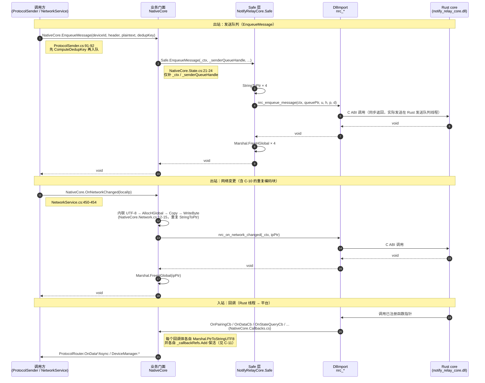
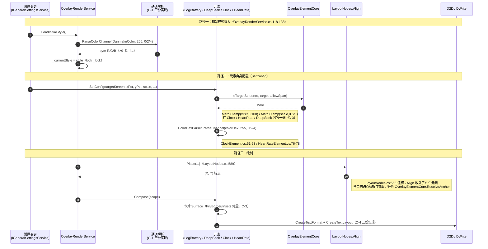
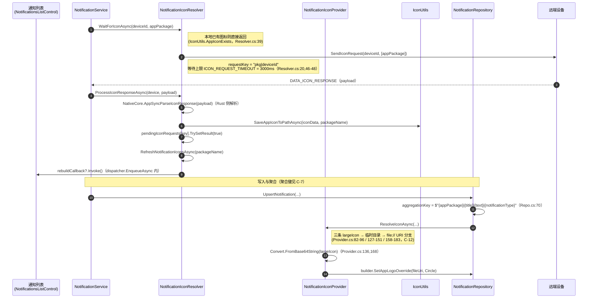

# 项目重复与过度包装清单（Windows 端）

> 分析工具：CodeGraph **1.6.2**（`codegraph_explore` MCP，索引根 `E:\GitHubCode\01Main\NotifyRelay`）
> 分析范围：`Windows/src/`（`NotifyRelay`、`NotifyRelay.Overlay`、`NotifyRelay.Worker`、`NotifyRelay.NativeCore` 的 C# 部分）
> 图谱规模：整库索引 **1,108 文件 / 25,467 节点 / 52,026 边**（DB 233.15 MB），语言构成 Kotlin 405、C# 343、Rust 332、YAML 9、XML 8、properties 7、C/C++ 4
> 源码规模：**306 个 .cs / 约 35,411 行**（`NotifyRelay` 237 文件 / 24,111 行，`NotifyRelay.Overlay` 51 / 9,361，`NotifyRelay.NativeCore` 11 / 666，`NotifyRelay.Worker` 7 / 1,273）
> 排除范围：`NotifyRelay.NativeCore/notify-relay-core`、`NotifyRelay.Overlay/logi-battery` 两个 Rust 子模块内部；Android / Gamebar / LSP 侧
> 分析性质：**静态结构分析**。下列条目均为「图谱证据 + 源码核对 + 文本检索复核」得出的**疑似项**，不等同于必须修改的结论；是否收敛、如何收敛需人工决策。
>
> 本清单为 **Windows 端独立清单**，与仓库根目录的 `项目重复与过度包装清单.md`（Android 端）互不合并。

---

## 0. 结论速览

| 类别 | 条目数 | 主要集中区域 |
| --- | --- | --- |
| A. 多重包装（A→B→C 纯转发） | 7 | `Native/`、`NativeCore/`、`Platforms/Windows/Services/` |
| B. 薄封装（wrapper） | 7 | `Services/Adb`、`Services/Media`、`Extensions/`、`Overlay/UI/` |
| C. 重复实现 | 21 | `Overlay/UI/`、`Data/AppDatabase/`、`Platforms/`、`ViewModels/`、`Views/` |
| D. 应公用未公用 | 6 | `Helpers/`、`Services/Settings/`、`ViewModels/`、`Views/Settings/` |

**最高优先关注**：

1. **A-1 / A-2 / A-3** FFI 边界存在三层包装（`NativeCore` → `Safe` → `DllImport`），其中 `NativeCore` 的 45 处转发与 `Safe` 的 54 个方法为机械样板，且平台侧另有 2 个类绕开 `NativeCore` 直连 `Safe`，形成两条并行通路。
2. **C-1** `#RRGGBB` 通道解析在 3 处各自实现（主项目 1 份 + Overlay 程序集 2 份），且 Overlay 内部两份可零依赖收敛。
3. **C-5 / C-6** `NotificationRepository` 的「设备列表增删」样板 4 份逐字重复（含索引对齐不变量），base64/data-URL 解码 6 处内联而 `ImageHelper.FromBase64` 已存在。

---

## A. 多重包装（A→B→C 纯转发）

判定标准：调用链上存在一层只做「补参数 / 改名 / 搬参」、不编码、不解码、不校验的转发层。

### A-1 FFI 第三层门面 `NativeCore` 相对 `Safe` 层无新增语义（高）

- 位置：`Windows/src/NotifyRelay/Native/NativeCore.Lifecycle.cs:7`、`NativeCore.State.cs:5`、`NativeCore.Pairing.cs:5`、`NativeCore.Keys.cs:5`、`NativeCore.AppSync.cs:6`、`NativeCore.Network.cs:32`、`NativeCore.Audio.cs:5`
- 证据：`Native/` 目录下 `return NotifyRelayCore.Safe.X(...)` 形式的单行转发共 **45 处**，按文件分布：`NativeCore.Keys.cs` 9、`NativeCore.Lifecycle.cs` 8、`NativeCore.Pairing.cs` 8、`NativeCore.AppSync.cs` 7、`NativeCore.Audio.cs` 6、`NativeCore.State.cs` 5、`NativeCore.Network.cs` 2（`NativeCore.cs`、`NativeCore.Callbacks.cs` 为 0）。
- 证据：`NativeCore` 的 50 个公开门面方法中，**10 个在 `Windows/src` 内零外部调用**：`ComputeFeatureId`（`NativeCore.Lifecycle.cs:25`）、`ExportState`（`:30`）、`EncryptLocalState`（`:40`）、`HasKeypair`（`NativeCore.Keys.cs:27`）、`SendHandshake`（`NativeCore.Pairing.cs:10`）、`SendPairingInit`（`:15`）、`GeneratePairingCode`（`:36`）、`ClearPairingCode`（`:41`）、`AppSyncClearIconPending`（`NativeCore.AppSync.cs:22`）、`PushSuperIslandState`（`NativeCore.State.cs:27`）。已按技能 §4.5 复核裸名调用、`nameof(...)`、字符串与 `GetMethod(` 反射形式，均无命中。
- 证据：唯一带语义的是 `AudioStart`（硬编码端口 `23335`，`NativeCore.Audio.cs:7`）、`AudioWriteFrame`（补 `pcm.Length`，`:12`）、`HandleDeviceTimeout`（平台会话清理，`:33`）、`Initialize`/`GetGitHash`/`RegisterCallbacks`/`SetLogCallback`。典型转发体：`NativeCore.State.cs:21-24` `EnqueueMessage` 仅补 `_ctx` / `_senderQueueHandle`。
- 性质：多重包装
- 说明：链路为 `调用方 → NativeCore → NotifyRelayCore.Safe → nrc_* DllImport → Rust`。第三层相对第二层只多一个 `_ctx` 捕获与时间戳（`NativeCore.AppSync.cs:8,13,19`）。属可收敛项。
- 建议：把 `_ctx` 提升到 `Safe` 层（或由 `NotifyRelayCore` 内部持有），删除纯转发方法，仅保留承载平台语义的 4~7 个入口。

### A-2 `NotifyRelayCore.Safe` 为纯样板层，无空指针校验与异常保护（中）

- 位置：`Windows/src/NotifyRelay.NativeCore/NotifyRelayCore.AppSync.cs:25-66`、`NotifyRelayCore.State.cs:22-52`、`NotifyRelayCore.Messaging.cs:21-52`、`NotifyRelayCore.Network.cs:65-196`、`NotifyRelayCore.Pairing.cs`、`NotifyRelayCore.Core.cs:34-65`、`NotifyRelayCore.Audio.cs:35-71`
- 证据：11 个绑定文件共 **69 个 `DllImport`**；每个 `Safe` 方法形态固定为 `StringToPtr × N → nrc_* → Marshal.FreeHGlobal × N → PtrToStringAndFree`。例：`NotifyRelayCore.AppSync.cs:29-33` 为 5 次 `StringToPtr` + 5 次 `FreeHGlobal`。
- 证据：`NotifyRelayCore.Audio.cs:47-50`、`:57-60`、`NotifyRelayCore.Core.cs:62-64` 等 6 处零处理，直接等于 `DllImport`。全部 54 个 `Safe` 方法中无一处做 `IntPtr.Zero` 入参判断或异常兜底。
- 性质：浅包装 / 多重包装
- 说明：该层的合理价值是 UTF-8 编解码，但其内容 100% 机械；同时 `StringToPtr` 私有化（`NotifyRelayCore.cs:22`）又把编解码能力对上层封闭，直接导致 A-3 与 C-10 的重复。
- 建议：抽出 `WithUtf8(params string?[])` 或改用 `LibraryImport` 字符串封送，把 54 个方法收敛为声明式绑定；`Safe` 中真正零处理的 6 个方法可删除。

### A-3 `SuperIslandProtocol` / `NotifyCryptoHelper` 绕开 `NativeCore` 直连 `Safe`，形成第二条通路（中）

- 位置：`Windows/src/NotifyRelay/Services/Protocol/SuperIslandProtocol.cs:21`、`:36`、`:45`、`:54`；`Windows/src/NotifyRelay/Helpers/NotifyCryptoHelper.cs:14`、`:34`、`:39`
- 证据：`Native/` 之外对 `NotifyRelayCore.Safe.*` 的引用共 7 处，全部集中在这两个文件。`SuperIslandProtocol.cs:34-46`、`:52-55` 三处方法体各一行、零变换；`ComputeFeatureId`（`:21-27`）只加 `?? ""`。`NotifyCryptoHelper.DerivePasswordHash`（`:34`）与 `GenerateRandomPassword`（`:39`）同样只有 `?? ""`（`DeriveFtpCredentials`（`:14`）含 base64 + JSON 语义，属正常）。
- 证据：`NativeCore` 也暴露同名 `ComputeFeatureId`（`NativeCore.Lifecycle.cs:25`）且零外部调用——同一 FFI 能力存在两个平台侧入口。
- 调用方：`ProtocolRouter.cs:231`、`NotificationService.cs:134`、`MusicMediaBlockManager.cs:59`。
- 性质：浅包装 / 应公用未公用
- 说明：A-1 判定该层「可选」，本项是该判定的直接证据。属可收敛项。
- 建议：统一为单一入口；三个零变换解析方法删除，调用方直接走统一入口。

### A-4 `WindowftpService` 兼容壳 + `IftpService` 空壳契约（中）

- 位置：`Windows/src/NotifyRelay/Platforms/Windows/Services/WindowsFtpService.cs:11`、`:18`；接口 `Windows/src/NotifyRelay/Data/Contracts/ISftpService.cs:5`
- 证据：`InitializeAsync`（`:11-16`）方法体只有一行日志 + `await Task.CompletedTask`，注释自述「这个方法现在由ProtocolRouter直接调用NetworkDriveMapper处理，这里只是保持接口兼容」。`Remove`（`:18-31`）除日志外唯一动作是 `networkDriveMapper.UnmapftpDrive(deviceId)`（`:24`）。
- 证据：接口仅 2 个成员、全仓唯一实现（`Platforms/Windows/ServiceCollectionExtensions.cs:26` 注册）、唯一消费者 `ViewModels/Settings/DeviceSettingsViewModel.cs:48` 且只调用 `FtpService.Remove(device.Id)`（`:112`）。
- 性质：浅包装 / 多重包装
- 说明：真实逻辑已迁至 `NetworkDriveMapper`，此服务为显式保留的兼容壳。属历史欠账，本轮不建议改动（涉及 ViewModel 与 DI）。
- 建议：待 `DeviceSettingsViewModel` 改为直接依赖 `NetworkDriveMapper` 后，删除 `IftpService` / `WindowftpService` 与 `InitializeAsync` 空实现。

### A-5 `WindowsNotificationHandler` 4 个纯透传 + 剪贴板通知双方法近似重复（中）

- 位置：`Windows/src/NotifyRelay/Platforms/Windows/Services/WindowsNotificationHandler.cs:35`、`:41`、`:47`、`:53`；`Windows/src/NotifyRelay/Platforms/Windows/Services/Notifications/TransferNotificationBuilder.cs:121`、`:146`
- 证据：`WindowsNotificationHandler.cs:35-56` 四个方法体各只有一行 1:1 转发到 `_transferBuilder`（字段声明 `:27`），其中 `ShowFileTransferNotification`（`:35`）与 `ShowCompletedFileTransferNotification`（`:41`）声明为 `async void` 却无 `await`。
- 证据：`TransferNotificationBuilder.ShowClipboardNotification`（`:121-143`）与 `ShowClipboardNotificationWithActions`（`:146-175`）结构相同：同样的 `.SetTag($"clipboard_{DateTime.Now.Ticks}")`、`.SetGroup("clipboard")`、`ExpiresOnReboot = true`、`AppNotificationManager.Default.Show`，唯一差异是 `:156-161` 的可选按钮。`ShowClipboardNotification` 的 `iconPath` 形参（`:121`）在方法体内从未使用（接口 `Data/Contracts/IPlatformNotificationHandler.cs:23` 同样保留该参数）。
- 性质：浅包装 / 重复
- 说明：`IPlatformNotificationHandler` 接口 + 实现的分层本身合理，问题是实现类对其中 4 个成员只做透传，且剪贴板两方法为同一构建逻辑的参数化缺失。可收敛。
- 建议：`ShowClipboardNotificationWithActions` 内部调用 `ShowClipboardNotification` 的公共构建私有方法（可选按钮作为参数）；未使用的 `iconPath` 参数与接口同步清理或真正接线；去掉无 `await` 的 `async void`。

### A-6 `DefaultActionsProvider` 纯透传 + `WindowsActionService` 空派生类（低）

- 位置：`Windows/src/NotifyRelay/Services/DefaultActionsProvider.cs:8-11`；`Windows/src/NotifyRelay/Platforms/Windows/Services/WindowsActionService.cs:11`；`Windows/src/NotifyRelay/Platforms/Windows/DefaultActions.cs:5`
- 证据：`DefaultActionsProvider.cs:8-11` 方法体仅 `return WindowsDefaultActions.GetDefaultActions();`，唯一调用方 `Services/BaseActionService.cs:17`。`WindowsActionService.cs:11-16` 为 16 行空派生类，除构造函数外无任何成员，注册于 `Platforms/Windows/ServiceCollectionExtensions.cs:19` 作为 `IActionService`；全部行为在 `BaseActionService`。
- 性质：浅包装 / 多重包装
- 说明：`WindowsDefaultActions.GetDefaultActions()` 已是平台实现，中间的 `DefaultActionsProvider` 未做任何平台无关化；`WindowsActionService` 存在只为 DI 有一个可注册的具体类型。`WindowsActionService.cs:2` 注释声明这两个类型被刻意保留在 `Services` 根命名空间，改动前需确认该分层约定是否硬性。收益有限。
- 建议：若该分层约定非硬性要求，`BaseActionService.cs:17` 直接调 `WindowsDefaultActions.GetDefaultActions()` 并删除中间层；否则登记保留。

### A-7 `DeepSeekBalanceSettingsAccessor` 三属性零加工透传（低）

- 位置：`Windows/src/NotifyRelay/Services/Settings/DeepSeekBalanceSettingsAccessor.cs:15`、`:17`、`:19-23`
- 证据：三个成员全部直接转发到 `IGeneralSettingsService` 的**同名**属性（`_settings.DeepSeekApiToken`、`_settings.DeepSeekBalancePollingInterval`、`_settings.DeepSeekBalanceHistoryJson`），无改名、无类型转换、无缺省值。注册于 `Helpers/ServiceCollectionConfigurator.cs:40`，唯一消费方 `NotifyRelay.Worker/Services/DeepSeekBalanceService.cs:19,32`。
- 性质：浅包装
- 说明：为满足 `NotifyRelay.Worker` 的 `IDeepSeekBalanceSettings`（`NotifyRelay.Worker/Configuration/IDeepSeekBalanceSettings.cs:7`，属性名与 `IGeneralSettingsService` 完全同名）而写的适配器。跨项目解耦理由成立（Worker 不引用主项目），但属性名一致使适配器零信息增量。
- 建议：属可接受的分层适配，**不建议优先处理**；若收敛，可让 `IGeneralSettingsService` 直接实现 `IDeepSeekBalanceSettings`（需注意循环引用风险）。登记为历史欠账。

---

## B. 薄封装（wrapper）

判定标准：方法体只有 1–3 行、只是换个名字或加一行调用，可读性/复用收益低于维护成本。

### B-1 `AdbService` 9 处纯转发，退化为协作层的透明门面（中）

- 位置：`Windows/src/NotifyRelay/Services/AdbService.cs:63`、`:66`、`:69`、`:71`、`:73`、`:292`、`:294`、`:296`、`:325`、`:327`
- 证据：`:63` `=> catalog.Devices`、`:66` `=> commandExecutor.AdbClient`、`:69/71/73` `=> ScrcpyPreferences.DisplayOrientation/VideoCodec/AudioCodec`、`:292` `=> deviceOperator.UnlockDevice(...)`、`:294` `=> deviceOperator.IsLocked(...)`、`:296` `=> deviceOperator.UninstallApp(...)`、`:325` `=> tcpReconnector.TryConnectTcp(host)`、`:327` `=> tcpReconnector.TryAutoReconnectAsync(device)`——全部为单表达式一行体。
- 证据：外部调用点稀少：`TryConnectTcp` 1 处（`NetworkService.cs:150`）、`TryAutoReconnectAsync` 1 处（`ScrcpyDeviceSelector.cs:171`）；`DisplayOrientationOptions` 等 3 项另有二级转发 `ViewModels/Settings/DeviceSettingsViewModel.Scrcpy.cs:10-12`。同层 `Services/Adb/AdbCommandExecutor.cs:72`、`:75-76` 亦为同类一行转发。
- 性质：浅包装
- 说明：`AdbService` 的拆分（`AdbProcessLauncher` / `AdbCommandExecutor` / `AdbDeviceCatalog` / `AdbDeviceInfoResolver` / `WirelessAdbConnector` / `AdbTcpReconnector` / `AdbDeviceOperator`，构造见 `:43-61`）本身是合理的职责分离，**不算问题**；问题是拆分后保留了 9 个「同签名、零加工」的转发成员。
- 建议：把 `TryConnectTcp` / `TryAutoReconnectAsync` 收敛到已有接口（`AdbTcpReconnector` 目前是具体类型、无接口），或删除其余无加工转发并让调用方直接依赖协作接口。改动面较大，建议登记后分批。

### B-2 `ScreenMirrorService` 4 处纯转发，其中 1 个公开方法零调用（中）

- 位置：`Windows/src/NotifyRelay/Services/Media/ScreenMirrorService.cs:137`、`:140`、`:142`、`:144`
- 证据：`:137-138` `=> configBuilder.Build(args, deviceSerial, settings)`，唯一调用点 `:102`（同类内部）；`:140` `=> pathResolver.PickLocationAsync()`，**全仓零调用点**（`SelectScrcpyLocationClick` 检索仅命中自身定义 + `ScrcpyPathResolver.cs:13` 注释；`Views/Settings/ScrcpyAdbSettingsPage.xaml:42` 绑定的是 `SelectScrcpyLocation_Click`，其实现 `ScrcpyAdbSettingsPage.xaml.cs:31-39` 直接调用 `PickerHelper.PickFileAsync()`，**未走** `SelectScrcpyLocationClick`）；`:142` `=> processManager.StopScrcpy(...)`，外部零调用（仅 `IScreenMirrorService.cs:8` 声明）；`:144` `=> processManager.StopScrcpyByDeviceId(...)`，唯一外部调用点 `ViewModels/MainPageViewModel.Commands.cs:75`。
- 性质：浅包装
- 说明：拆分（`ScrcpyConfigBuilder` / `ScrcpyPathResolver` / `ScrcpyProcessManager` / `ScrcpyDeviceSelector` / `ScrcpyPasswordCache`）合理；问题集中在转发残留 + `SelectScrcpyLocationClick` 已成为死公开 API。另 `ScrcpyPathResolver.PickLocationAsync:60-71` 的 `ToolPathHelper.TrySetCompanionTool` 与 `ScrcpyAdbSettingsPage.xaml.cs:37` 是两份并行实现。
- 建议：删除 `SelectScrcpyLocationClick`（或让设置页改调它以统一 `TrySetCompanionTool` 行为）；`BuildScrcpyArguments` 内联到 `:102`；`StopScrcpy` 若无计划使用一并清理。

### B-3 `DeviceDirectory` 整类零消费方，仅被 DI 注册（中）

- 位置：`Windows/src/NotifyRelay/Services/Devices/DeviceDirectory.cs:11-23`（`Find:13`、`OnlinePaired:16`、`OnlinePairedCount:22`）；接口 `Windows/src/NotifyRelay/Data/Contracts/IDeviceDirectory.cs:11`
- 证据：全 `Windows/src` 检索 `IDeviceDirectory` 仅 3 个文件命中——接口自身、`Services/Devices/DeviceDirectory.cs`、`Helpers/ServiceCollectionConfigurator.cs:70`（`.AddSingleton<IDeviceDirectory, DeviceDirectory>()`）。三个成员的调用点检索（`OnlinePairedCount`、`OnlinePaired(`、`Ioc...GetService/GetRequiredService<IDeviceDirectory>`）均为 0。已核验无 `GetService(typeof(...))` 与 `nameof` 命中。
- 证据：类注释自称「设备信息的同步查询入口，全部数据来自 `IDeviceSnapshotStore` 的只读投影」，但实际消费方全部直接注入 `IDeviceSnapshotStore`（`DiscoveryService.cs:41`、`DeviceManager.cs:15`、`NetworkService.cs:19`、`AppLifecycleHelper.cs:137`）。
- 性质：浅包装（登记了共用入口但无人使用）
- 说明：属「已公用但未落地」的中间层，当前只增加一个 DI 注册与一份接口。属历史欠账。
- 建议：二选一——(a) 让 `DeviceManager` / `DiscoveryService` / `NetworkService` 的只读查询改走 `IDeviceDirectory`，坐实该层；(b) 确认无计划后删除类 + 接口 + 注册。

### B-4 `Extensions/` 两个扩展类无生效调用点（中）

- 位置：`Windows/src/NotifyRelay/Extensions/LinqExtensions.cs:5`、`Windows/src/NotifyRelay/Extensions/CollectionExtensions.cs:11`
- 证据：`LinqExtensions.Get<TOut,TKey,TValue>`：定向检索仅命中定义本身，**0 个调用点**（`PaintScope.cs:58` 的 `_brushes.Get(Rt, color)` 是 `BrushCache.Get`，非本方法）。
- 证据：`CollectionExtensions.AddRange`：全部 10 个 `.AddRange(` 调用点（`PairedDevice.cs:317`、`AdbTcpReconnector.cs:123`、`NotificationGrouper.cs:121,125,134`、`DeepSeekBalanceViewModel.cs:313`、`OverlayScreenOptions.cs:64`、`MainPageViewModel.Dashboard.cs:88,92`、`OverlayComposer.cs:206`）实参均为 `List<T>`（如 `OverlayComposer.cs:206` 的 `parent.Children` 为 `List<OverlayNode>`、`AdbTcpReconnector.cs:123` 的 `possibleIps` 为 `List<string>`），走 BCL `List.AddRange`，本扩展无实际生效调用。同文件 `ToObservableCollection:5` 有 1 个调用点（`RemoteAppRepository.cs:41`）。
- 性质：浅包装 / 死代码
- 说明：静态可判定，不涉及 DI 或 XAML 绑定。属历史欠账。
- 建议：`LinqExtensions.cs` 在确认无外部项目引用后整体删除；`CollectionExtensions.AddRange` 删除，保留 `ToObservableCollection`。

### B-5 `ElementContext` 转发方法与只写不读字段（中）

- 位置：`Windows/src/NotifyRelay.Overlay/Services/Overlay/UI/Elements/ElementContext.cs:94`（`ResolveAnchor`）、`:51`（`MarkDirty`）；`Windows/src/NotifyRelay.Overlay/Services/Overlay/OverlayRenderService.Elements.cs:112`（`AnyElementTargets`）；`Windows/src/NotifyRelay.Overlay/Services/Overlay/UI/Elements/ClockElement.cs:31`（`_cacheText`）
- 证据：`ElementContext.ResolveAnchor:94-95` 为 `=> OverlayElementCore.ResolveAnchor(o, xPercent, yPercent)` 的纯转发，**0 个调用点**；其能力已被 `UI/LayoutNodes.cs:566` `Align` 节点的 `Place:589` 取代（`LayoutNodes.cs:563` 注释说明 Align 收敛了 5 个元素各自的锚点解析与夹取，与 `OverlayElementCore.ResolveAnchor:43` 等价）。
- 证据：`ElementContext.MarkDirty:51` 有定义与存储（构造注入见 `OverlayRenderService.Elements.cs:31`），但全仓无任何元素调用。`AnyElementTargets:112` **0 个调用点**（同文件 `AnyElementActive:104`、`AnyNonClockElementTargets:123` 各有 1 个调用点 `OverlayRenderService.cs:226`、`:377`）。`ClockElement._cacheText:31` 仅在 `:103` 赋值、`:132` 重置，全文件无读取。
- 性质：浅包装 / 死代码
- 说明：`ElementContext` 的转发方法是为兼容 `OverlayElementCore` 抽取前的调用形态而保留，`Align` 落地后 `ResolveAnchor` 已无存在理由。属历史欠账。
- 建议：按「先删字段与方法、后删文件」顺序清理；清理前建议一次全解决方案编译验证。

### B-6 空壳 code-behind 与两个无意义 `OnNavigatingFrom` 覆盖（低）

- 位置：`Windows/src/NotifyRelay/Views/Settings/DeviceDiscoveryPage.xaml.cs:56-59`、`Windows/src/NotifyRelay/Views/Onboarding/SyncPage.xaml.cs:31-34`、`Views/UserControls/TitleBar.xaml.cs:3-9`、`Views/Settings/AboutPage.xaml.cs:3-9`、`Views/SplashScreen.xaml.cs:3-9`、`Views/Settings/OverlayTopCardsPage.xaml.cs:6-14`
- 证据：`DeviceDiscoveryPage` 与 `SyncPage` 各有一个仅调 `base.OnNavigatingFrom(e)` 的空覆盖（无附加逻辑）；`TitleBar.xaml.cs` 全文 9 行仅 `InitializeComponent()`；`AboutPage.xaml.cs` 9 行、`SplashScreen.xaml.cs` 9 行、`OverlayTopCardsPage.xaml.cs` 14 行（仅构造 + `InitializeComponent` + `ViewModel => (DanmakuViewModel)DataContext`）。对照 `Views/Settings/OverlayTopCardsPage.xaml` 有实际内容（媒体卡片 / SuperIsland / Gamebar 转发），页面本身并非死代码，仅 code-behind 为空壳。
- 性质：浅包装
- 说明：这些空壳属 WinUI 代码生成所需（`InitializeComponent` 必须存在），本身合理；真正可清理的是两个无意义的 `OnNavigatingFrom` 覆盖。**不要**把空壳页面当作死代码删除。
- 建议：仅删除 `DeviceDiscoveryPage.xaml.cs:56-59` 与 `SyncPage.xaml.cs:31-34` 两个空覆盖；其余保留。

### B-7 已声明但无消费方的转换器与 ViewModel 成员（低）

- 位置：`Windows/src/NotifyRelay/Converters/Converters.cs:261-283`（`RingerModeToIconConverter`）、`:285-307`（`AdbIconToTypeConverter`）、`ViewModels/MainPageViewModel.AdbStatus.cs:119-144`（`AdbStatusIcons`）、`ViewModels/MainPageViewModel.Dashboard.cs:9-39`（`MixedNotifications`）、`ViewModels/MainPageViewModel.cs:124-128`（`GetDeviceName`）
- 证据：对 `Views/**/*.xaml` + `UserControls/**/*.xaml` 全量检索 `Converter={StaticResource <名>}`：`RingerModeToIconConverter` 0 次、`AdbIconToTypeConverter` 0 次（二者仅在 `MainPage.xaml:33,41` 声明资源）。`AdbStatusIcons` 除自身定义外，仅被 `MainPageViewModel.cs:70,116` 与 `AdbStatus.cs:163` 三处 `OnPropertyChanged(nameof(AdbStatusIcons))` 提及，无任何 XAML / 代码消费；`MixedNotifications` 除定义外仅内部引用，无绑定（`NotificationsListControl.xaml:571` 绑的是 `DashboardItems`）；`GetDeviceName` 全仓库仅 1 处命中即其定义。对照 `AdbConnectionTypes`（`MainPage.xaml:261`）确有绑定。
- 性质：重复（冗余实现）/ 浅包装
- 说明：`AdbIconToTypeConverter` 与 `MainPageViewModel.AdbStatus.cs:119-144` 的图标映射是同一套「USB/WiFi → 字形」规则的两种写法（`Converters.cs:295-296` 与 `AdbStatus.cs:133,139` 共用 `\uE89E` / `\uE927` 字面量），且 `AdbConnectionTypes` 版已覆盖展示需求，二者皆无消费者。属历史欠账，删除前需确认无反射 / 动态绑定（已核对无 `x:Bind` 名称匹配）。
- 建议：删除 4 个无消费成员与其资源声明；如担心外部引用，可先标 `[Obsolete]`。

---

## C. 重复实现

### C-1 `#RRGGBB` 通道解析三份实现（高）

- 位置：`Windows/src/NotifyRelay/Helpers/ColorHex.cs:12`（`TryParseChannel`）、`Windows/src/NotifyRelay.Overlay/Services/Overlay/UI/LeafNodes.cs:584`（`ColorHexParser.ParseChannel`）、`Windows/src/NotifyRelay.Overlay/Services/Overlay/OverlayRenderService.cs:151`（私有 `ParseColorChannel`）
- 证据：三处算法同一：`StartsWith('#')` 判空 → `TrimStart('#')` → `Length != 6` 判空 → 按下标取两位 → `NumberStyles.HexNumber` 解析 → 失败回退 `fallback`；仅目标类型与失败处理方式不同（`ColorHex` / `LeafNodes` 用 `byte.TryParse`，`OverlayRenderService` 用 `byte.Parse` + `catch`）。
- 证据（调用面）：
  - `ColorHex.TryParseChannel`：9 个调用点，全部在 `ViewModels/Settings/DanmakuViewModel.cs:273-286`。
  - `ColorHexParser.ParseChannel`：**2 个文件 / 6 个调用点**——`UI/Elements/ClockElement.cs:51-53`、`UI/Elements/HeartRateElement.cs:76-78`。同文件 `Parse:569` **不调用**它（自行内联三次 `byte.TryParse`，`LeafNodes.cs:573-576`）；`PreferDark:600` 为 `=> dark ?? light`；`ResolveTheme:603` 调的是 `Parse`。
  - `OverlayRenderService.ParseColorChannel`：9 个调用点，`OverlayRenderService.cs:122-135`（`LoadInitialStyle`）。
- 性质：重复实现
- 说明：`ColorHex.cs:5-8` 的文件注释声明其用途是「替代各自的重复实现」，主项目内确已收敛（3 个 Overlay 设置页 + 弹幕 ViewModel 共用）；但同一算法在 Overlay 程序集内仍有两份独立副本。跨程序集复用受引用方向限制（`NotifyRelay.Overlay.csproj` 的 `ProjectReference` 数为 0），Overlay 内部两份属可直接收敛的历史欠账。
- 建议：Overlay 内部以 `ColorHexParser.ParseChannel` 为唯一实现，`OverlayRenderService.ParseColorChannel` 直接调用它；`ColorHex` 与 `ColorHexParser` 的合并需先决定共用类型（`Color4` vs `Windows.UI.Color`），建议放在两端都可引用的位置，暂不改动引用方向。

### C-2 十六进制 → `Color` 字节解析三份实现（高）

- 位置：`Windows/src/NotifyRelay.Worker/Services/DynamicLightingService.cs:88-97`、`:105-124`、`Windows/src/NotifyRelay/Views/Settings/DynamicLightingViewModel.cs:204-218`
- 证据：三处均为 `TrimStart('#')` → `Convert.FromHexString` → 按 `bytes.Length == 4 / 3` 分支构造 `Color`（4 字节取 `bytes[0]` 作 A，3 字节默认 A=255），仅方法名与所在层不同。`DynamicLightingService` 内部两份分别服务于 `LoadSettings:81` 与 `SetColorFromString:103`。
- 性质：重复实现
- 说明：同一服务内两份同算法副本属典型历史欠账；`DynamicLightingViewModel` 是第三份，位于主项目，与 Worker 之间无项目引用（`NotifyRelay.Worker.csproj` 仅含 `Microsoft.Extensions.Logging` 与 `System.Management` 两个 `PackageReference`，无 `ProjectReference`），跨程序集合并需新增依赖或下沉到共享位置。
- 建议：先收敛 `DynamicLightingService` 内部两份为一个私有静态方法（零依赖、零风险）；第三份待确定主项目与 Worker 的共享放置位置后再合并。

### C-3 Overlay 元素卡片常量、配置夹取、卡片表面绘制各自重复（高）

- 位置：`Windows/src/NotifyRelay.Overlay/Services/Overlay/UI/Elements/LogiBatteryElement.cs:16-24`、`.../DeepSeekBalanceElement.cs:13-22`、`.../ClockElement.cs:42-58`、`.../HeartRateElement.cs:66-92`
- 证据（常量逐字相同）：`CardPaddingX=12f`、`CardPaddingY=8f`、`CardCornerRadius=7f`、`IconSize=20f`、`IconTextGap=8f`、`CardMaxWidthFactor=0.35f`、`Opacity=0.9f` 在 `LogiBatteryElement.cs:16-24` 与 `DeepSeekBalanceElement.cs:13-22` 两处逐字重复（两文件各自另有专属常量：`CardSpacing`/`TextSize` vs `ValueSize`/`ChangeSize`/`ValueChangeGap`）。
- 证据（绘制逐字相同）：`Compose` 中卡片表面 Fill `new Color4(0,0,0,0.6f*Opacity)`、Border `(1,1,1,0.35f*Opacity)`、`BorderWidth = 1f*scale`、四边 Insets 相同（`LogiBatteryElement.cs:110-141` vs `DeepSeekBalanceElement.cs:135-141`）；Icon 叶子节点形状相同（`LogiBatteryElement.cs:168` / `DeepSeekBalanceElement.cs:151-158`，FontFamily 均为 `"Segoe MDL2 Assets"`）。
- 证据（`SetConfig` 夹取样板）：`targetScreen` 缺省 `"PRIMARY"`、`Math.Clamp(xPct,0,100)`、`Math.Clamp(scale,0.5f,·)` 在 `ClockElement.cs:45-58`、`HeartRateElement.cs:69-92`、`DeepSeekBalanceElement.cs:49-56` 各写一遍。
- 性质：应公用未公用
- 说明：同一元素层内的「卡片外观」与「配置解析」是两个已稳定的横切关注点，目前靠复制维持一致。`OverlayElementCore` 已存在（含 `IsTargetScreen:21`、`ResolveScale:48`）说明该收敛模式已被项目接受，此处只是尚未覆盖到外观与配置解析。
- 建议：新增 `ElementCard`（常量 + Surface/Icon 组装）与 `ElementConfig`（夹取 + 缺省值）两个共用入口，元素只传自身字段；先改 `LogiBattery` / `DeepSeek` 两个同形元素验证，再推广到 Clock / HeartRate。

### C-4 文本格式创建三份实现与自认的「薄封装」（中）

- 位置：`Windows/src/NotifyRelay.Overlay/Services/Overlay/UI/OverlayNode.cs:23`、`.../UI/PaintScope.cs:111`、`.../OverlayRenderService.Drawing.cs:17`
- 证据：三者函数体逐字相同（`DwFactory.CreateTextFormat(fontFamily, null!, weight, DWriteFontStyle.Normal, DWriteFontStretch.Normal, size)`）。调用面：`Drawing.cs:17` 被 `OverlayRenderService.Danmaku.cs:21` 与 `OverlayRenderService.Resources.cs:30,36,51,57,63,69` 使用；`PaintScope.cs:111` 有 **6 个调用方**，分布于 `LeafNodes.cs`、`WidgetNodes.cs:189,368`、`HeartRateElement.cs`、`Islands/Templates.cs`；`OverlayNode.cs:23` 有 3 个调用方，分布于 `OverlayNode.cs`、`LeafNodes.cs`。
- 证据：同文件 `OverlayRenderService.Drawing.cs:22` `CreateSolidColorBrush` 自注「薄封装」，3 个调用点（`Danmaku.cs:74,83,95`）。`OverlayRenderService.Resources.cs:28-71` 在 `EnsureMediaResources` 内联了 6 组 `CreateTextFormat` + `CreateTextLayout`。
- 性质：浅包装 / 重复实现
- 说明：三份同体实现同时存在，而 `PaintScope` 已持有 `DwFactory`，是天然的唯一定义点（调用面亦最广）。`Drawing.cs` 的两个转发本身无害（确为分层），但转发目标与另两份重复才是问题。`Resources.cs` 的内联块与 `PaintScope.CreateTruncatedLayout:115` / `CreateMeasureLayout:128` 能力重叠。
- 建议：以 `PaintScope.CreateTextFormat` 为唯一实现，`MeasureScope` 与 `OverlayRenderService` 转发到它；`EnsureMediaResources` 的 6 组内联改用既有 `CreateTextLayout` 路径。

### C-5 `NotificationRepository` 中「设备列表增删」样板四份逐字重复（高）

- 位置：`Windows/src/NotifyRelay/Data/AppDatabase/Repository/NotificationRepository.cs:139-165`、`:190-216`、`:245-268`、`:294-320`
- 证据：`DeleteNotification:128`、`ClearDeviceNotifications:180`、`ClearDeviceNotificationsByPackage:231`、`ClearDeviceNotificationsExceptPinned:284` 四个公开方法各自包含同一段约 27 行逻辑：反序列化 `DeviceIds` → `Contains(deviceId)` → `Count == 1` 则 `Delete(entity)`，否则反序列化 `DeviceNames`、按同一 `index` 双向 `RemoveAt`、重新序列化后 `InsertOrReplace`。四份仅在「选取候选集合」上不同（全表 / 全表 / 前缀过滤 `:242` / `Where(n => !n.Pinned)` `:288`）。第五个方法 `UpdatePinned:335` 复用同一遍历骨架但只改 `Pinned`。
- 证据：`JsonSerializer.Deserialize<List<string>>(` 在 `NotificationRepository.cs` 内共 **12 处**（`:37`、`:80`、`:81`、`:139`、`:150`、`:190`、`:201`、`:245`、`:254`、`:294`、`:305`、`:346`），全仓共 15 处。
- 性质：重复实现
- 说明：该段含索引对齐这一易错不变量（`index < deviceNames.Count` 的越界保护），四处副本使修正必须同步四处。纯仓储内部收敛，无跨程序集障碍。
- 建议：抽出 `RemoveDeviceFromNotification(NotificationEntity entity, string deviceId)` 私有方法承载 `Count==1` / `RemoveAt` / 序列化回写分支，四个公开方法只保留候选集合的选取与遍历。

### C-6 data-URL / base64 解码多处内联，而 `ImageHelper.FromBase64` 已存在（中）

- 位置：既有实现 `Windows/src/NotifyRelay/Helpers/ImageHelper.cs:49-58`（`FromBase64`）；内联副本 `Converters/Converters.cs:138-142`、`NotifyRelay.Overlay/Services/Overlay/OverlayRenderService.Resources.cs:264-275`、`Utils/IconUtils.cs:136`、`Services/Media/ClipboardService.cs:364`、`Platforms/Windows/Services/Notifications/NotificationIconProvider.cs:136`、`:168`、`Services/Protocol/ProtocolRouter.cs:273`
- 证据：各处均重复「判断 `data:image/` 前缀（或 `base64` 标记）→ 取 `IndexOf(',')` 之后子串 → `Convert.FromBase64String`」。`ImageHelper.FromBase64:49-58` 实现同一语义（`base64.Contains(',') ? base64.Split(',')[1] : base64`），已被 3 处调用（`Platforms/Windows/Services/PlaybackDataSyncer.cs:227`、`Services/Notifications/MusicMediaBlockManager.cs:121`、`:151`）；`ImageHelper.ToBase64Async:30-46` 是反向配对。
- 证据：全仓 `Convert.FromBase64String` 共 11 处，其余为密钥/凭据解码（`NetworkService.cs:323`、`:346`、`NetworkDriveMapper.cs:157`），不属本项。
- 性质：应公用未公用
- 说明：同一工具类已提供该能力，多处仍各自内联，属可收敛的历史欠账。`OverlayRenderService.Resources.cs` 与 `Converters.cs` 不在同一程序集，Overlay 侧复用需引用主项目或把该纯函数下沉到共享位置。
- 建议：主项目内五处（`Converters.cs`、`IconUtils.cs`、`ClipboardService.cs`、`NotificationIconProvider.cs`、`ProtocolRouter.cs`）先统一改为调用 `ImageHelper.FromBase64`；Overlay 侧待确定共享位置后处理。

### C-7 通知聚合键（`aggregationKey`）格式三处各自实现（中）

- 位置：`Windows/src/NotifyRelay/Data/AppDatabase/Repository/NotificationRepository.cs:70`、`Windows/src/NotifyRelay/Services/LocalNotificationListenerService.cs:283`、`Windows/src/NotifyRelay/Platforms/Windows/Services/Notifications/RemoteNotificationBuilder.cs:59`
- 证据：三处拼接同一概念但分隔语义不同——`$"{appPackage}|{title}|{text}|{notificationType}"`（`NotificationRepository.cs:70`）、`$"{androidPackage ?? appPackage}|{title}|{text}|New"`（`LocalNotificationListenerService.cs:283`，随后用于 `FindByAggregationKey`，`:284`）、`$"{titleText}|{textText}|New"`（`RemoteNotificationBuilder.cs:59`，**缺 `appPackage` 段**）。三处均无共享构造器；`FindByAggregationKey` 定义于 `NotificationRepository.cs:115`。
- 证据：`Data/AppDatabase/DatabaseContext.cs:178-182` 的迁移块亦逐字重复 `NotificationRepository.cs:61-70` 的解析与同一键格式；键格式还与 `NotificationRepository.cs:235` 的 `$"{packageName}|"` 前缀假设耦合。
- 性质：应公用未公用
- 说明：同一主键语义在三个类中各写一次，字段集与类型常量都不一致（第三处缺 `appPackage` 段），去重行为是否等价无法从代码判定，属疑似缺陷点。
- 建议：抽出 `NotificationAggregationKey.Build(package, title, text, type)` 单一来源，三处 + 迁移块调用；前缀拼接改用同一常量。

### C-8 `RemoteAppRepository` 查询管道重复与重叠的 `HasDevice` 重载（中）

- 位置：`Windows/src/NotifyRelay/Data/AppDatabase/Repository/RemoteAppRepository.cs:14`、`:34`、`:228`、`:233`
- 证据：`LoadApplicationsFromDevice:14` 与 `GetApplicationsForDevice:34` 各自执行同一条 `Table<ApplicationInfoEntity>().ToList().Where(a => HasDevice(a, deviceId)).OrderBy(AppName)` + `ToApplicationInfo` 管道（`:22` 与 `:38` 两处 `HasDevice` 调用）。两个 `HasDevice` 重载（`:228` 返回 `bool`、`:233` 返回 `bool` 且 `out AppDeviceInfo?`）逻辑重叠，后者再次解析同一 JSON。
- 性质：重复实现
- 说明：同一仓储内两条等价查询路径，调用方需自行选择；`HasDevice` 双重载使「判定」与「取值」被拆成两次解析。属可收敛项，收敛后需确认两个公开方法的调用方语义差异（若有）不被破坏。
- 建议：保留一个私有 `QueryByDevice(deviceId)` 供两个公开方法复用；`HasDevice` 只留带 `out` 的重载，`bool` 版本改为其包装。

### C-9 DeepSeek 余额「相邻同类型合并」两处实现（中）

- 位置：`Windows/src/NotifyRelay.Worker/Services/DeepSeekBalanceService.cs:217`（`MergeOldestConsecutiveItems`）vs `Windows/src/NotifyRelay/ViewModels/Settings/DeepSeekBalanceViewModel.cs:305`（`UpdateDisplayHistory`，合并逻辑在 `:318-341`）
- 证据：`DeepSeekBalanceService` 在写入历史时（`AddHistoryItem:186`，上限 `MaxHistoryItems=500:23`）合并最旧的连续同类型项（`:217` 的唯一调用方为 `:186`）；`DeepSeekBalanceViewModel.UpdateDisplayHistory:305` 在展示前再次执行同样的「相邻同类型合并」（调用点 `:110`、`:284`）。两处触发时机不同（溢出时 vs 展示时），但合并规则是同一条。
- 性质：重复实现
- 说明：规则重复意味着两侧可能对「同类型」的判定产生分歧，展示结果与持久化结果不一致时难以定位。属可收敛项，需先确认展示侧合并是否包含持久化侧没有的额外语义。
- 建议：把合并规则提为 `DeepSeekBalanceService` 的公开静态方法，`UpdateDisplayHistory` 调用它；若展示侧确有额外语义，则在方法上以参数区分而非复制规则。

### C-10 UTF-8 → `HGlobal` 编码块重复实现（高）

- 位置：重复方 `Windows/src/NotifyRelay/Native/NativeCore.Network.cs:8-23`（`OnNetworkChanged`）；被重复方 `Windows/src/NotifyRelay.NativeCore/NotifyRelayCore.cs:22-30`（`StringToPtr`，`private`）
- 证据：`NativeCore.Network.cs:12-15` 内联手写 `Encoding.UTF8.GetBytes` → `Marshal.AllocHGlobal(len+1)` → `Marshal.Copy` → `Marshal.WriteByte(...,0)`，与 `NotifyRelayCore.StringToPtr`（`NotifyRelayCore.cs:22-30`）逐行等价。根因是 `StringToPtr` 为 `private`，`NativeCore` 无法复用，只能内联复制。
- 证据：`Marshal.PtrToStringUTF8` 内联使用 16 处（`NativeCore.Callbacks.cs:12,25,49-52,169-170,223-224,245-246,258,283-284,304`、`Services/Media/.../AudioRelayService.cs:129-130`）；`Services/Infrastructure/LogiBatteryProvider.cs:252-259` 又自写 `unsafe PtrToStringUtf8`、`:209-215` 自写 `ReadFixedUtf8String`。
- 证据：`NativeCore.cs:63-70` `GetGitHash` 用 `Marshal.PtrToStringAnsi` + 手工 `nrc_free_string`，绕开同类的 `PtrToStringAndFree`，编码约定也不一致（ANSI vs UTF-8）。
- 性质：重复实现
- 说明：`StringToPtr` 私有化同时造成 A-2 与 C-10 两项。属可收敛项。
- 建议：`StringToPtr` 改 `internal` / `public` 并复用；`GetGitHash` 统一走 `PtrToStringAndFree`；`LogiBatteryProvider` 的两个私有辅助并入共享工具。

### C-11 回调注册样板重复 8 处，且存在第 4 / 5 种注册风格（中）

- 位置：`Windows/src/NotifyRelay/Native/NativeCore.Callbacks.cs:163`、`:214`、`:237`、`:253`、`:278`、`:292`、`:299`、`:307`；对照 `:16-41`、`NativeCore.Audio.cs:25-31`
- 证据：8 组固定成对样板 `nrc_set_on_*_cb(_ctx, cb); _callbackRefs.Add(cb);`（`_callbackRefs` 声明于 `NativeCore.cs:29`；`Add` 位于 `Callbacks.cs:164,215,238,254,279,293,300,308`）。`SetLogCallback`（`Callbacks.cs:39`）用完全不同的风格：`Marshal.GetFunctionPointerForDelegate(cb)` + `nrc_set_log_callback(fp)`（无 `_ctx`，`Add` 在 `:40`）；`RegisterAudioCallbacks`（`NativeCore.Audio.cs:25-31`）又是第三种（经 `Safe.RegisterAudioDataCb/EventCb` + 两次 `Add` 于 `:29,30`）。
- 性质：重复 / 应公用未公用
- 说明：注册动作与 GC 保活是同一语义，被复制 11 次；漏写 `_callbackRefs.Add` 会导致原生回调悬垂，属隐患型重复。可收敛。
- 建议：统一 `Register<TDelegate>(Action<IntPtr,TDelegate> setter, TDelegate cb)` 辅助，内部完成 `setter(_ctx, cb)` 与保活登记；`SetLogCallback` 的裸函数指针风格并入同一入口。

### C-12 `NotificationIconProvider.ResolveIconAsync` 大图标落盘分支三处近似重复（中）

- 位置：`Windows/src/NotifyRelay/Platforms/Windows/Services/Notifications/NotificationIconProvider.cs:82-96`、`:127-151`、`:158-183`
- 证据：三段各自执行 `GetTempIconsDirectory()`（`:15`）→ 拼 `largeIcon_*.png` → `Convert.FromBase64String` → `File.WriteAllBytesAsync` / `CopyAsync` → `new Uri($"file://{tempFilePath}")` → `builder.SetAppLogoOverride(..., AppNotificationImageCrop.Circle)`，并各自重复一对 `COMException` / `Exception` catch（`:98-107`、`:143-150`、`:175-182`），日志文案仅前缀不同。差异只有文件名前缀与来源（`ms-appdata` 复制 vs base64 写入）。
- 证据：`:71` `var appIconExists = IconUtils.AppIconExists(appPackage);` 赋值后全文件无引用。
- 性质：重复实现
- 说明：完全可用一个私有方法 + 枚举/参数表达。可收敛。
- 建议：抽 `TrySetLargeIconFromBytesAsync(builder, bytes, fileNamePrefix, notificationKey, logger)`，三处调用；删除未使用的 `appIconExists`。

### C-13 设备匹配（`AndroidId` 精确 + `Model` 模糊）逻辑 6 处重复（高）

- 位置：`Windows/src/NotifyRelay/Services/Adb/AdbDeviceCatalog.cs:132-143`（`HasConnectionForAsync`）、`Windows/src/NotifyRelay/Services/Media/ScrcpyDeviceSelector.cs:46`、`:180`、`Windows/src/NotifyRelay/Data/Models/PairedDevice.cs:265-271`（`HasAdbConnection`）、`:307-313`（`RefreshConnectedAdbDevices`）、`Windows/src/NotifyRelay/Services/Adb/AdbDeviceInfoResolver.cs:89-93`
- 证据：六处均为同一表达式族 `AndroidId == device.Id || (Model.Equals(..., OrdinalIgnoreCase) || Model.Contains(...) || 反向 Contains(...))`。调用方：`AdbDeviceCatalog.HasConnectionForAsync` 唯一调用点 `AdbTcpReconnector.cs:93`；`PairedDevice.HasAdbConnection` 被 `MainPageViewModel.cs:110`、`MainPageViewModel.AdbStatus.cs:51,125` 消费。`AdbDeviceInfoResolver.cs:89-93` 是第三份（仅 Model 分支，缺 `AndroidId` 分支）。
- 性质：应公用未公用
- 说明：同一「ADB 设备 ↔ 已配对设备」映射判定散落 3 个文件 6 处，任一处的 `StringComparison` / 空值策略调整都会造成两端判定不一致。`AdbDeviceCatalog.HasConnectionForAsync` 已是现成可复用入口，`PairedDevice` 却未调用它。
- 建议：抽静态判定（如 `AdbDeviceMatcher.Matches(AdbDevice, PairedDevice)`），六处统一改为调用；`PairedDevice.HasAdbConnection` 与 `RefreshConnectedAdbDevices` 复用同一判定。

### C-14 「带符号电量」表达式 6 处逐字重复（中）

- 位置：`Windows/src/NotifyRelay/Services/Devices/DiscoveryService.cs:74`、`:114`；`Windows/src/NotifyRelay/Services/Protocol/NetworkService.cs:54`、`:163`、`:262`、`:466`
- 证据：`var signedBattery = isCharging ? Math.Abs(battery) : -Math.Abs(battery);`（`NetworkService.cs:163` 为 `localBattery` / `localIsCharging` 变量名变体，`:262` 为 `signedLocalBattery` / `localBattery`）。全仓 `Math.Abs` 共 10 处，其中 6 处集中在这两个文件且全部是该表达式；其余 4 处为 DeepSeek / MediaCard 的无关用法。前置取值也对：`GetSystemBatteryLevel()` / `GetSystemChargingStatus()` 在这两个文件共 12 个调用点（DiscoveryService 4、NetworkService 8）。
- 性质：重复实现
- 说明：这是 Rust core 的协议约定（正=充电、负=放电），注释在 `NetworkService.cs:259` 与 `:466` 各写了一遍。协议常量语义分散在 6 处，任一处漏改都会造成电量方向错误且难以察觉。
- 建议：抽 `BatterySign.Signed(level, isCharging)`（或 `ISystemInfoService.GetSignedBatteryLevel()`，由 `SystemInfoService` 内部读两个 API），6 处统一调用。

### C-15 SMTC 会话事件处理成对重复（低）

- 位置：`Windows/src/NotifyRelay/Platforms/Windows/Services/SmtcSessionRegistry.cs:150`、`:166`；`Windows/src/NotifyRelay/Platforms/Windows/Services/WindowsPlaybackService.cs:67`、`:83`
- 证据：`SmtcSessionRegistry.Session_MediaPropertiesChanged`（`:150-164`）与 `Session_PlaybackInfoChanged`（`:166-180`）结构相同，仅 `MediaPropertiesChanged?.Invoke` / `PlaybackInfoChanged?.Invoke` 一行不同，两处 `catch` 的日志文案逐字相同（`:158` vs `:174`、`:162` vs `:178`）。`WindowsPlaybackService.OnSessionMediaPropertiesChanged`（`:67-81`）与 `OnSessionPlaybackInfoChanged`（`:83-97`）同样同构，唯一差异是 `catch (COMException)` 的日志文案（`:75` vs `:91`），两者都调用 `playbackDataSyncer.UpdatePlaybackDataAsync(session)`。
- 性质：重复实现
- 说明：两处各有一对，共 4 个方法承载 2 个语义，属低风险重复。
- 建议：各抽一个私有 `SafeInvoke(Action)` 包装；`WindowsPlaybackService` 两个处理器合并为一个方法并直接订阅两个事件。

### C-16 `KeyboardHookService` 两份逐行相同的 `GetKeyName`（低）

- 位置：`Windows/src/NotifyRelay/Platforms/Windows/Services/KeyboardHookService.cs:255-279`（`private static`）与 `:320-344`（`KeyboardMappingConfig.GetKeyName`，`public static`）
- 证据：两份 `vkCode` switch 体经 `Compare-Object` 逐行比对，**22 行零差异**（`0x08 => "Backspace"` … `_ => $"0x{vkCode:X2}"`）。UI 侧走的是 `Views/Settings/OverlayKeyboardPage.xaml.cs:96,194,197` 对 `KeyboardMappingConfig.GetKeyName` 的引用。
- 性质：重复实现
- 说明：私有那份无任何调用方，属纯冗余。属可收敛项。
- 建议：删除 `KeyboardHookService.cs:255-279` 私有副本，内部调用 `KeyboardMappingConfig.GetKeyName`。

### C-17 `ScrcpyConfigBuilder.Build` 内音频三参数发射块重复（低）

- 位置：`Windows/src/NotifyRelay/Services/Media/ScrcpyConfigBuilder.cs:44-57`（音频独占分支）与 `:127-140`（常规分支）
- 证据：两段逐字同构，均为 `AudioBitrate` → `--audio-bit-rate=`、`AudioBuffer` → `--audio-buffer=`、`AudioOutputBuffer` → `--audio-output-buffer=` 三连 `if (!string.IsNullOrEmpty(...)) args.Add(...)`。调用方 1 处：`ScreenMirrorService.cs:102`（经 `:137` 转发）。方法内其余分支（视频 / 方向 / 音频输出模式）不重复，重复仅限这 9 行。
- 性质：重复实现
- 说明：`Build` 用「音频独占模式」提前 return 分成两条路径，导致公共的音频参数发射被复制。参数名是 scrcpy CLI 契约，重复意味着新增音频参数需改两处。
- 建议：抽 `private static void AppendAudioArgs(List<string> args, IDeviceSettingsService s)`，两处调用。改动极小。

### C-18 Win32 P/Invoke 声明分散且互不复用（低，疑似）

- 位置：`Windows/src/NotifyRelay/Services/LocalNotificationListenerService.cs:467-474`（`private static class NativeMethods`，`OpenInputDesktop` / `CloseDesktop`）、`Windows/src/NotifyRelay/Platforms/Windows/Services/KeyboardHookService.Native.cs:8`（`LibraryImport`）、`Windows/src/NotifyRelay/Platforms/Windows/Interop/InteropHelpers.cs:31-47`（`DllImport`）；`Windows/src/NotifyRelay.Overlay/Services/Overlay/Internal/Win32.cs:129-203`
- 证据：按文件的 `DllImport` / `LibraryImport` 计数：`Win32.cs` 36、`ScreenColorAnalyzer.cs` 10、`KeyboardHookService.Native.cs` 7、`InteropHelpers.cs` 4、`LocalNotificationListenerService.cs` 2。`Win32.cs:5-9` 的文件注释声明其存在即为避免新功能重复声明。
- 证据：`Windows/src/NotifyRelay.Worker/Services/ScreenColorAnalyzer.cs:262-271` 自行声明 `GetDC` / `ReleaseDC` / `CreateCompatibleDC` / `DeleteDC` / `CreateCompatibleBitmap` / `SelectObject` / `DeleteObject` / `StretchBlt` / `GetDIBits`，而 `Win32.cs` 未声明 `StretchBlt` / `GetDIBits` / `CreateCompatibleBitmap`。
- 性质：重复实现（疑似，受程序集边界限制）
- 说明：`NotifyRelay.Worker.csproj` **无 `ProjectReference`**（仅两个 `PackageReference`），`ScreenColorAnalyzer` 无法在不新增依赖的前提下复用 `Win32.cs`。故标记为疑似：真实重复，但收敛需先决定是否让 Worker 引用 Overlay（或把 Win32 归口下沉为独立程序集）。
- 建议：P/Invoke 归口问题需先确认 Worker 与 Overlay 的依赖方向，暂不建议改动。

### C-19 `LogiBatteryLoader` 与 `NativeCore.Initialize` 的候选目录扫描同构（低）

- 位置：`Windows/src/NotifyRelay/Native/LogiBatteryLoader.cs:37-53` 与 `Windows/src/NotifyRelay/Native/NativeCore.cs:41-57`
- 证据：两处均为「组装候选目录列表 → 逐个 `Path.Combine` + `File.Exists` → `NativeLibrary.Load`」结构；`LogiBatteryLoader.cs:10` 文件头注释自述「仿 NativeCore.Initialize」。差异仅在候选目录项与目标 DLL 名。
- 性质：重复实现
- 说明：`asmLocation` / `checkDirs` 组装逻辑可共用。属可收敛项。
- 建议：抽 `NativeLibraryLocator.Load(string dllName, IEnumerable<string> extraDirs)` 供两处调用。

### C-20 内联 `new ContentDialog` 12 处，其中错误弹窗与确认弹窗近乎同构（中）

- 位置：`Windows/src/NotifyRelay/ViewModels/Settings/DeviceSettingsViewModel.cs:89-97`（删除设备确认）、`:115-121` 与 `:127-133`（两处 `Title = "Error"` 弹窗）、`ViewModels/Settings/ActionsViewModel.cs:90-98`、`Views/Settings/OverlayDeepSeekBalancePage.xaml.cs:45-53`、`Views/Settings/DynamicLightingSettingsPage.xaml.cs:28-35`、`Dialogs/DeviceSelector.cs:33-41`；另 `Services/Media/ScrcpyDeviceSelector.cs:203,219,274`、`Services/Media/ScrcpyPathResolver.cs:32`、`Services/Media/ScrcpyProcessManager.cs:173`
- 证据：全仓 `new ContentDialog` 共 12 处。其中 `DeviceSettingsViewModel.cs:115-121` 与 `:127-133` 除 `Content` 文本外完全一致（均 `Title="Error"`、`CloseButtonText="OK"`、同 XamlRoot）；`ScrcpyDeviceSelector.cs:203-209` 与 `:219-225` 亦逐字相同（`Title = "AdbDeviceOffline".GetLocalizedResource()`）。
- 证据：`ActionsViewModel.cs:92-95` 硬编码英文 `"Remove Action"` / `"Are you sure you want to remove the action '...'?"` / `"Remove"` / `"Cancel"`，而同文件 `:59` 的 `AddAction` 用的是 XAML 化的 `ProcessActionDialog`；`DeviceSettingsViewModel.cs:91-94` 走的是 `.GetLocalizedResource()`。项目已有 `Dialogs/` 三个 `ContentDialog` 子类（`PairingCodeDialog`、`PasswordInputDialog`、`ProcessActionDialog`）作为可复用范式。
- 性质：重复 / 应公用未公用
- 说明：确认弹窗与错误弹窗是最典型的可抽公共物；`ActionsViewModel` 的硬编码英文与全项目本地化约定不一致，属遗留缺陷。
- 建议：抽 `Dialogs/ConfirmDialog` 与 `Dialogs/ErrorDialog`（或 `DialogHelper.ConfirmAsync(xamlRoot, title, content, primaryText)`）；`ActionsViewModel` 文案改走 `.GetLocalizedResource()`。

### C-21 转换器资源在页面级重复声明，`App.xaml` 未集中（中）

- 位置：`Views/MainPage.xaml:17-43`、`Views/DeviceSettings/DeviceSettingsPage.xaml:16-25`、`Views/AppsPage.xaml:18-21`、`Views/LocalNotificationHistoryPage.xaml:20-21`、`UserControls/NotificationsListControl.xaml:23-33`、`Views/Settings/OverlayLogiBatteryPage.xaml:15-16`
- 证据：`App.xaml:9-15` 仅合并 `XamlControlsResources`，未放任何转换器。逐字重复统计（按 `x:Key` 声明数）：
  | 转换器 | 声明数 | 位置 |
  | --- | --- | --- |
  | `BoolToPinGlyphConverter` | 3 | `AppsPage.xaml:18`、`MainPage.xaml:28`、`NotificationsListControl.xaml:23` |
  | `BoolToConnectionStatusTextConverter` | 2 | `MainPage.xaml:19`、`DeviceSettingsPage.xaml:20` |
  | `EmptyObjectToOpacityConverter` | 2 | `MainPage.xaml:27`、`DeviceSettingsPage.xaml:17` |
  | `LogiBatteryStatusToBrushConverter` | 3 | `MainPage.xaml:43`、`DeviceSettingsPage.xaml:24`、`OverlayLogiBatteryPage.xaml:15` |
  | `BooleanToVisibilityConverter` | 4 | `AppsPage.xaml:20`、`MainPage.xaml:36`、`LocalNotificationHistoryPage.xaml:20`、`NotificationsListControl.xaml:29` |
  | `InverseBooleanToVisibilityConverter` | 4 | `AppsPage.xaml:21`、`MainPage.xaml:37`、`LocalNotificationHistoryPage.xaml:21`、`NotificationsListControl.xaml:30` |
- 性质：应公用未公用
- 说明：同一转换器实例无状态（`BoolToObjectConverter` / `EmptyObjectToObjectConverter` / 本项目转换器均无可变字段，`CountToVisibilityConverter.Inverse` 等由属性配置），可在 App 级共享。`MainPage.xaml:29` 的注释「不再使用，已移至 NotificationsListControl.xaml」表明作者已意识到该问题但只做了单点搬迁。
- 建议：把无参转换器资源统一移入 `App.xaml` 的 `ResourceDictionary`；带参数的用不同 `x:Key` 保留在 App 级。

### C-22 `AboutViewModel` 第三方库清单存在重复条目（低）

- 位置：`Windows/src/NotifyRelay/ViewModels/Settings/AboutViewModel.cs:91` 与 `:103`
- 证据：两行均为 `new("https://github.com/SharpAdb/AdvancedSharpAdbClient", "AdvancedSharpAdbClient"),`，逐字相同，分处 `// ADB` 与 `// Other` 两个注释分区。
- 性质：重复实现
- 说明：纯数据重复，会导致关于页列出两条相同依赖。属历史欠账。
- 建议：删除 `:103` 一条。

---

## D. 应公用未公用

### D-1 `DeviceSettings` 四个子页 code-behind 逐字重复（高）

- 位置：`Windows/src/NotifyRelay/Views/DeviceSettings/AdbSettingsPage.xaml.cs:7-34`、`ClipboardSettingsPage.xaml.cs:7-34`、`NotificationSettingsPage.xaml.cs:7-43`、`ScreenMirrorSettingsPage.xaml.cs:8-44`
- 证据：四文件均含同一段 `public DeviceSettingsViewModel ViewModel { get => (DeviceSettingsViewModel)DataContext; private set => DataContext = value; }` + `OnNavigatedTo` 参数强转赋值 + `BackButton_Click { if (Frame.CanGoBack) Frame.GoBack(); }`。`Compare-Object` 结果：`AdbSettingsPage.xaml.cs` 与 `ClipboardSettingsPage.xaml.cs` 均为 35 行、**仅 4 处差异**（类名与构造函数名各 2 处）；Notification 仅多一个 `OnMenuFlyoutItemClick`；ScreenMirror 仅多 `OnKeyDown`。
- 证据：调用方 `Views/DeviceSettings/DeviceSettingsPage.xaml.cs:70,75,80,85` 四处 `Frame.Navigate(typeof(X), ViewModel, new DrillInNavigationTransitionInfo())`，均以同一 `DeviceSettingsViewModel` 实例作参数。
- 性质：应公用未公用
- 说明：四个页面共享同一 ViewModel 实例与同一导航契约，却各自维护一份完全相同的接收 / 回退逻辑，属可收敛的历史欠账（非框架限制）。
- 建议：抽 `DeviceSettingsSubPageBase : Page`（含 `ViewModel` 属性 + `OnNavigatedTo` 强转 + `BackButton_Click`），四页仅保留自身专有事件处理器。

### D-2 七个 Settings 页各自实现 `SetupBreadcrumb` + `ItemClicked`，另有一页声明了 `BreadcrumbBar` 却从未填充（高）

- 位置：`Views/Settings/GeneralPage.xaml.cs:25-46`、`ActionsPage.xaml.cs:13-36`、`DeviceDiscoveryPage.xaml.cs:25-48`、`MonitorBrightnessSettingsPage.xaml.cs:27-39`、`OverlaySettingsPage.xaml.cs:14-27`、`VirtualSpeakerSettingsPage.xaml.cs:27-42`、`ScrcpyAdbSettingsPage.xaml.cs:14-29`
- 证据：全仓 `void SetupBreadcrumb()` 定义 **7 处**、`void BreadcrumbBar_ItemClicked(` 定义 **7 处**，结构完全一致（构造 `ObservableCollection<BreadcrumbBarItemModel>` → 赋 `ItemsSource` → `ItemClicked += BreadcrumbBar_ItemClicked`），7 份 `ItemClicked` 仅比较的 PageType 与注释不同。对应 **8 份**逐字相同的 XAML `<DataTemplate x:DataType="items:BreadcrumbBarItemModel">`（含 `AutomationProperties.Name="{Binding Name}"`、`FontSize="28" FontWeight="SemiBold"`），分布在上述 7 页 + `DynamicLightingSettingsPage.xaml:25-37`。共用类型 `Data/Items/BreadcrumbBarItemModel.cs:3` 已存在（`internal record BreadcrumbBarItemModel(string Name, Type PageType)`）。
- 证据（额外发现）：`DynamicLightingSettingsPage.xaml:25-37` 声明了 `x:Name="BreadcrumbBar"`，但 `DynamicLightingSettingsPage.xaml.cs` 全文无 `Breadcrumb` 字样（0 命中），全仓 `BreadcrumbBar.ItemsSource = ...` 赋值仅出现在其余 7 个页面（`ActionsPage.xaml.cs:15`、`DeviceDiscoveryPage.xaml.cs:27`、`GeneralPage.xaml.cs:27`、`MonitorBrightnessSettingsPage.xaml.cs:29`、`OverlaySettingsPage.xaml.cs:16`、`ScrcpyAdbSettingsPage.xaml.cs:16`、`VirtualSpeakerSettingsPage.xaml.cs:29`）→ 该页面包屑恒为空。
- 性质：应公用未公用
- 说明：模型已收敛、行为未收敛；`DynamicLighting` 页属遗漏接入，非刻意留白。
- 建议：抽 `BreadcrumbHelper.Setup(BreadcrumbBar bar, params (string Name, Type PageType)[] items, Action<Type> navigate)` 或基类；XAML 模板移入 `App.xaml` 共享资源。`DynamicLighting` 页补接或删除该控件。

### D-3 UI 线程封送 `RunOnUi(Action)` 三份逐字重复，且未复用 `BaseViewModel.dispatcher`（高）

- 位置：`Windows/src/NotifyRelay/ViewModels/Settings/HeartRateViewModel.cs:278-285`、`LogiBatteryViewModel.cs:151-158`、`DeepSeekBalanceViewModel.cs:369-378`
- 证据：三份方法体逐字相同（`var dispatcher = _dispatcher ??= DispatcherQueue.GetForCurrentThread(); if (dispatcher != null && !dispatcher.HasThreadAccess) dispatcher.TryEnqueue(() => action()); else if (dispatcher != null) action();`），DeepSeek 版仅多一个恒等的 `else action();` 冗余分支。调用点：HeartRate 3 处（`:252,263,275`）、DeepSeek 4 处（`:199,248,276,344`）、LogiBattery 1 处（`:136`）。另一变体 `Views/Settings/VirtualSpeakerSettingsPage.xaml.cs:89-108` 把同一模式内联进 `StatusText` setter。
- 证据：`ViewModels/BaseViewModel.cs:5,10` 已提供 `public DispatcherQueue dispatcher` 字段（6 个 ViewModel 继承 `BaseViewModel`），但这三个类均声明为 `: INotifyPropertyChanged`，故各自持 `_dispatcher` 并重写。
- 性质：重复 / 应公用未公用
- 说明：既有公共基类字段未被使用，属可收敛；`VirtualSpeakerViewModel` 的 setter 内联版本还额外承担属性赋值职责，收敛时需保留语义。
- 建议：在 `BaseViewModel` 或新的 `ObservableViewModelBase` 上提供 `RunOnUi(Action)`，三处删除私有副本；VirtualSpeaker 的 setter 改为 `RunOnUi(() => { _statusText = value; OnPropertyChanged(); })`。

### D-4 `OnPropertyChanged([CallerMemberName])` 在 8 处重复声明（高）

- 位置：`ViewModels/Settings/ClockViewModel.cs:116`、`DanmakuViewModel.cs:293`、`DeepSeekBalanceViewModel.cs:380`、`HeartRateViewModel.cs:306`、`KeyboardViewModel.cs:74`、`LogiBatteryViewModel.cs:160`、`Views/Settings/DynamicLightingViewModel.cs:315`、`Views/Settings/VirtualSpeakerSettingsPage.xaml.cs:171`
- 证据：全仓 `void OnPropertyChanged(` 定义 10 处，其中 8 处签名 / 实现同构（`PropertyChanged?.Invoke(this, new PropertyChangedEventArgs(propertyName))`），另各配一份 `public event PropertyChangedEventHandler? PropertyChanged`（依次位于 `:17`、`:14`、`:36`、`:29`、`:13`、`:26`、`:22`、`:169`）。7 个类显式声明 `: INotifyPropertyChanged`（`ClockViewModel.cs:12`、`DanmakuViewModel.cs:9`、`DeepSeekBalanceViewModel.cs:14`、`HeartRateViewModel.cs:22`、`KeyboardViewModel.cs:8`、`LogiBatteryViewModel.cs:19`、`DynamicLightingViewModel.cs:9`）。调用量：HeartRate 26 次、Danmaku 22 次、DeepSeek 18 次、Clock 10 次、LogiBattery 8 次、Keyboard 2 次。另 2 处为 `MusicMediaBlock.cs:182`（`protected virtual`，含额外逻辑）与 `NotificationService.cs:41`，不属本项。
- 性质：重复 / 浅包装
- 说明：项目内已有 CommunityToolkit.Mvvm `ObservableObject`（`BaseViewModel.cs:3` 继承它，`AppsViewModel.cs`、`DevicesViewModel.cs:7` 直接继承），这 7 个类却各自手写通知基建，属历史欠账。
- 建议：统一继承 `ObservableObject`（或 `BaseViewModel`），删除各自的事件与 `OnPropertyChanged` 声明。

### D-5 `DeviceSettingsViewModel` 系列属性 getter/setter 样板 36 处逐字重复（中）

- 位置：`ViewModels/Settings/DeviceSettingsViewModel.Scrcpy.cs`（25 处）、`.Clipboard.cs:6-69`（5 处）、`.Notifications.cs`（5 处）、`DeviceSettingsViewModel.cs:37` 附近（1 处）
- 证据：精确匹配 `if (DeviceSettings != null && DeviceSettings.<X> != value)` 共 **36 处**（`.Scrcpy.cs` 25、`.Clipboard.cs` 5、`.Notifications.cs` 5、主文件 1）。单文件 `OnPropertyChanged();` 计数：`.Scrcpy.cs` 26、`.Clipboard.cs` 5、`.Notifications.cs` 5。每处形如 `get => DeviceSettings?.X ?? default; set { if (DeviceSettings != null && DeviceSettings.X != value) { DeviceSettings.X = value; OnPropertyChanged(); } }`。同文件 `:28` 已存在 `SetProperty(ref ...)` 写法，说明两种风格混用。
- 性质：重复实现
- 说明：`DeviceSettings` 是同一持久化模型，属性只是转发 + 通知，纯样板。同文件 `:10-12` 的三个透传集合（`DisplayOrientationOptions` / `VideoCodecOptions` / `AudioCodecOptions` → `AdbService.*`）亦属同类浅包装，但仅 3 处、语义清晰，可暂留。
- 建议：为 `DeviceSettings` 转发场景提供泛型辅助（如 `SetDeviceSetting(ref backing, v => DeviceSettings.X = v, value)`），或改用源生成器；不改变持久化模型。

### D-6 `ViewModels/Settings/` 与 `Views/Settings/` 两套同类实现（中）

- 位置：`Views/Settings/DynamicLightingViewModel.cs:9`（整文件 319 行）、`Views/Settings/MonitorBrightnessSettingsPage.xaml.cs:141-219`、`Views/Settings/VirtualSpeakerSettingsPage.xaml.cs:80-175`
- 证据：三个类均声明在 `NotifyRelay.Views.Settings` 命名空间下：`DynamicLightingViewModel : INotifyPropertyChanged`（独立 .cs，自带 `OnPropertyChanged:315`、`_dispatcher:13`、`_dispatcher.TryEnqueue` 于 `:229,239`）；`MonitorBrightnessViewModel`（页面 `.xaml.cs:141`，无通知基类，直接转发 `IGeneralSettingsService` 与 `MonitorBrightnessService`）；`VirtualSpeakerViewModel`（页面 `.xaml.cs:80`，自带 `PropertyChanged:169` + `OnPropertyChanged:171`）。消费方各 1 个，均为同目录页面（`DynamicLightingSettingsPage.xaml.cs:5,11`；`MonitorBrightnessSettingsPage.xaml:15` + `.xaml.cs:10`；`VirtualSpeakerSettingsPage.xaml:14` + `.xaml.cs:12`）。
- 性质：重复 / 应公用未公用
- 说明：`ViewModels/Settings/` 已有 11 个同类设置 VM（含 6 个 `INotifyPropertyChanged` 手写版），此处又出现 3 个，形成「按目录分裂的两套写法」。属历史欠账；三者均非 DI 注册（`Helpers/ServiceCollectionConfigurator.cs` 未注册），故迁移需同步改 XAML 的 `local:` 引用。
- 建议：迁入 `ViewModels/Settings/` 并注册 DI（或至少统一基类与通知方式）；`VirtualSpeakerViewModel` 与 `MonitorBrightnessViewModel` 建议独立成文件。

### D-7 `GeneralSettingsService` 各 partial 的 `_settings.Get/Set` 样板 155 处（中）

- 位置：`Windows/src/NotifyRelay/Services/Settings/GeneralSettingsService*.cs`（8 个 partial：基类、Clock、Danmaku、DeepSeek、DynamicLighting、HeartRate、Keyboard、LogiBattery）
- 证据：8 个文件合计 `_settings.Get(` **75 处**、`_settings.Set(` **80 处**，共 **155 处**。典型形态（`GeneralSettingsService.cs:41-45`）：`public StartupOptions StartupOption { get => _settings.Get(nameof(StartupOption), StartupOptions.InTray); set => _settings.Set(nameof(StartupOption), value); }`。`SettingsRepository` 已提供泛型 `Get<T>(string, T)` / `Set<T>`（`Data/AppDatabase/Repository/SettingsRepository.cs:45-68`）与内存缓存，故每属性只剩「键名 = 属性名」这一约定。
- 性质：重复实现
- 说明：纯样板，键名与属性名强绑定（`nameof`）。属可收敛项，改动面涉及全部设置项。
- 建议：引入源生成器（如以特性标注属性，生成 `Get`/`Set` 转发）或泛型基类 `SettingsSection`，保留 `IGeneralSettingsService` 契约不变。

### D-8 JSON 属性提取无共用助手，至少 4 处各自手写（中）

- 位置：既有助手 `Windows/src/NotifyRelay/Services/Protocol/ProtocolRouter.cs:312`（私有 `TryGetString`，唯一一份）；手写副本 `Services/NotificationService.cs:146-163`、`Services/Notifications/MusicMediaBlockManager.cs:64-71`、`Services/Protocol/RemoteAppService.cs:32-37`、`Services/Notifications/NotificationIconResolver.cs:135-160`
- 证据：全仓 `TryGetString(` 仅 `ProtocolRouter.cs` 命中（定义 `:312` + 调用 `:223,230,241,242,243`），为 `private static`，其他文件无法复用。其余各处一律手写 `TryGetProperty("x", out var p) ? p.GetString() : null`。`JsonDocument.Parse` 在全 `Windows/src` 共 31 处；`TryGetProperty("` 共 96 处。`MusicMediaBlockManager.cs:64-71` 需额外处理 `ValueKind == JsonValueKind.False`，`NotificationService.cs:150-154` 需处理 `JsonValueKind.Number`，属同族变体。
- 性质：应公用未公用
- 说明：`ProtocolRouter` 已把这份助手写出来，却锁在私有作用域内，导致同一取值语义（含 `ValueKind` 判定、缺省值策略）在多个文件各写一遍。`NotificationIconResolver.cs:135-160` 的嵌套 `TryGetProperty` 链尤其长。
- 建议：把 `TryGetString` / `TryGetBool` / `TryGetLong` 提升到 `Utils`（如 `Utils/Json/JsonElementExtensions.cs`）作为公共扩展方法，各处改为复用。

### D-9 `MonitorBrightnessSettingsPage` 绕过共用 `PickerHelper` 手写 `FileOpenPicker`（中）

- 位置：`Windows/src/NotifyRelay/Views/Settings/MonitorBrightnessSettingsPage.xaml.cs:57-69`
- 证据：该处 `new FileOpenPicker()` + 手动 `WinRT.Interop.WindowNative.GetWindowHandle(App.MainWindow)` + `InitializeWithWindow.Initialize` + `FileTypeFilter.Add(".exe")` + `PickSingleFileAsync()`。共用件 `Utils/PickerHelper.cs:52-57` 已封装 `InitializePicker`，`:26-50` 已封装 `PickFileAsync(List<string>? fileTypes)`。同目录 `ScrcpyAdbSettingsPage.xaml.cs:33` 与 `:43` 两处、`GeneralPage.xaml.cs:50`、`Dialogs/ProcessActionDialog.xaml.cs:36,56`、`Services/Media/ScrcpyPathResolver.cs:62` 共 6 处均走 `PickerHelper`。
- 性质：应公用未公用
- 说明：唯一未走共用件的调用点，且手写版缺少 `PickerHelper` 内的 try/catch（`PickerHelper.cs:20-23,46-49`），异常行为不一致。
- 建议：改为 `await PickerHelper.PickFileAsync([".exe"])`。

### D-10 本地化资源两条并行获取路径（中）

- 位置：`Windows/src/NotifyRelay/Extensions/StringExtensions.cs:19`（`GetLocalizedResource`）vs `Windows/src/NotifyRelay/Helpers/ResourceHelpers.cs:1-16`（`ResourceString` MarkupExtension）
- 证据：`GetLocalizedResource:19` 走 `ResourceManager.MainResourceMap.TryGetValue($"Resources/{key.Replace('.','/')}")` 并带 `ConcurrentDictionary` 缓存，约 60 处代码调用点（`Dialogs/DeviceSelector.cs:36`、`ViewModels/Settings/GeneralViewModel.cs:34-36`、`Services/Media/FileTransferSender.cs:69` 等）；`ResourceString` 走 `ResourceLoader.GetString`，在 XAML 中约 126 处使用。
- 性质：应公用未公用
- 说明：两条路径对同一资源键使用不同 API 与不同键名变换规则（`GetLocalizedResource` 做 `.`→`/` 转换，XAML 侧依赖 `ResourceLoader` 自身规则），键写法不一致时会出现「代码能取到、XAML 取不到」的隐性差异。长期并存的历史欠账，非本次引入。
- 建议：不必强行统一 API（XAML 标记扩展有其必要性），但应统一键名书写规则；若要收敛，可让 `ResourceString` 内部转发到 `GetLocalizedResource` 以共享缓存与键变换。

### D-11 `LogiBatteryViewModel` 以服务定位器取依赖并用反射调用私有方法（中）

- 位置：`Windows/src/NotifyRelay/ViewModels/Settings/LogiBatteryViewModel.cs:90-175`
- 证据：构造函数使用 `Ioc.Default.GetService<ILogiBatteryProvider>()` / `GetService<OverlayRenderService>()`（`:93,94`）而非构造注入；同文件 `file static class LogiBatteryProviderRefreshExtensions`（`:165-175`）以 `typeof(LogiBatteryProvider).GetMethod("RefreshOnceAsync", BindingFlags.Instance | BindingFlags.NonPublic)` 反射调用私有方法（`:170-171`），该路径不产生静态调用边。
- 证据：全仓 `Ioc.Default.Get(Required)?Service<` 共 **111 处**（`App.xaml.cs`、`AppInitializer.cs`、`AppLifecycleHelper.cs`、`PairedDevice.cs`、各 ViewModel 等），即服务定位器为项目普遍写法；本项的独立问题是「反射绕过 private」，注释 `:169` 自述「调用反射绕过 private，或调用 StartMonitoring 都会有效。这里选择简单反射」。
- 性质：重复（`RunOnUi` 见 D-3；通知基建见 D-4）/ 反模式
- 说明：反射调用使 `RefreshOnceAsync` 的调用关系对静态分析不可见，且 `GetMethod` 返回 null 时静默返回 `Task.CompletedTask`，失败无日志。属可收敛项。
- 建议：把 `RefreshOnceAsync` 改为 `internal` / `public`，或经 `ILogiBatteryProvider` 暴露一个 `RefreshAsync` 成员，删除反射路径。

### D-12 契约虚设：抛 `NotImplementedException` 的接口成员与空方法体（中）

- 位置：`Windows/src/NotifyRelay/Platforms/Windows/Services/WindowsPlaybackService.cs:104-107`；`Windows/src/NotifyRelay/Platforms/Windows/Services/WindowsNotificationHandler.cs:150-161`
- 证据：`HandleRemotePlaybackMessageAsync`（`:104-107`）方法体为 `throw new NotImplementedException();`，但它是 `Data/Contracts/IPlaybackService.cs:22` 的契约成员；全仓文本检索该成员名仅 3 处（接口声明、实现、无其他调用点）。`WindowsNotificationHandler.HandleMessageNotification`（`:150-161`）在完成 `deviceManager.FindDeviceById(deviceId)` 与 null 检查后直接结束（`:158-159` 之后无任何语句）。
- 证据：全仓 `NotImplementedException` 共 17 处，其余 16 处均在 `Converters/Converters.cs` 的 `ConvertBack`（WPF/WinUI 转换器单向绑定的常规写法），不属本项。
- 性质：契约虚设
- 说明：接口成员无有效实现，任何 DI 解析后调用即抛异常；空方法体使通知点击路径静默失效。属可收敛清理，但需先确认调用方（`ProtocolRouter` 经 `Lazy<IPlaybackService>` 持有，`ProtocolRouter.cs:28,54`）。
- 建议：要么实现，要么从 `IPlaybackService` 删除该成员；`HandleMessageNotification` 补实现或删除调用分支。

---

## E. 调用链时序（涉及顺序的部分）

### E-1 FFI 边界跨层时序

**观察**：出站路径为「调用方 → 业务门面（补 `_ctx`）→ Safe（UTF-8 编解码）→ DllImport → Rust」，三段同步返回，无异步边界；入站路径为 Rust 线程直接回调已注册函数指针，跨线程进入平台层，回调委托的 GC 保活由 `_callbackRefs`（`NativeCore.cs:29`）承担。`nrc_enqueue_message`（`NotifyRelayCore.Messaging.cs:11`）返回 `void`，真实网络发送在 Rust 发送队列线程内完成，平台侧不感知完成时点。

### E-2 Overlay 元素渲染的配置解析与绘制时序

**观察**：配置解析存在三条入口（初始样式、元素 `SetConfig`、主题双色 `ResolveTheme`），三条各自持有通道解析副本；绘制阶段的锚点计算已收敛到 `Align` 节点，故 `ElementContext.ResolveAnchor`（B-5）已无调用方。

### E-3 通知图标请求 / 响应与聚合键写入时序

**观察**：图标请求的等待 / 完成配对由 `pendingIconRequests`（`Resolver.cs:19`）承担，键格式 `{appPackage}|{deviceId}` 与 `ProcessIconResponseAsync:168` 一致；而聚合键在同一仓储内有 3 种写法（C-7），其中 `RemoteNotificationBuilder.cs:59` 缺 `appPackage` 段，故「本地通知」与「远端通知」的去重行为不等价。

---

## F. 建议处置顺序（供决策，不代表已执行）

> 按「收益 / 风险」排序。

| 优先级 | 条目 | 建议动作 | 风险提示 |
| --- | --- | --- | --- |
| 高 | C-1 | Overlay 内部以 `ColorHexParser.ParseChannel` 为唯一实现，删除 `OverlayRenderService.ParseColorChannel` | 低。同程序集、纯函数、调用点 9 处 |
| 高 | C-5 | 抽 `RemoveDeviceFromNotification` 私有方法，收敛 4 份 27 行样板 | 低。仓储内部，无跨程序集；需覆盖 `Count==1` / 索引对齐分支 |
| 高 | C-6 | 主项目 5 处改用 `ImageHelper.FromBase64` | 低。语义已一致；`Converters.cs` 需保留 `BitmapImage` 构造部分 |
| 高 | C-10 | `StringToPtr` 改 `internal` 并复用；`GetGitHash` 统一走 `PtrToStringAndFree` | 低。注意 `GetGitHash` 由 ANSI 改 UTF-8 后需核对 Rust 侧返回编码 |
| 高 | C-13 | 抽 `AdbDeviceMatcher.Matches`，6 处统一 | 中。`AdbDeviceInfoResolver.cs:89-93` 缺 `AndroidId` 分支，统一后行为会变化，需确认 |
| 高 | D-1 / D-2 | 抽子页基类与 `BreadcrumbHelper`；`DynamicLighting` 页补接或删除 `BreadcrumbBar` | 低。纯 UI 样板；XAML `local:` 引用需同步 |
| 高 | D-3 / D-4 | 统一 `RunOnUi` 与 `ObservableObject` 通知基建 | 中。涉及 7 个 ViewModel 的基类变更，需逐页验证绑定 |
| 中 | A-1 / A-2 / A-3 | 决定 FFI 单一出口：或收敛到 `NativeCore`，或取消该层让业务持 `_ctx` | 高。触及全部 FFI 调用路径与 10 个零调用成员的存废；建议先单独提交 |
| 中 | C-2 | 先收敛 `DynamicLightingService` 内部两份 | 低。零依赖；第三份待定共享位置 |
| 中 | C-3 / C-4 | 抽 `ElementCard` / `ElementConfig`；`CreateTextFormat` 归一到 `PaintScope` | 中。影响全部 Overlay 元素外观，需视觉核对 |
| 中 | C-7 | 抽 `NotificationAggregationKey.Build`，含迁移块 | 中。键格式为跨模块契约，第三处缺段属行为差异，需先确认预期 |
| 中 | C-12 | 抽 `TrySetLargeIconFromBytesAsync` | 低。三处分支差异明确 |
| 中 | C-20 / C-21 | 抽 `ConfirmDialog` / `ErrorDialog`；转换器资源移入 `App.xaml` | 低。需核对带参转换器的 `x:Key` 冲突 |
| 中 | D-5 / D-7 | `DeviceSettings` 转发与设置项样板改用泛型辅助或源生成器 | 中。改动面大（36 + 155 处），建议分批并逐段编译 |
| 中 | D-8 / D-9 | 抽 `JsonElementExtensions`；`MonitorBrightness` 改走 `PickerHelper` | 低。两处均为单点补齐 |
| 中 | D-12 | 实现或删除 `IPlaybackService.HandleRemotePlaybackMessageAsync`；补 `HandleMessageNotification` | 中。需先确认 `Lazy<IPlaybackService>` 的调用方预期 |
| 低 | B-1 ~ B-7 | 删除零调用转发 / 死代码 / 无消费成员 | 低。均经文本检索复核；`AdbService` 一项改动面较大，建议分批 |
| 低 | C-14 ~ C-19、C-22 | 表达式与常量收敛、重复数据清理 | 低。改动小、独立 |
| 低 | D-10 | 统一本地化键名书写规则 | 低。属约定问题，非代码缺陷 |
| 暂缓 | A-4 / A-6 / A-7 | 兼容壳与分层适配保留现状 | 见各条说明。`WindowsActionService.cs:2` 的分层约定需先确认 |

---

## G. 说明与免责

1. **构建对比**：本清单为纯分析产物，**未修改任何源码**，故无构建前后对比。分析全程只读；如后续按 F 节落地改动，均需按 `Windows/AGENTS.md` 与根 `AGENTS.md` 约定执行 `msbuild -p:Platform=x64` 构建前后警告比对。
2. **静态分析局限**：CodeGraph 基于 AST 与引用解析，**无法覆盖反射、动态分发与运行时装配**。本清单已识别两处此类路径：`LogiBatteryViewModel.cs:170-171` 对 `LogiBatteryProvider.RefreshOnceAsync` 的反射调用（D-11），以及 111 处 `Ioc.Default.Get(Required)?Service<T>()` 服务定位器解析（不产生静态边）。所有「零调用 / 未使用」结论均已按 `codegraph-usage` 技能 §4.5 用文本检索复核（裸名调用、`nameof(...)`、字符串字面量、`GetMethod(`），涉及 DI 与 XAML 绑定的类型未作「未使用」断言。
3. **引用方向约束**：`NotifyRelay` → (`NativeCore`, `Overlay`, `Worker`)；`NotifyRelay.Overlay.csproj` 与 `NotifyRelay.Worker.csproj` 的 `ProjectReference` 数均为 **0**。因此 C-1、C-2、C-6、C-18 中跨程序集的部分受硬约束，收敛前需先决定共享位置（新增共享程序集 / 下沉纯函数 / 调整引用方向）。
4. **已核实为「已公用」、未作为问题上报的项**：`OverlayElementCore.ReplaceProvider:60`（2 个调用方：`KeyboardElement.cs:75`、`LogiBatteryElement.cs:44`）、`ElementContext.WithLock:57/:76`、`PaintScope` 的 `BrushCache:151` 与 `TextLayoutCache`（`LeafNodes.cs:15`）、`SettingsRepository`、`ViewModels/Settings/OverlayScreenOptions.cs`（4 个消费方：`ClockViewModel.cs:44`、`HeartRateViewModel.cs:225`、`LogiBatteryViewModel.cs:130`、`DeepSeekBalanceViewModel.cs:171`）、`Helpers/ColorHex.cs`（主项目内已收敛）、`Utils/PickerHelper.cs`（6 个调用点，仅 `MonitorBrightness` 未接入）、`Overlay/Helpers/BatteryIconUtility.cs:20/:60`（`Converters.cs:230-447`、`LogiBatteryDeviceInfo.cs:49-61`、`LogiBatteryElement.cs:164` 全部调用其 `GetGlyph` / `GetColorBytes`，未内联副本）、`Data/Items/BreadcrumbBarItemModel.cs`（模型已公用，行为未抽，见 D-2）、`OverlayRenderService.*.cs` 的 partial 拆分与 `Internal/` 职责分解、`AdbService` 的协作层拆分、`Protocol/SocketProvider.cs` 与 `Transfers/*.cs` 的 NetCoreServer 适配样板（各实现体语义不同）、`AdbProcessLauncher` 作为唯一 `Process.Start` 站点、`OverlayFeatures/*` 的契约驱动转发、`Data/Enums` 与 `Data/Items` 的纯数据声明。
5. **另发现一处不对称（未计入条目）**：`LogiBatteryElement.cs:41-44` 在 `_ctx.WithLock` 内调用 `ReplaceProvider`，而 `KeyboardElement.cs:75` 未加锁，建议核对是否遗漏加锁。
6. 行号以本次索引时的磁盘内容为准（索引位于仓库根目录 `.codegraph/codegraph.db`，覆盖 `Windows/src` 与 `Android/` 等全部子项目）；后续编辑会使行号平移。
